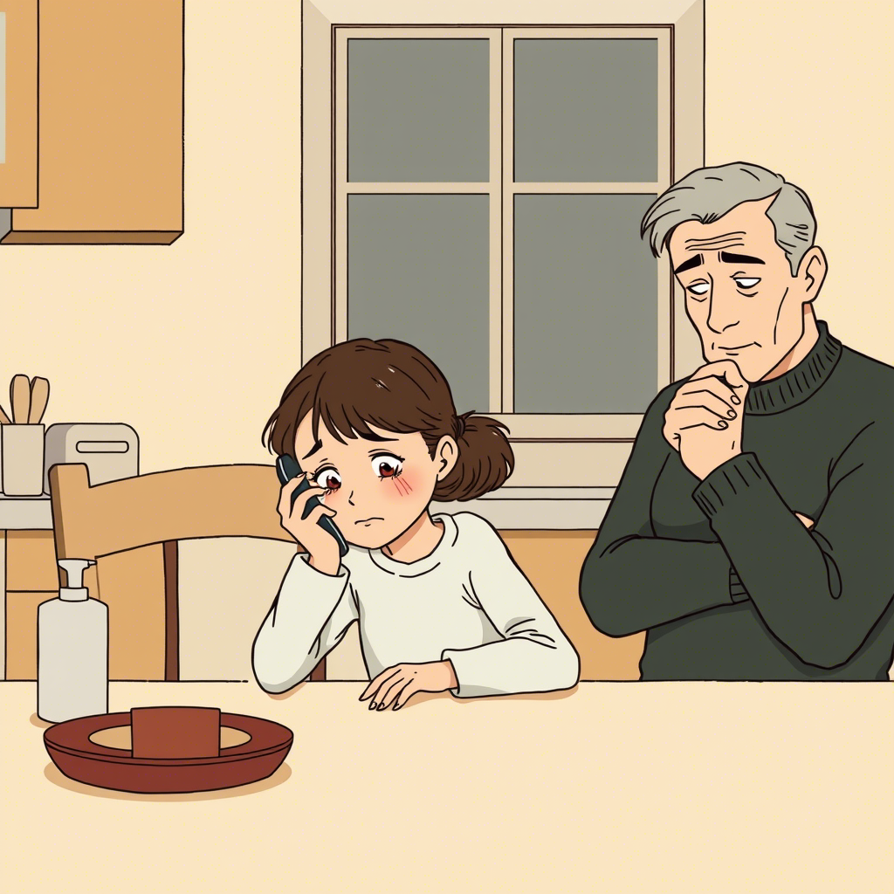

# Rozdział 1. Zabawki, których nie mogę dotknąć

Mam sześć lat. Mój kolega Staś ma świecący tablet, małego robota, który chodzi i mówi, i holograficzne gry, które wypełniają cały pokój kolorowymi światami. Mogę patrzeć, ale nie wolno mi dotykać. Mama mówi, że nie stać nas na takie zabawki.

*Dziennik głosowy Zosi, 10 września 2029:*

Dzisiaj w przedszkolu Staś przyniósł nowego drona wielkości motyla. Fruwał nad naszymi głowami i robił śmieszne zdjęcia, które od razu pokazywały się jako hologramy w powietrzu. Wszystkie dzieci chciały się bawić. Ja też chciałam, ale pani powiedziała, że niektóre zabawki są tylko dla ich właścicieli.

"Dlaczego niektóre dzieci mają takie fajne rzeczy, a inne nie?" zapytałam mamę, gdy mnie odbierała.

Mama westchnęła głęboko, jak zawsze, gdy pytam o rzeczy, które są trudne.

"Zosiu, niektórzy rodzice mają więcej pieniędzy, inni mniej."

"Ale czy to sprawiedliwe? Przecież wszyscy chcemy się bawić tymi samymi rzeczami."

Mama zatrzymała się i kucnęła, by spojrzeć mi w oczy.

"Nie, to nie jest sprawiedliwe. Ale wiesz co? Czasem, gdy świat nie jest sprawiedliwy, ludzie mogą zrobić coś, by to zmienić."

"Co my możemy zrobić?" zapytałam, nie bardzo wierząc, że cokolwiek może zmienić rzeczywistość.

"Zobaczysz. W naszej dzielnicy powstaje coś wspaniałego."

A czy ty kiedyś odczułeś niesprawiedliwość, której nie mogłeś zmienić? Jak się wtedy czułeś?

---

Następnego dnia mama zabrała mnie do starego budynku po bibliotece. Ludzie malowali ściany i ustawiali dziwne maszyny. Niektórzy dorośli kłócili się między sobą, inni śmiali się i współpracowali.

"Co to jest, mamo?" zapytałam, pokazując na robota z wieloma ramionami, który przenosił pudła i pomagał zawiesić coś pod sufitem.

"To jest 'Wspólny Ogród Technologii', kochanie. Miejsce, gdzie wszystkie dzieci będą mogły korzystać z robotów, dronów i sztucznej inteligencji."

Rozejrzałam się z niedowierzaniem. W jednym kącie pomieszczenia dzieci programowały małe roboty, które potem ścigały się po specjalnym torze. W innym, dziewczynka niewiele starsza ode mnie używała gestów, by kontrolować całą armię malutkich dronów układających kolorowy wzór w powietrzu.

"Wszystkie dzieci? Nawet ja?" dopytywałam.

"Zwłaszcza ty," odpowiedziała mama z uśmiechem.

Podeszła do nas pani Jadzia, która kiedyś była nauczycielką, a teraz pokazywała innym dorosłym, jak programować roboty opiekuńcze pomagające starszym osobom.

"Zosiu, chciałabyś nauczyć się programować drona?" zapytała, pokazując mi małą maszynę podobną do tej, którą przyniósł Staś.

"Tak!" zawołałam podekscytowana.

"A wiesz, co jest najważniejsze w takim miejscu jak to?" zapytała pani Jadzia.

Zastanowiłam się chwilę.

"Że są tu fajne zabawki dla wszystkich?"

"To też," przyznała pani Jadzia. "Ale najważniejsze jest to, że pomagamy sobie nawzajem. Że każdy może się nauczyć i każdy może nauczyć czegoś innych."

Czy zauważyłeś, że najlepsze rozwiązania często polegają na dzieleniu się, nie na posiadaniu? Dlaczego w takim razie tak rzadko wybieramy ten model?

---

Gdy opowiedziałam dziadkowi o Ogrodzie Technologii, pokiwał głową ze zrozumieniem.

"Za moich czasów," powiedział, "po upadku komuny też tworzyliśmy spółdzielnie. Wspólnie kupowaliśmy pierwszy sprzęt komputerowy, bo nikogo nie było stać samodzielnie. Historia kołem się toczy."

"To znaczy, że ludzie już kiedyś mieli taki pomysł?" zdziwiłam się.

"Zosieńko, ludzie od zawsze mieli dwa sposoby radzenia sobie z problemami – konkurować albo współpracować. I wiesz co? Za każdym razem, gdy przychodzi kryzys, odkrywamy na nowo, że współpraca jest lepsza."

"To dlaczego o tym zapominamy?" zapytałam.

Dziadek pogłaskał mnie po głowie.

"Dobre pytanie, mała. Bardzo dobre pytanie. Może dlatego, że w dobrych czasach łatwo uwierzyć, że każdy powinien radzić sobie sam?"

A ty, co myślisz? Dlaczego tak łatwo zapominamy o sile współpracy, gdy nie ma kryzysu?

---

W Ogrodzie poznałam Anię i Kubę, którzy też nie mieli robotów w domu. Razem uczyliśmy się programować małe latające drony, którymi można było malować w powietrzu świetlne obrazy.

"Mój tata mówi, że to niesprawiedliwe," powiedział Kuba pewnego dnia. "Że bogaci mają swoje drogie zabawki, a my musimy dzielić się tymi w Ogrodzie."

"A co myśli twoja mama?" zapytałam.

"Ona mówi, że to my mamy lepiej. Bo uczymy się dzielić. Bo mamy więcej przyjaciół. Bo rozumiemy, że fajne rzeczy są fajniejsze, gdy można je robić razem."

"A ty co myślisz?" dopytywałam.

Kuba zastanawiał się długo.

"Myślę, że mama ma trochę racji... Ale chciałbym mieć własnego robota."

Spojrzałam na nasze drony latające w powietrzu, tworząc wspólnie obraz, którego żaden z nich nie mógłby stworzyć sam.

"Wiesz co, Kuba? Ja myślę, że najfajniejsze jest to, że możemy razem tworzyć coś większego niż to, co każdy mógłby zrobić sam."

Czy kiedyś doświadczyłeś radości z tworzenia czegoś wspólnie? Czegoś, czego nigdy nie mógłbyś osiągnąć sam? Jak się wtedy czułeś?