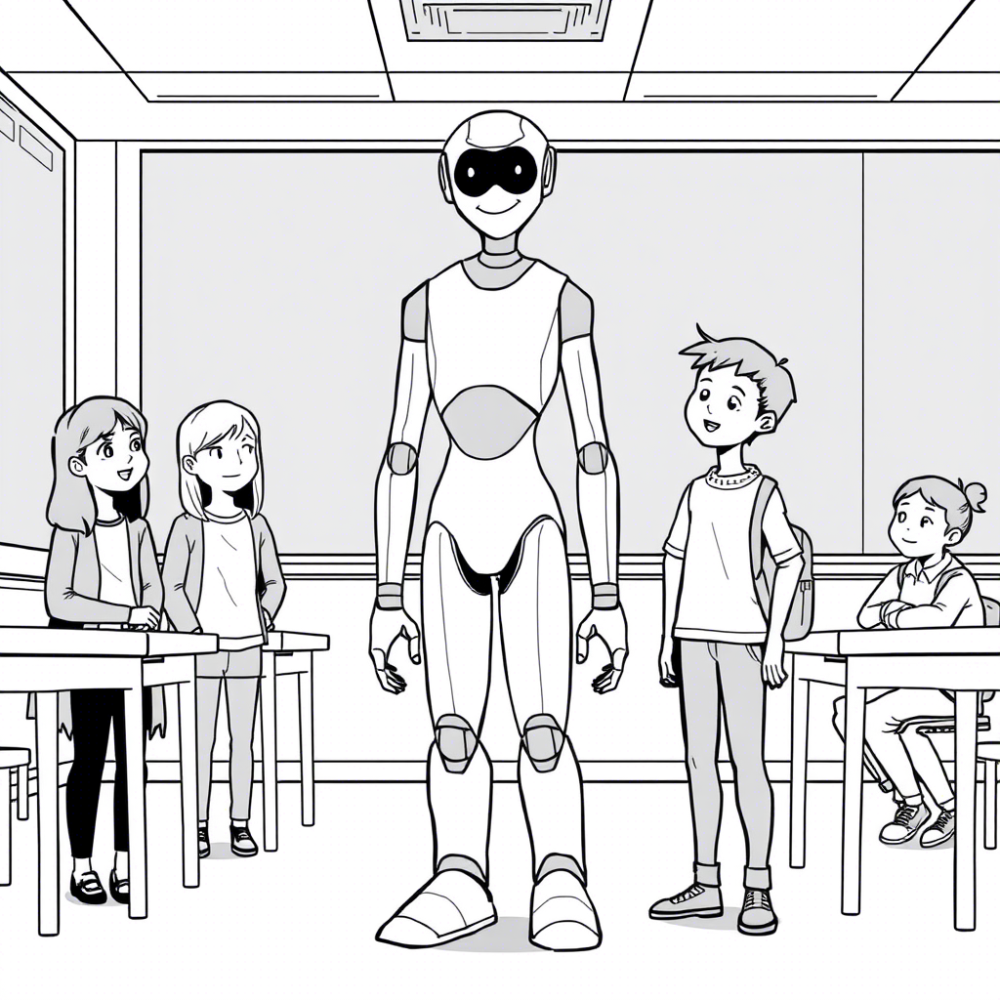

# Rozdział 11: Pokolenie połączonych

Mamy po dziewiętnaście lat. Ja, Adam z Syrii, Ania z rodziny dotkniętej automatyzacją, Marek z zamożnego domu, Maja z depresją, której pomogły nasze spotkania – razem tworzymy niezwykłą grupę. Dostrzegamy wzorce, które umykają innym. Widzimy, jak te same problemy wracają w nowych przebraniach.

*Dziennik głosowy Zosi, 23 września 2042:*

Dzisiaj mieliśmy burzliwą dyskusję podczas spotkania naszej grupy. Zaczęło się niewinnie – od najnowszych doniesień o kryzysie migracyjnym wywołanym zmianami klimatu i kolejnej fali automatyzacji.

"Co jeśli największym problemem nie jest technologia, automatyzacja czy migracja, ale sposób, w jaki społeczeństwo radzi sobie ze zmianami?" zapytałam, gdy analizowaliśmy najnowsze dane.

"Dokładnie," przytaknął Adam, który teraz studiuje socjologię. "Mój ojciec zawsze mówi, że w Syrii przed wojną też były napięcia społeczne związane z nowymi technologiami i zmianami klimatu. Nie umialiśmy sobie z nimi poradzić i to było podłoże wojny, nie polityka."

"Moja babcia opowiada to samo o Polsce lat 90.," dodała Ania, stukając w tablet z danymi. "Szok transformacji, zamykanie fabryk, bezrobocie. Wtedy też technologia zmieniała świat, tylko wolniej."

"I co z tego?" zapytał Janek, nowy w naszej grupie. "Co nam daje zauważenie tych wzorców?"

"Możliwość ich przerwania," odpowiedziałam. "Jeśli widzimy, że historia się powtarza, możemy spróbować zmienić jej bieg."

Marek, który studiuje politologię, podniósł rękę.

"Wiecie co? Myślę, że powinniśmy pójść dalej niż tylko dyskusje. Powinniśmy działać. Wykorzystać to, co wiemy, do realnej zmiany."

"Co proponujesz?" zapytała Maja.

"Założenie 'Rady Młodych' przy władzach miasta," odpowiedział Marek. "Formalnego ciała doradczego złożonego z młodych ludzi, którzy wniosą świeżą perspektywę do podejmowania decyzji."

Pomysł wydawał się szalony, ale im więcej o nim rozmawialiśmy, tym bardziej nabierał sensu. Może właśnie tego brakowało – połączenia doświadczenia starszych z perspektywą młodszych? Dialogu między pokoleniami?

A ty, jak sądzisz – czy młodzi ludzie powinni mieć większy głos w podejmowaniu decyzji o przyszłości? Co mogliby wnieść, czego brakuje obecnie?

---

Założyliśmy "Radę Młodych" przy władzach miasta. Początkowo traktowano nas z pobłażaniem – grupka idealistycznych studentów bez doświadczenia. To zabawne, jak dorośli potrafią jednocześnie narzekać na brak zaangażowania młodych i lekceważyć ich, gdy się angażują.

Pierwsze spotkanie z radnymi było trudne. Czuliśmy się jak dzieci zaproszone do stołu dorosłych – możemy siedzieć, ale nie powinniśmy się odzywać.

"Z całym szacunkiem," powiedział radny Kowalski, gdy przedstawialiśmy nasze propozycje dotyczące integracji migrantów klimatycznych, "ale brakuje wam doświadczenia. Nie rozumiecie złożoności tych problemów."

"Może właśnie dlatego mamy świeże spojrzenie?" odpowiedziałam. "Może czasem doświadczenie jest ciężarem, który nie pozwala zobaczyć nowych rozwiązań?"

"Poza tym," dodał Adam, "mamy inne doświadczenia. Ja sam byłem migrantem. Ania pochodzi z rodziny dotkniętej automatyzacją. Marek widział, jak jego rodzina korzystała na zmianach, które innych pogrążały w biedzie. Nasze doświadczenia są inne, ale nie mniej wartościowe."

"Proponujemy program międzypokoleniowej wymiany wiedzy," przedstawiłam naszą główną propozycję. "Starsi dzielą się doświadczeniem z przeszłych transformacji, młodzi wnoszą zrozumienie nowych technologii i świeże spojrzenie. Razem możemy znaleźć lepsze rozwiązania."

"To nic nowego," prychnął jeden z radnych. "Takie programy już były."

"Tak, były," zgodziłam się. "I właśnie dlatego powinniśmy je przywrócić, ale w nowej formie. Historia się powtarza, ale możemy się z niej uczyć."

Czy myślisz, że dialog międzypokoleniowy jest kluczem do rozwiązania dzisiejszych problemów? Jak mógłby wyglądać, by był autentyczny i efektywny?

---

Program "Mosty Pokoleń" ruszył miesiąc później. Łączymy umiejętności technologiczne z tradycyjną wiedzą. Dziadkowie uczą nas, jak tworzyć wspólnoty wsparcia, my pokazujemy, jak wykorzystać technologię dla dobra wspólnego.

Największym sukcesem była współpraca przy projekcie mieszkań wielopokoleniowych. Starsi mieszkańcy mieli przestrzeń i doświadczenie, ale brakowało im energii i znajomości nowych technologii. Młodzi mieli wiedzę i energię, ale nie mogli sobie pozwolić na własne mieszkania w coraz droższym mieście.

"To jak za dawnych czasów," powiedziała pani Krystyna, emerytowana pielęgniarka, która udostępniła część swojego dużego mieszkania młodej parze studentów. "Kiedyś rodziny mieszkały razem, pomagały sobie. Potem nastała moda na izolację, każdy osobno. A teraz znów odkrywamy wartość wspólnoty."

Studenci pomagali w codziennych czynnościach, uczyli obsługi nowych technologii, zapewniali towarzystwo. Seniorzy dzielili się przestrzenią, doświadczeniem życiowym i często umiejętnościami, które młodsi nie posiadali – od gotowania tradycyjnych potraw po naprawy domowe.

"Tak samo robiliśmy po transformacji," powiedział dziadek podczas jednego ze spotkań ewaluacyjnych. "Łączyliśmy stare metody samoorganizacji z nowymi możliwościami. Tylko wtedy to był przymus ekonomiczny, a teraz świadomy wybór."

"Czy to źle, że robimy to z wyboru, a nie z przymusu?" zapytała Maja.

"Wręcz przeciwnie," uśmiechnął się dziadek. "To pokazuje, że jesteście mądrzejsi od nas. My potrzebowaliśmy kryzysu, by odkryć wartość współpracy. Wy odkrywacie ją z wyprzedzeniem."

Historia rzeczywiście się powtarza, ale tym razem jesteśmy mądrzejsi. Widzimy wzorce, których dorośli często nie dostrzegają, zaabsorbowani codziennymi problemami.

Czy uważasz, że nowe pokolenia rzeczywiście mogą być mądrzejsze, ucząc się na błędach poprzedników? Czy też każde pokolenie jest skazane na popełnianie własnych błędów?

---

"Może właśnie po to jest nowe pokolenie?" zapytał kiedyś Adam podczas jednej z naszych dyskusji. "Żeby patrzeć świeżymi oczami na stare problemy?"

"Ale też po to, by doceniać stare rozwiązania," dodała Ania. "Zauważyliście, jak wiele z naszych 'innowacyjnych' pomysłów ma korzenie w przeszłości?"

"To jak z modą," zaśmiała się Maja. "Wszystko wraca w nowym wydaniu."

"Ale czy to wystarczy?" zapytał Marek, zawsze najbardziej sceptyczny z nas. "Czy naprawdę zmieniamy coś, czy tylko odtwarzamy te same wzorce w nowych dekoracjach?"

To pytanie często do mnie wraca. Czy naprawdę zmieniamy świat, czy tylko dostosowujemy się do jego cyklicznych przemian? Czy dostrzeganie wzorców wystarczy, by je przerwać?

Może odpowiedź leży gdzieś pośrodku. Nie możemy całkowicie uwolnić się od przeszłości, ale możemy świadomie wybierać, które wzorce chcemy powtarzać, a które przerwać.

"Myślę, że największą różnicą jest świadomość," powiedziałam podczas ostatniego spotkania Rady Młodych. "Poprzednie pokolenia działały instynktownie, reaktywnie. My staramy się działać świadomie, z pełnym zrozumieniem historycznych wzorców."

"A może właśnie w tym leży nasza nadzieja," dodał Adam. "Nie w znalezieniu całkowicie nowych rozwiązań, ale w świadomym wykorzystaniu tego, co już wiemy, w nowy sposób."

Rada Młodych stała się stałym elementem procesu decyzyjnego w mieście. Nasze inicjatywy – od mieszkań wielopokoleniowych, przez punkty telemedyczne, aż po Banki Czasu – przestały być eksperymentami, a stały się standardem.

Czy wierzysz, że świadomość historycznych wzorców jest kluczem do lepszej przyszłości? Jak możemy wykorzystać wiedzę o przeszłości, nie będąc przez nią ograniczanymi?