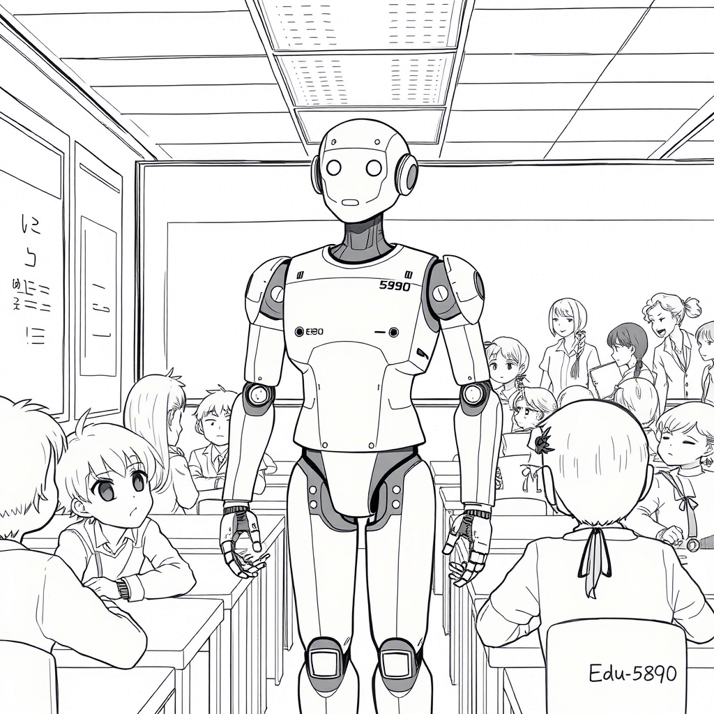

# Rozdział 3: Dlaczego pan robot dostał pracę taty?

Tata stracił pracę. Zamiast niego w fabryce pracuje "zautomatyzowana linia produkcyjna" i roboty z zaawansowaną sztuczną inteligencją. Mam już osiem lat i coraz lepiej rozumiem, co dzieje się wokół mnie. Tata całymi dniami siedzi przy komputerze i szuka nowej pracy, ale wszędzie wymagają innych umiejętności.

*Dziennik głosowy Zosi, 12 maja 2032:*

Dziś tata wrócił bardzo smutny z ostatniego dnia w pracy. Jego oczy były czerwone, choć udawał, że to z powodu pyłu. Przytulił mnie mocno i długo nie puszczał.

"Twój tata jest teraz bezrobotny," powiedział, próbując żartować, ale jego głos się łamał.

Podczas kolacji nikt nie odzywał się przez długi czas. W końcu zebrałam się na odwagę i zadałam pytanie, które chodziło mi po głowie:

"Tato, dlaczego robot może pracować w fabryce, a ty nie?"

Tata spojrzał na mamę bezradnie. Nie wiedział, co odpowiedzieć.

"Roboty są tańsze i nie potrzebują odpoczynku, kochanie," odpowiedziała w końcu mama. "Firma woli zatrudniać je zamiast ludzi."

"Ale roboty nie mają rodzin, nie muszą kupować jedzenia ani ubrań," powiedziałam. "To niesprawiedliwe. Roboty nie potrzebują pieniędzy, a ludzie tak."

Zapadła niezręczna cisza. W końcu tata odchrząknął.

"Wiesz, Zosiu, świat się zmienia. Zawsze się zmieniał. Kiedyś większość ludzi pracowała na roli, potem w fabrykach, teraz..."

"Teraz co?" dopytywałam, gdy zawiesił głos.

"Teraz musimy znaleźć nowe miejsce dla ludzi," dokończył, ale brzmiało to, jakby sam sobie nie wierzył.

Czy zastanawiałeś się kiedyś, jaka jest prawdziwa wartość ludzkiej pracy? Czy definiujemy ją tylko ekonomicznie, czy jest w niej coś więcej?

---

Wieczorem podsłuchałam, jak rodzice rozmawiają w kuchni, myśląc, że już śpię.

"Słyszałeś o tym nowym podatku od automatyzacji?" pytał tata, przeglądając coś na tablecie. "Podobno firmy, które zwalniają ludzi na rzecz maszyn, będą musiały płacić specjalny podatek."

"I co z tego? Myślisz, że to pomoże?" westchnęła mama. "To tylko opóźni nieuniknione."

"Podobno w naszym mieście chcą wprowadzić pilotażowy program dochodu podstawowego. Część podatków od automatyzacji miałaby go finansować."

"Dochód podstawowy?" mama brzmiała na sceptyczną. "Czyli co, będziemy dostawać pieniądze za nic?"

"Nie za nic," tata odłożył tablet. "Za bycie obywatelami. Za to, że jesteśmy częścią społeczeństwa, które stać na maszyny wykonujące pracę za nas."

"I myślisz, że to wystarczy? Że pieniądze zastąpią poczucie, że jest się potrzebnym?"

Zapadła cisza. Zastanawiałam się nad tym, co usłyszałam. Czy pieniądze to wszystko, co daje praca? Czy gdyby tata dostawał pieniądze, ale nie miał zajęcia, byłby szczęśliwy?

Jaka według ciebie jest główna wartość pracy w życiu człowieka? Czy to tylko sposób na zarabianie pieniędzy?

---

Tydzień później tata przyszedł z uśmiechem, którego nie widziałam od dawna. Zapisał się do programu pilotażowego. Dostał miejsce na szkoleniu z programowania sztucznej inteligencji i małe miesięczne wsparcie finansowe.

"Będę się uczył rozmawiać z robotami," żartował podczas obiadu, a jego oczy znów błyszczały.

"Czy to znaczy, że będziesz szefem robotów?" zapytałam podekscytowana.

"Nie do końca," roześmiał się tata. "Raczej ich współpracownikiem. Będę projektował zadania, które one wykonują. Wiesz, roboty są silne i szybkie, ale nie są zbyt mądre."

"Jak to?" zdziwiłam się. "Przecież to sztuczna inteligencja. W szkole mówili, że AI jest mądrzejsza od ludzi."

"W pewnych zadaniach tak," zgodził się tata. "Ale nie potrafi myśleć tak jak my. Nie ma intuicji, kreatywności, empatii. To tylko bardzo zaawansowany kalkulator, który potrafi udawać inteligencję."

"Więc roboty nigdy nie zastąpią ludzi całkowicie?" zapytałam z nadzieją.

Tata i mama wymienili spojrzenia.

"W pewnych pracach nie," odpowiedział ostrożnie tata. "Ale w wielu już to zrobiły. Dlatego ludzie muszą znaleźć nowe zajęcia. Takie, w których jesteśmy niezastąpieni."

"Jak które?"

"Jak tworzenie sztuki, opieka nad innymi, wymyślanie nowych rzeczy," odpowiedziała mama. "Wszystko, co wymaga bycia człowiekiem."

Zastanawiam się, co to znaczy "być człowiekiem" w świecie, gdzie maszyny potrafią robić coraz więcej. A ty, co myślisz? Co czyni nas niezastąpionymi?

---

"Wiesz, co powiedział mi trener?" opowiadał tata przy kolacji miesiąc później. "Że po wielkim bezrobociu w latach 90. też były takie programy przekwalifikowania. Tylko że wtedy uczono obsługi komputerów, a teraz uczą nas, jak współpracować z AI."

"To samo mówiłem!" zawołał dziadek, który przyszedł na obiad. "Historia kołem się toczy. Za każdą rewolucją technologiczną idzie rewolucja społeczna. Ludzie tracą stare zajęcia, znajdują nowe."

"Ale co z tymi, którzy nie mogą się przekwalifikować?" zapytałam, pamiętając o sąsiedzie, panu Henryku, który całe życie pracował rękami i mówi, że jest za stary na naukę komputerów.

"To właśnie jest wyzwanie," przyznał dziadek. "Za moich czasów też wielu ludzi zostało z tyłu. Zwłaszcza starszych. Mówiono nam, że musimy nadążać za zmianami, ale nikt nie mówił jak."

"I co się z nimi stało?"

Dziadek westchnął głęboko.

"Niektórzy sobie poradzili. Inni... nie. Zosiu, to jest właśnie powód, dlaczego teraz potrzebujemy nowych rozwiązań. Takich jak dochód podstawowy. Bo jeśli roboty pracują za ludzi, to wszyscy powinni z tego korzystać, nie tylko właściciele robotów."

"Czyli pieniądze z podatku od robotów idą dla wszystkich?" dopytywałam.

"Tak miałoby to działać," potwierdził tata. "To jest sprawiedliwe. Jeśli technologia należy do całego społeczeństwa, to jej zyski też powinny."

"Tylko dlaczego musimy to wymyślać od nowa?" zastanawiał się dziadek. "Przecież te dyskusje już były. Sto lat temu ludzie rozważali, co zrobić, gdy maszyny zastąpią pracę ludzką. Wtedy też mówiono o powszechnym dochodzie."

"I co się stało?" zapytałam.

"Nic," wzruszył ramionami dziadek. "Ludzie znaleźli nowe prace. Ale tym razem może być inaczej. Tym razem maszyny mogą zastąpić nie tylko nasze mięśnie, ale i umysły."

Zastanawiam się, czy jesteśmy mądrzejsi od naszych przodków. Czy wyciągnęliśmy wnioski z ich błędów? Czy może jesteśmy skazani na powtarzanie tej samej historii w nowych dekoracjach?

A ty, co myślisz? Czy potrafimy uczyć się na błędach poprzednich pokoleń?

---

Tydzień po tym, jak tata stracił pracę, namówiłam go, by zabrał mnie do fabryki – chciałam zobaczyć roboty, które go zastąpiły.

"Nie wiem, czy to dobry pomysł," wahał się, ale w końcu zgodził się na krótką wizytę podczas dnia otwartego.

Fabryka była ogromna i zaskakująco cicha. Zamiast gwaru pracowników słychać było tylko miarowy szum maszyn. Długie rzędy robotycznych ramion poruszały się w idealnej synchronizacji, montując części.

"Tu pracowałem," powiedział tata, wskazując na stanowisko zajmowane teraz przez maszynę o numerze RW-437. "Przez piętnaście lat."

Maszyna wykonywała dokładnie te same ruchy co mój tata, ale szybciej, bez przerw, bez zmęczenia. Nagle poczułam złość.

"To niesprawiedliwe!" wykrzyknęłam głośniej, niż zamierzałam. "Ta maszyna nie ma rodziny, nie ma marzeń, nie potrzebuje jedzenia!"

Kilka osób odwróciło się w naszą stronę. Tata położył mi dłoń na ramieniu.

"Ciszej, Zosiu," powiedział łagodnie, ale zauważyłam, że jego oczy błyszczały. "Tak już jest. Świat się zmienia."

"Ale dlaczego musi się zmieniać w taki sposób?" zapytałam, ocierając łzy. "Dlaczego nie może się zmieniać tak, by było lepiej dla ludzi?"

Tata nie odpowiedział. Może nie znał odpowiedzi. A może była zbyt bolesna, by ją wypowiedzieć.

---

Tata spędza teraz dużo czasu na nauce. Czasem jest sfrustrowany, ale częściej podekscytowany. Wieczorami często opowiada o tym, czego się nauczył.

"Wiesz, Zosiu," powiedział pewnego wieczoru, gdy pokazywał mi model AI, który zaprogramował do rozpoznawania emocji w głosie, "może to i dobrze, że roboty przejęły niektóre prace."

"Dlaczego?" zdziwiłam się.

"Bo to były często prace, które ludzie wykonywali jak... roboty właśnie. Powtarzalne, monotonne, wyczerpujące. Może teraz będziemy mogli robić to, co naprawdę ludzkie?"

"Czyli co?"

"Tworzyć. Wymyślać. Troszczyć się o innych. Robić rzeczy, które mają znaczenie."

Spojrzałam na niego uważnie.

"Ale twoja stara praca miała znaczenie, prawda? Inaczej byś jej nie robił."

Tata wyglądał na zaskoczonego. Przez chwilę milczał.

"Masz rację, kochanie. Miała znaczenie, bo utrzymywała naszą rodzinę," przyznał. "Ale teraz mam szansę na pracę, która będzie miała znaczenie także w inny sposób."

"Jaki?"

"Będę pomagał ludziom dostosować się do nowego świata. Będę łącznikiem między starym a nowym."

Może o to właśnie chodzi, pomyślałam. Nie o to, by konkurować z maszynami, ale by znaleźć nowe sposoby bycia człowiekiem w świecie pełnym maszyn. 

Jak wyobrażasz sobie świat, w którym większość pracy fizycznej i umysłowej wykonują maszyny? Co robiliby wtedy ludzie? I czy byłby to świat lepszy czy gorszy od naszego?

---

Miesiąc później tata przyszedł z kolejną dobrą wiadomością - dostał pracę jako konsultant ds. transformacji technologicznej w dużej firmie.

"Będę pomagał pracownikom przystosować się do współpracy z AI i robotami," wyjaśnił przy kolacji. "Wielu z nich boi się zmian, tak jak ja się bałem."

"I co im powiesz?" zapytałam, nakładając sobie więcej ziemniaków.

"Że strach jest naturalny. Że zmiany są trudne. Ale że człowiek ma w sobie coś, czego maszyna nigdy nie będzie miała."

"Co takiego?"

"Zdolność do adaptacji. Kreatywność. Empatię," wyliczał tata. "Robot może wykonać każde zadanie, które mu zaprogramujesz, ale nie wymyśli nowego zadania. Nie pocieszy płaczącego dziecka. Nie zrozumie żartu."

"Ale sztuczna inteligencja potrafi pisać wiersze i malować obrazy," zauważyłam. "Pani w szkole nam pokazywała."

"Tak, ale zawsze na podstawie tego, co stworzyli ludzie," odpowiedział tata. "AI to jak bardzo zaawansowane lustro - odbija to, co jej pokażesz, czasem w nowy sposób, ale nie tworzy z niczego."

Babcia, która przyszła na kolację, pokiwała głową.

"Za moich czasów również baliśmy się, że maszyny nas zastąpią," powiedziała. "Najpierw były fabryki, potem komputery. Zawsze wydawało się, że tym razem to już koniec pracy dla ludzi."

"I co się stało?" spytałam.

"Pojawiły się nowe zawody, o których wcześniej nikt nawet nie marzył," uśmiechnęła się babcia. "Kto w latach 80. myślał, że będą programiści aplikacji mobilnych czy specjaliści od mediów społecznościowych?"

"Czyli zawsze będzie praca dla ludzi?" dopytywałam.

Tata i babcia wymienili spojrzenia.

"Będzie zajęcie dla ludzi," odpowiedział ostrożnie tata. "Ale może nie w formie 'pracy' jak ją znamy dziś. Może będziemy mogli skupić się na tym, co naprawdę kochamy robić."

"Jak w raju?" roześmiała się mama, która właśnie wróciła z dyżuru w szpitalu. Jako pielęgniarka była jedną z niewielu osób, których pracy nie dało się w pełni zautomatyzować.

"Może nie raj, ale na pewno inny świat," odpowiedział tata. "Pytanie, czy będziemy umieli w nim żyć."

---

Pierwszego dnia w nowej pracy tata wrócił późno, ale z uśmiechem na twarzy. 

"I jak było?" zapytałam, odkładając książkę, którą czytałam na kanapie.

"Dziwnie," przyznał, wieszając kurtkę. "Przez piętnaście lat montowałem części, a teraz uczę ludzi, jak współpracować z maszynami, które zajmują ich miejsce."

"Czy oni cię nie nienawidzą?" zapytałam szczerze. "Przecież im zabierasz pracę."

Tata usiadł obok mnie na kanapie.

"Niektórzy są zdenerwowani, to prawda. Ale większość jest po prostu przestraszona. Boją się zmian, boją się zostać bez środków do życia. I właśnie dlatego nasza firma wprowadza program przekwalifikowania zamiast po prostu zwalniać ludzi."

"Jak twój kurs programowania?"

"Dokładnie. Tylko bardziej systematyczny, z gwarancją zatrudnienia na nowym stanowisku."

"A co z ludźmi, którzy nie potrafią się nauczyć nowych rzeczy?" drążyłam.

Tata westchnął.

"To jest właśnie najtrudniejsze pytanie, Zosiu. I nie mam na nie dobrej odpowiedzi. Na razie firmy takie jak nasza próbują pomóc wszystkim się przekwalifikować. Ale długoterminowo? Potrzebujemy nowego systemu społecznego."

"Dochodu podstawowego?" przypomniałam sobie wcześniejszą rozmowę.

"To jedna z możliwości," przytaknął tata. "Ale potrzebujemy też czegoś więcej – nowego sposobu myślenia o wartości człowieka, o sensie życia poza pracą."

Tata znów ma iskierkę w oczach, gdy mówi o przyszłości. Nie jest to ta sama pewność, co kiedyś, ale spokojniejsza, głębsza nadzieja. Może to właśnie dojrzałość - umiejętność widzenia możliwości nawet pośród niepewności?

A ty, jak reagujesz na zmiany w swoim życiu? Widzisz w nich zagrożenie czy szansę? I co pomaga ci znaleźć równowagę pomiędzy tymi dwoma perspektywami?