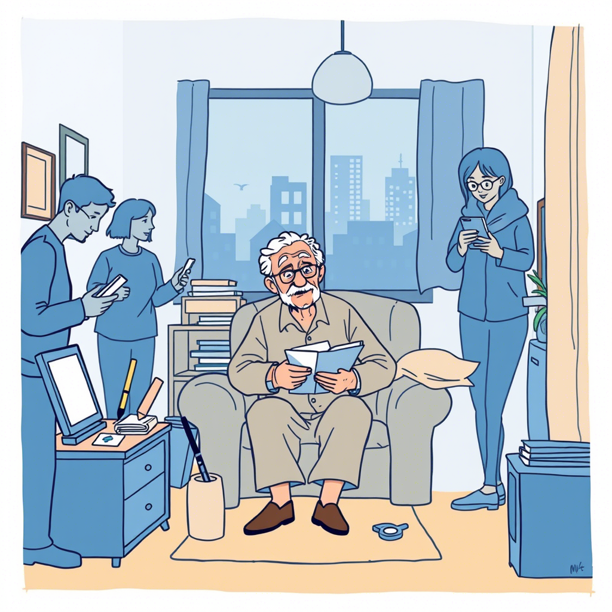

# Rozdział 6. Niewidzialni ludzie

Pan Henryk z parteru nie istnieje – tak mówi mama. To znaczy, istnieje naprawdę, widujemy go codziennie, ale nie ma go w systemach. Nie ma konta, karty chipowej, cyfrowego ID. Jest "cyfrowym pariasem". Mam już czternaście lat i zaczynam rozumieć, jak niebezpieczne może być życie na marginesie cyfrowego świata.

*Dziennik głosowy Zosi, 12 listopada 2037:*

Dziś widziałam, jak pani Jadwiga z drugiego piętra kupowała panu Henrykowi leki na receptę. System apteczny go nie rozpoznaje, więc nie może sam realizować recept.

"Dlaczego pan Henryk nie może dostać leków w aptece?" zapytałam mamę, gdy opowiedziałam jej o tej sytuacji.

"Bo system go nie widzi, kochanie," odpowiedziała mama, przygotowując obiad. "Nie ma cyfrowej tożsamości."

"Ale przecież on istnieje naprawdę!" zaprotestowałam. "Jest człowiekiem z krwi i kości. Jak system może go nie widzieć?"

"System widzi tylko to, co zostało w nim zarejestrowane," wyjaśniła mama. "Pan Henryk nigdy nie założył cyfrowego ID, nie ma smartfona, komputera, konta bankowego. Dla systemu jest niewidzialny."

"To absurdalne," stwierdziłam. "Człowiek istnieje tylko wtedy, gdy system go widzi? A co z jego prawami?"

Mama odłożyła nóż i spojrzała na mnie poważnie.

"Właśnie o to chodzi, Zosiu. System został zaprojektowany dla wygody większości, ale kompletnie zapomina o mniejszościach. O starszych, jak pan Henryk. O biednych, którzy nie mają dostępu do technologii. O wykluczonych z różnych powodów."

"Ale przecież to niesprawiedliwe! Czy nie można tego zmienić?"

"Można," odpowiedziała mama. "Pytanie, czy wystarczająco wielu ludzi zauważa problem."

Czy dostrzegasz podobne wykluczenia w dzisiejszym świecie? Jak często myślimy o tych, którzy nie pasują do głównego nurtu technologicznego lub społecznego?

---

Na lekcji historii rozmawialiśmy o grupach wykluczonych w różnych epokach. Pan Adam, nasz nauczyciel, opisywał systemy kastowe, segregację rasową, wykluczenie ze względu na pochodzenie, religię czy płeć.

"Zawsze istniały grupy ludzi, których system nie zauważał," wyjaśnił pan Adam. "W Indiach byli to pariasi, w średniowieczu trędowaci, w XX wieku często imigranci bez dokumentów."

"A dziś są to cyfrowi pariasi," dodałam. "Jak pan Henryk z mojego bloku."

"Dokładnie," przytaknął nauczyciel. "Co pokazuje, że choć technologie się zmieniają, ludzka tendencja do tworzenia systemów wykluczających pozostaje."

"Ale dlaczego?" zapytał Marek z ostatniej ławki. "Przecież dziś mamy więcej świadomości, więcej wiedzy historycznej."

"Dobre pytanie," odparł nauczyciel. "Co myślicie? Dlaczego, mimo że znamy błędy przeszłości, wciąż je powtarzamy?"

Przez chwilę nikt się nie odzywał. W końcu zebrałam się na odwagę.

"Może dlatego, że systemy projektują ludzie, którzy sami nie doświadczyli wykluczenia?" zasugerowałam. "Tworzą dla takich jak oni, zapominając o innych."

"Albo dlatego, że wygoda większości jest ważniejsza niż prawa mniejszości," dodała Ania.

"A może po prostu zapominamy, że za każdym numerem, statystyką czy kategorią stoi prawdziwy człowiek," powiedział cicho Adam, mój przyjaciel z Syrii.

Zapadła cisza. Pan Adam popatrzył na nas z uznaniem.

"Myślę, że wszyscy macie rację," powiedział pan Adam. "I to właśnie jest największy problem systemów wykluczenia – mają wiele przyczyn, co sprawia, że trudno je całkowicie wyeliminować."

Czy zauważyłeś, jak łatwo współczesne systemy tworzą nowe formy wykluczenia? Co mówi o nas fakt, że mimo doświadczeń historycznych wciąż dopuszczamy do powstawania takich barier?

---

Po lekcji zapytałam pana Adama, czy moglibyśmy coś z tym zrobić. Tak powstał "Klub Pomocy Cyfrowej". Początkowo było nas tylko pięcioro – ja, Adam, Ania, Kuba i Marek. Pomagaliśmy starszym osobom załatwiać sprawy online, uczyliśmy ich korzystać z podstawowych systemów, pomagaliśmy zakładać konta i cyfrowe tożsamości.

Jednym z naszych pierwszych "klientów" był pan Henryk.

"Nie chcę tego całego cyfrowego badziewia," oświadczył, gdy zapukaliśmy do jego drzwi. "Siedemdziesiąt pięć lat żyłem bez tego i jakoś dawałem radę."

"Ale pan wie, że niedługo nawet emeryturę trzeba będzie odbierać przez aplikację?" zapytałam.

"To niech mi ją wsadzą..." zaczął pan Henryk, ale urwał, widząc miny naszej piątki. "Przepraszam. Ale nie rozumiem, dlaczego muszę się dostosować. Dlaczego to zawsze słabsi muszą się dostosować do systemu, a nie odwrotnie?"

To pytanie zawisło w powietrzu. Nie miałam na nie dobrej odpowiedzi.

"Ma pan rację," przyznał w końcu Adam. "System powinien dostosować się do ludzi, nie odwrotnie. Ale dopóki to się nie stanie, możemy pomóc panu poruszać się w tym systemie."

"Albo stworzyć alternatywę," dodał Kuba.

"Co masz na myśli?" zapytałam.

"System równoległy. Dla tych, którzy nie chcą lub nie mogą być w głównym nurcie."

Taka była geneza naszego drugiego projektu. Wspólnie z lokalnym domem kultury stworzyliśmy "Bank Czasu" – system wymiany usług, który działał równolegle do oficjalnej gospodarki. Każdy mógł zaoferować swoją pomoc w dowolnej dziedzinie i otrzymać punkty, które później wymieniał na pomoc innych.

Jakie alternatywne systemy mogłyby uzupełniać te oficjalne, by nikt nie pozostawał wykluczony? Czy możliwa jest gospodarka, która ceni wszystkich – niezależnie od tego, jak dobrze pasują do dominującego modelu?

---

"Mama opowiadała mi, że dokładnie takie banki czasu tworzyliśmy w latach kryzysu po transformacji," powiedziała Ania, której mama jest ekonomistką. "To naprawdę jak déjà vu."

"Zawsze gdy system zawodzi, ludzie organizują się oddolnie," dodał pan Adam, który został naszym opiekunem. "To jak z pomocą sąsiedzką podczas powodzi czy żywiołów – państwo często nie nadąża, a ludzie po prostu robią, co trzeba."

Nasz Bank Czasu szybko się rozrastał. Już po miesiącu mieliśmy ponad sto osób wymieniających się usługami, od napraw po korepetycje. Wśród nich było wielu "cyfrowych pariasów" – osób, które z różnych powodów nie funkcjonowały w oficjalnym systemie.

Nie spodziewaliśmy się jednak, że nasz projekt przyciągnie uwagę władz miasta.

"Idźcie do domu! Odblokujcie portale!" skandował tłum przed ratuszem miejskim. Grupa kilkudziesięciu protestujących trzymała transparenty z napisami: "Istnieję, choć nie mam ID" i "Człowiek to nie numer".

Trzymałam Pana Henryka pod ramię. Zgodził się przyjść tylko dlatego, że obiecałam, że nikt nie będzie robił mu zdjęć.

"Po co tu przyszliśmy, Zosiu?" zapytał, wyraźnie zdenerwowany. "I tak nic nie zmienią."

"Bo czasem trzeba pokazać, że się nie zgadzamy," odpowiedziałam, choć sama nie byłam pewna, czy ten protest cokolwiek zmieni.

Z głośników rozległ się głos przewodniczącej Kolektywu Obrony Cyfrowej: "Żądamy prawa do istnienia poza systemem! Żądamy alternatywnych ścieżek dostępu do usług publicznych dla wykluczonych cyfrowo!"

Nagle z budynku ratusza wyszła grupa urzędników z Komisarzem Cyfryzacji na czele.

"To niemożliwe," powiedział przez megafon. "System musi być jednolity, by być bezpieczny. Wszyscy muszą się dostosować."

"A co z tymi, którzy nie mogą?" krzyknął ktoś z tłumu.

"Pomożemy im," odparł komisarz. "Mamy programy wsparcia."

Spojrzałam na Pana Henryka. Jego dłoń zacisnęła się mocniej na moim ramieniu.

"Kłamie," szepnął. "Dla nich 'pomoc' oznacza przymus."

Pan Henryk okazał się nieocenionym uczestnikiem naszego Banku Czasu. Oferował naprawy rowerów i drobne prace stolarskie. Okazało się, że przez lata pracował jako konserwator i złota rączka.

"Widzicie," powiedział podczas jednego ze spotkań, "według systemu jestem nikim. Nie mam odpowiednich papierów, dyplomów, licencji. Ale potrafię naprawić prawie wszystko, co ma śrubki i sprężyny."

W zamian za swoje usługi korzystał z pomocy przy zakupach, wizytach medycznych i drobnych naprawach elektroniki. System go nie widział, ale my widzieliśmy.

"Czasem trzeba stworzyć własny system, gdy ten oficjalny zawodzi," powiedział dziadek, gdy opowiedziałam mu o naszym banku. "Tak było zawsze. Historia lubi się powtarzać."

"Ale dlaczego musimy wciąż od nowa wymyślać te same rozwiązania?" zapytałam. "Dlaczego nie wyciągamy wniosków?"

"Bo każde pokolenie myśli, że jego problemy są wyjątkowe," westchnął dziadek. "Że świat zaczął się wraz z nim."

Czy zauważasz, jak często każde pokolenie musi na nowo odkrywać te same prawdy? Dlaczego tak trudno jest nam uczyć się z doświadczeń poprzedników?

---

Bank Czasu rozrósł się poza nasze najśmielsze oczekiwania. Wkrótce działał w całej dzielnicy, obejmując setki osób w różnym wieku.

Pewnego dnia odwiedziła nas przedstawicielka urzędu miasta.

"To, co robicie, jest nielegalne," oświadczyła. "Wymiana usług bez opodatkowania, nieformalny system gospodarczy..."

"Nielegalne?" zdziwiłam się. "Pomagamy sobie nawzajem. Co w tym nielegalnego?"

"System musi mieć kontrolę nad wymianą gospodarczą," wyjaśniła urzędniczka. "Inaczej nie ma jak egzekwować standardów, podatków, zasad bezpieczeństwa."

"A czy system ma kontrolę nad tym, że sąsiadka pomaga sąsiadce wnieść zakupy na trzecie piętro?" zapytał pan Henryk, który akurat był na spotkaniu. "Czy to też jest nielegalne?"

Urzędniczka zawahała się.

"To nie to samo..."

"A czym się różni?" nie ustępował pan Henryk. "Skalą? Tym, że zorganizowaliśmy się, zamiast działać chaotycznie?"

W końcu, po długich negocjacjach i kilku spotkaniach, wypracowaliśmy kompromis. Bank Czasu został zarejestrowany jako eksperymentalny program społeczny pod patronatem urzędu miasta. Otrzymaliśmy małe dofinansowanie i wsparcie prawne.

"Widzisz," powiedział mi później pan Henryk, "czasem trzeba nagiąć system, by się zmienił. Ale ostrożnie, żeby się nie złamał."

"Czy to nie paradoks?" zapytałam. "Walczymy z wykluczeniem przez system, a teraz staliśmy się jego częścią?"

"Nie," uśmiechnął się pan Henryk. "To ewolucja. System się zmienia, bo my się nie poddajemy."

Czy uważasz, że lepiej jest zmieniać system od wewnątrz czy budować alternatywy poza nim? A może prawdziwa zmiana wymaga obu tych strategii?