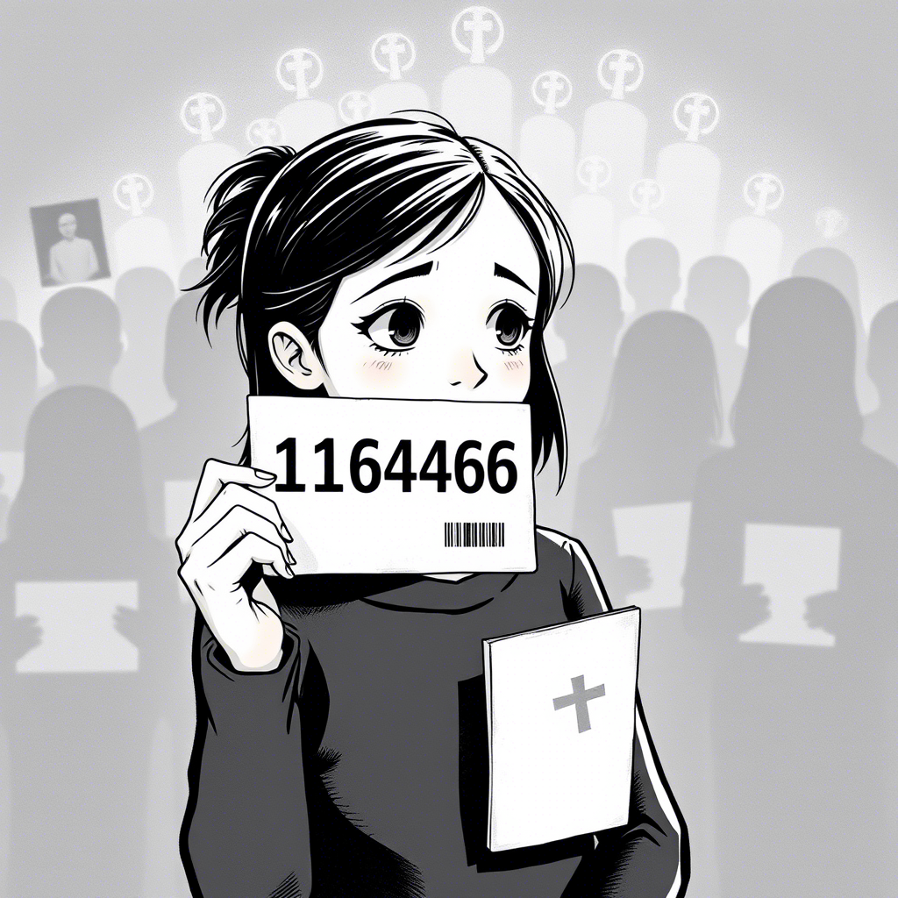

# Rozdział 7: Ludzie z numerami

Mam piętnaście lat. Świat wokół mnie zmienia się coraz szybciej, a ja staram się nadążyć. Dziś w szkole dowiedzieliśmy się o nowym systemie identyfikacji obywateli, który ma zastąpić tradycyjne imiona i nazwiska.

*Dziennik głosowy Zosi, 7 marca 2038:*

Pani od edukacji obywatelskiej przedstawiła nam dziś projekt nowej ustawy. Nazwała to "rewolucją w bezpieczeństwie cyfrowym". Od przyszłego roku wszyscy obywatele zamiast nazwisk będą używać kodów identyfikacyjnych. Dla zwiększenia prywatności, mówili. Dla ochrony przed kradzieżą tożsamości.

"Czy to znaczy, że nie będę już Zosią Kowalską?" zapytałam podczas lekcji.

Pani Nowak – czy raczej, jak sama zażartowała, wkrótce "Edukator-39218" – uśmiechnęła się łagodnie. "Oczywiście, że nadal będziesz Zosią dla rodziny i przyjaciół. Ale w oficjalnych dokumentach, systemach cyfrowych i publicznych bazach danych staniesz się po prostu numerem."

"Numerem," powtórzyłam. "Jak produkty w sklepie."

"To nie tak," zaprotestowała pani Nowak. "To dla waszego bezpieczeństwa. W świecie, gdzie wszystko jest cyfrowe, imiona i nazwiska są zbyt łatwe do wykorzystania przez cyberprzestępców."

Po lekcji rozmawialiśmy o tym z Adamem i Mają w drodze do domu.

"Mam złe przeczucia," powiedział Adam. "Mój dziadek opowiadał, jak w Syrii przed wojną zaczęli identyfikować ludzi według grup etnicznych i religijnych. To nie skończyło się dobrze."

"Ale to przecież zupełnie co innego," zaprotestowała Maja. "Tu chodzi tylko o bezpieczeństwo cyfrowe."

"Czy na pewno?" zapytałam. "Bo mnie to przypomina coś, o czym opowiadał dziadek..."

Czy zauważasz podobieństwa między współczesnymi praktykami a historycznymi przypadkami dehumanizacji? Jak łatwo w imię bezpieczeństwa możemy przekroczyć granicę, za którą człowiek staje się jedynie numerem?

---

Wieczorem zapytałam dziadka o jego skojarzenia z zastępowaniem nazwisk numerami. Zbladł i długo milczał. W końcu wstał i pokazał mi stary album ze zdjęciami.

"Twoja prababcia przeżyła obóz koncentracyjny w Auschwitz," powiedział cicho, pokazując czarno-białe zdjęcie wychudzonej kobiety z wytatuowanym numerem na przedramieniu. "Tam też ludzie przestawali być ludźmi, a stawali się numerami."

"Ale teraz jest inaczej, prawda?" zapytałam niepewnie. "To dla naszego dobra."

Dziadek westchnął głęboko.

"Zosiu, prawie zawsze, gdy odbierano ludziom imiona i dawano numery, mówiono, że to dla ich dobra. Dla porządku. Dla bezpieczeństwa. Dla efektywności."

"Ale przecież Polska to demokratyczny kraj. Nie jesteśmy w obozie..."

"I dlatego tak ważne jest, byśmy pamiętali historię," przerwał mi dziadek. "By rozpoznawać niebezpieczne wzorce, zanim się rozwiną. Obozy nie powstały w jeden dzień. To był proces. Najpierw klasyfikowanie ludzi, potem nadawanie im numerów, potem stopniowe odbieranie praw..."

"Więc uważasz, że to pierwszy krok do czegoś gorszego?" zapytałam, czując rosnący niepokój.

"Niekoniecznie," odpowiedział dziadek po chwili namysłu. "Historia nie musi się powtarzać dokładnie. Ale zawsze, gdy widzisz trend w kierunku odpersonalizowania ludzi, powinieneś być czujny."

Czy zgadzasz się z dziadkiem Zosi? Jakie zagrożenia widzisz w zastępowaniu osobistych tożsamości kodami cyfrowymi? Czy istnieje sposób na pogodzenie bezpieczeństwa cyfrowego z zachowaniem ludzkiej godności?

---

W szkole utworzyliśmy nieformalną grupę dyskusyjną na temat nowego systemu identyfikacji. Zaskoczyło mnie, jak wielu uczniów widziało w tym tylko praktyczne udogodnienie, a nie potencjalne zagrożenie.

"Ale zobaczcie, co stało się po Wielkim Wycieku Danych w 2036 roku," argumentował Marek. "Miliony ludzi straciły swoje tożsamości. Przestępcy brali na nich kredyty, publikowali w ich imieniu. Numery zamiast nazwisk to ochrona."

"Jeśli chodzi tylko o ochronę, dlaczego nie możemy używać pseudonimów?" zapytała Ania. "Czegoś, co wciąż brzmi ludzko?"

"Bo pseudonimy też można ukraść," odpowiedział Marek. "Kod alfanumeryczny jest bezpieczniejszy."

"A czy zauważyliście," wtrąciłam, "że projekt ustawy przewiduje również zdjęcie odcisków palców i skanów tęczówki od wszystkich obywateli? To nie tylko o zmianę nazwisk na numery."

W sali zapadła cisza. Adam przerwał ją:

"Mój ojciec mówi, że to jak w Syrii przed rewolucją. Zaczęło się od 'środków bezpieczeństwa', a skończyło na śledzeniu każdego kroku obywateli."

Pan Adam, nasz nauczyciel historii, który przysłuchiwał się dyskusji, postanowił się włączyć:

"Czy wiecie, że podczas II wojny światowej, jeszcze przed obozami koncentracyjnymi, Niemcy wprowadzili kompleksowy system identyfikacji i ewidencji obywateli? Używali do tego zaawansowanych jak na tamte czasy maszyn IBM, które sortowały ludzi według różnych kategorii."

"Ale przecież technologia jest neutralna," zaprotestował Marek. "To ludzie decydują, jak jej użyć."

"Dokładnie," zgodził się pan Adam. "I dlatego tak ważne jest, byśmy jako społeczeństwo dyskutowali o granicach jej stosowania. Historia nie zawsze się powtarza, ale często rymuje."

Historia rymująca się – to określenie zostało ze mną. Czy dostrzegasz takie "rymy" we współczesnym świecie? Jakie historyczne lekcje powinniśmy pamiętać, wprowadzając nowe technologie identyfikacji i nadzoru?

---

Tydzień później w wiadomościach ogłoszono, że projekt ustawy będzie konsultowany społecznie. Rodzice byli zaproszeni na spotkanie w szkole. Niespodziewanie, zostałam poproszona, by przedstawić perspektywę młodzieży.

"Nie jesteśmy przeciwko zwiększeniu bezpieczeństwa cyfrowego," powiedziałam, stojąc przed rodzicami i przedstawicielami lokalnych władz. "Ale wierzymy, że można to osiągnąć bez odbierania ludziom ich tożsamości."

Przedstawiłam alternatywny projekt opracowany przez naszą grupę: system wielopoziomowej tożsamości, gdzie obywatele zachowywaliby swoje imiona i nazwiska, ale mieliby również kody dostępu do różnych systemów.

"Historia uczy nas, że dehumanizacja często zaczyna się od pozornie niewinnych zmian administracyjnych," kontynuowałam. "Moja prababcia przeżyła obóz, gdzie ludzie byli tylko numerami. W Rwandzie przed ludobójstwem wprowadzono karty identyfikacyjne z oznaczeniem grupy etnicznej. W Związku Radzieckim i innych reżimach totalitarnych śledzono obywateli dla 'ich własnego bezpieczeństwa'."

Dostrzegłam poruszenie na sali. Niektórzy rodzice kiwali głowami, inni wyglądali na zaniepokojonych.

"Nie twierdzę, że zmierzamy w tym samym kierunku," dodałam szybko. "Ale wierzę, że powinniśmy być świadomi historycznych wzorców. Że powinniśmy pytać nie tylko 'czy to działa?', ale też 'jakie są długoterminowe konsekwencje?'"

Po spotkaniu podeszła do mnie starsza kobieta, przedstawiając się jako była więźniarka polityczna z czasów komunizmu.

"Miałam numer 27891," powiedziała cicho. "Nie imię, nie nazwisko. Tylko numer. I wiesz, co było najgorsze? Nie brutalne traktowanie, nie głód. Najgorsze było to, że po jakimś czasie sama zaczęłam myśleć o sobie jako o '27891'. I to jest prawdziwe niebezpieczeństwo – gdy zaczynasz akceptować, że jesteś tylko numerem."

Jej słowa głęboko mnie poruszyły. W drodze do domu zastanawiałam się, jak cienka jest granica między wygodą a utratą człowieczeństwa. Jak łatwo, krok po kroku, możemy zaakceptować zmiany, które kiedyś wydawały się nie do pomyślenia.

Czy uważasz, że w erze cyfrowej możliwe jest zachowanie pełni naszego człowieczeństwa i tożsamości? Czy istnieje złoty środek między bezpieczeństwem a wolnością osobistą?