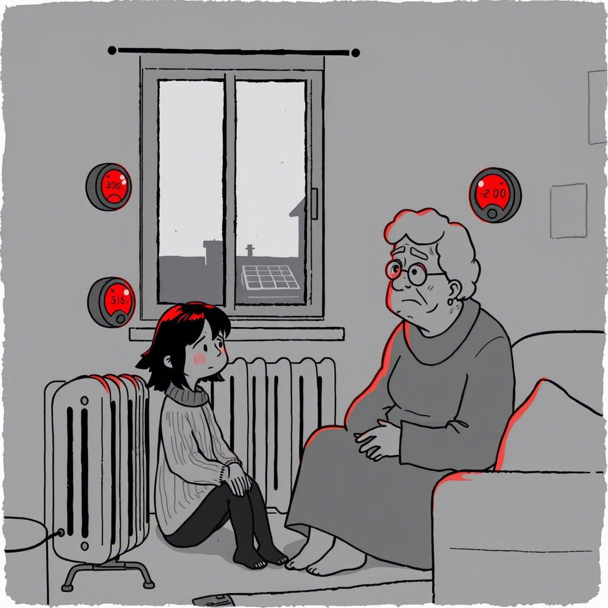
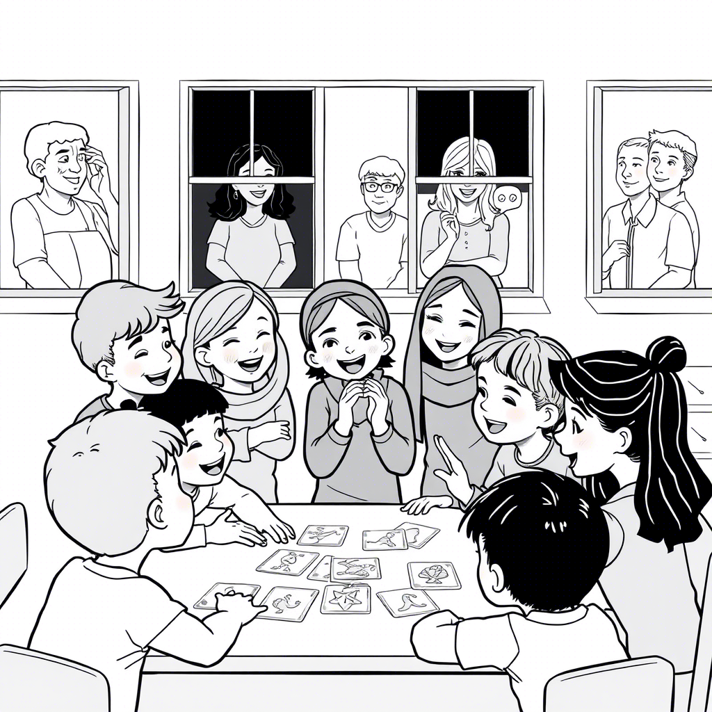
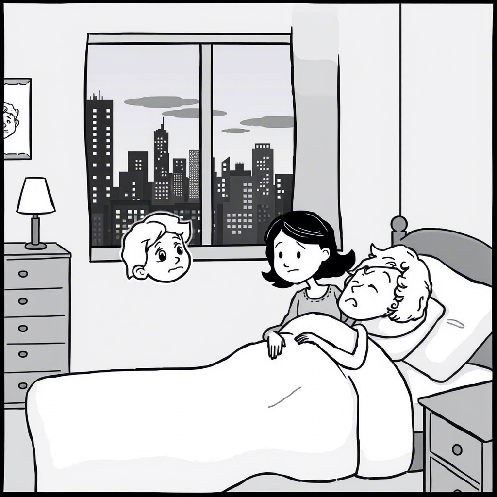

+ [github.com](http://github.com)
+ [1 # Deja-vu](http://github.com/1)
+ [md2pdf <style>](http://github.com/md2pdf)
+ [1 ## Spis treści](http://github.com/1)
+ [1 # Prolog: Pierwsze wspomnienie (2027-2029)](http://github.com/1)
+ [1 ](http://github.com/1)
+ [1 ](http://github.com/1)
+ [1 ](http://github.com/1)
+ [1 ](http://github.com/1)
+ [1 ](http://github.com/1)
+ [1 ](http://github.com/1)
+ [1 ](http://github.com/1)
+ [1 ](http://github.com/1)
+ [1 ](http://github.com/1)
+ [1 ](http://github.com/1)
+ [1 ](http://github.com/1)
+ [1 # Epilog: Nowe początki (2045)](http://github.com/1)
+ [1 # Posłowie](http://github.com/1)
+ [1 # O Autorze](http://github.com/1)
+ [#1 ](http://github.com/#1)
