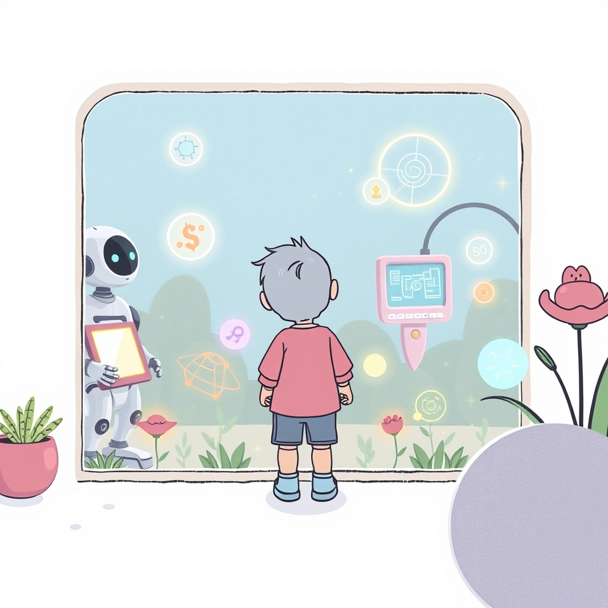
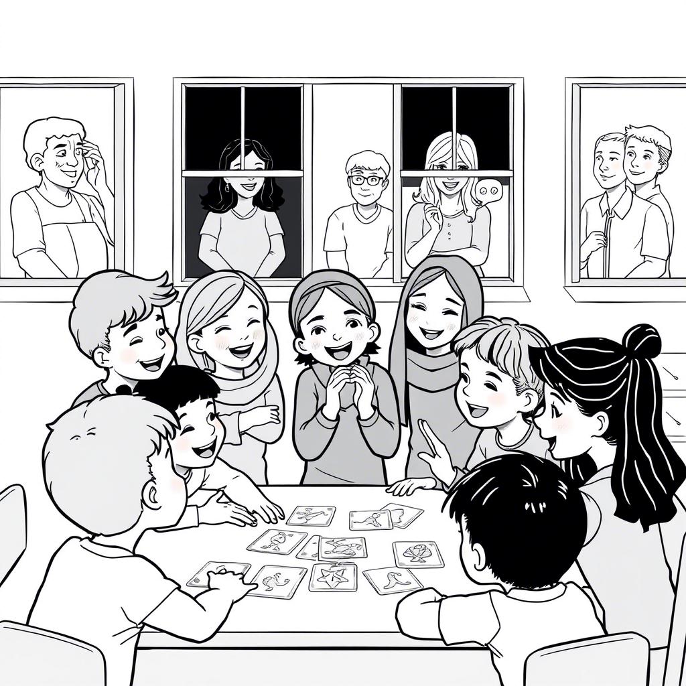
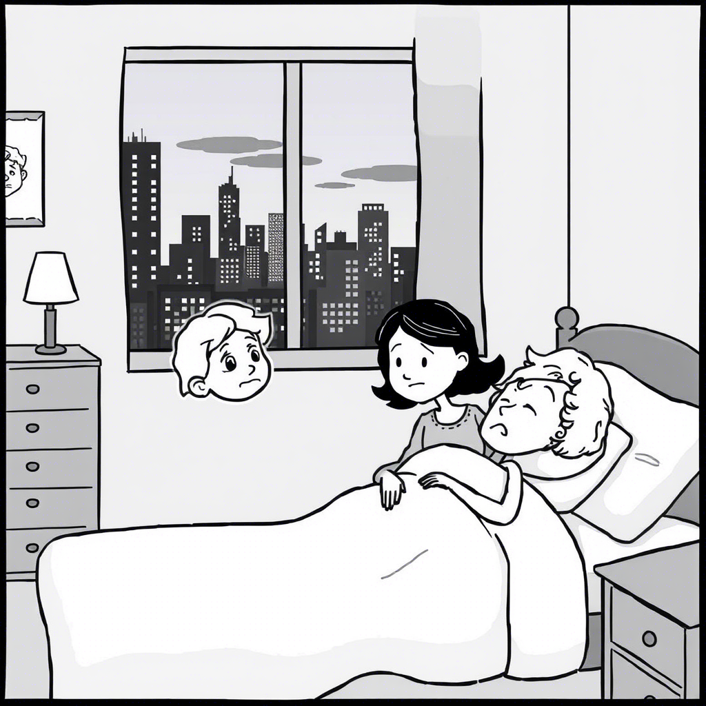
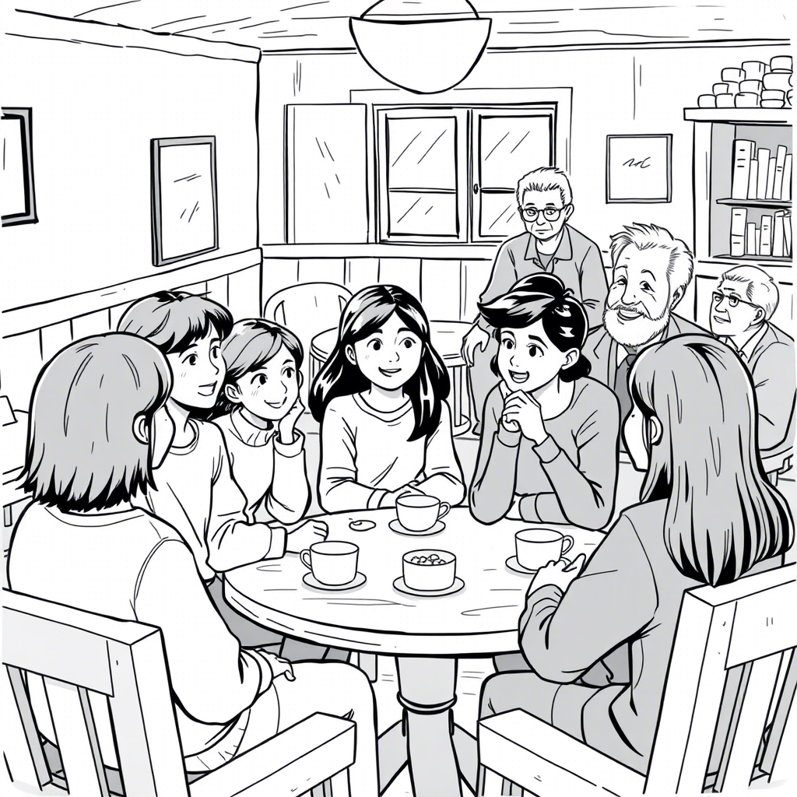

+ [/home/tom/github/tom-sapletta-com/deja-vu](file:///home/tom/github/tom-sapletta-com/deja-vu/)
+ [1 # Deja-vu](file:///home/tom/github/tom-sapletta-com/deja-vu/1/index.html)
+ [md2pdf <style>](file:///home/tom/github/tom-sapletta-com/deja-vu/md2pdf/index.html)
+ [1 ## Spis treści](file:///home/tom/github/tom-sapletta-com/deja-vu/1/index.html)
+ [1 # Prolog: Pierwsze wspomnienie (2027-2029)](file:///home/tom/github/tom-sapletta-com/deja-vu/1/index.html)
+ [1 ](file:///home/tom/github/tom-sapletta-com/deja-vu/1/index.html)
+ [1 ](file:///home/tom/github/tom-sapletta-com/deja-vu/1/index.html)
+ [1 ](file:///home/tom/github/tom-sapletta-com/deja-vu/1/index.html)
+ [1 ](file:///home/tom/github/tom-sapletta-com/deja-vu/1/index.html)
+ [1 ](file:///home/tom/github/tom-sapletta-com/deja-vu/1/index.html)
+ [1 ](file:///home/tom/github/tom-sapletta-com/deja-vu/1/index.html)
+ [1 ](file:///home/tom/github/tom-sapletta-com/deja-vu/1/index.html)
+ [1 ](file:///home/tom/github/tom-sapletta-com/deja-vu/1/index.html)
+ [1 ](file:///home/tom/github/tom-sapletta-com/deja-vu/1/index.html)
+ [1 ](file:///home/tom/github/tom-sapletta-com/deja-vu/1/index.html)
+ [1 ](file:///home/tom/github/tom-sapletta-com/deja-vu/1/index.html)
+ [1 # Epilog: Nowe początki (2045)](file:///home/tom/github/tom-sapletta-com/deja-vu/1/index.html)
+ [1 # Posłowie](file:///home/tom/github/tom-sapletta-com/deja-vu/1/index.html)
+ [1 # O Autorze](file:///home/tom/github/tom-sapletta-com/deja-vu/1/index.html)
+ [#1 ](file:///home/tom/github/tom-sapletta-com/deja-vu/#1/index.html)
