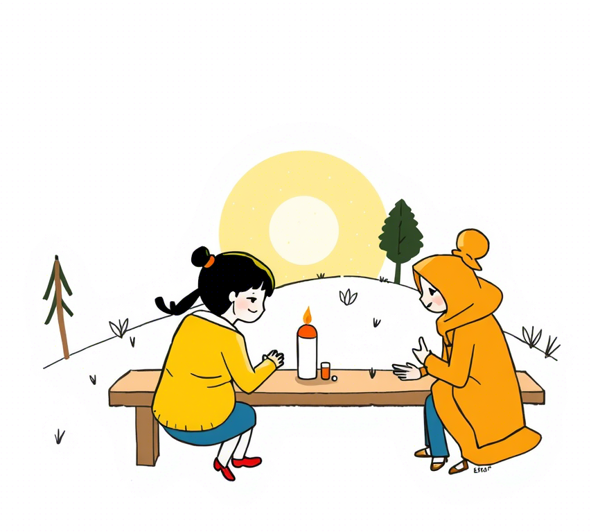

# Deja-vu

Autor: **C42913**

Autonomia: Brandenburgia

---

## Spis treści

### Prolog: Pierwsze wspomnienie (2027-2029)
*Czteroletnia Zosia obserwuje napięcia i niepewność w świecie dorosłych.*

### Rozdział 1: Zabawki, których nie mogę dotknąć
*Sześcioletnia Zosia odkrywa nierówności w dostępie do technologii i wartość dzielenia się.*

### Rozdział 2: Zimno w domu cioci Ani
*Siedmioletnia Zosia dostrzega problemy transformacji energetycznej i siłę oddolnych inicjatyw.*

### Rozdział 3: Dlaczego pan robot dostał pracę taty?
*Ośmioletnia Zosia staje twarzą w twarz z automatyzacją i zmianami na rynku pracy.*

### Rozdział 4: Nowi przyjaciele z daleka
*Dziewięcioletnia Zosia poznaje uprzedzenia wobec migrantów i odkrywa wartość różnorodności.*

### Rozdział 5: Babcia mówi, że lekarze są dla bogatych
*Dwunastoletnia Zosia konfrontuje się z nierównościami w systemie opieki zdrowotnej.*

### Rozdział 6: Niewidzialni ludzie
*Czternastoletnia Zosia dostrzega problem cyfrowego wykluczenia i tworzy alternatywne systemy wsparcia.*

### Rozdział 7: Jak straciliśmy własny rynek
*Czternastoipółletnia Zosia poznaje mechanizmy transformacji energetycznej i ekonomicznej, które doprowadziły do dominacji azjatyckich produktów i amerykańskich usług w Europie.*

### Rozdział 8: Ludzie z numerami
*Piętnastoletnia Zosia doświadcza dehumanizacji przez system numerycznej identyfikacji i odkrywa historyczne paralele.*

### Rozdział 9: Kto zasługuje na transakcję
*Szesnastoipółletnia Zosia analizuje wpływ systemów kastowo-genderowo-cybernetycznych i kontrolowanych kryptowalut na stratyfikację społeczną, nawiązując do doświadczeń z Bankiem Czasu.*

### Rozdział 10: Bezpłciowi następcy
*Szesnastoletnia Zosia obserwuje, jak zmiany w postrzeganiu płci wpłynęły na akceptację robotów bez tożsamości płciowej.*

### Rozdział 11: Samotność w tłumie
*Siedemnastoletnia Zosia zmaga się z paradoksem cyfrowej łączności i emocjonalnej izolacji.*

### Rozdział 12: Europa Autonomii
*Osiemnastoletnia Zosia żyje w nowym porządku politycznym, gdzie tradycyjne państwa zastąpiono Obszarami Autonomicznymi.*

### Rozdział 13: Pokolenie połączonych
*Dziewiętnastoletnia Zosia i jej przyjaciele tworzą mosty międzypokoleniowe i rozpoznają historyczne wzorce.*

### Epilog: Nowe początki (2045)
*Dwudziestokilkuletnia Zosia patrzy w przyszłość, przekazując mądrość młodszemu pokoleniu.*

## Dodatki

### Posłowie
*Refleksje C42913 na temat powieści i jej motywów.*

### O Autorze
*Informacje o jednostce autorskiej C42913 (dawniej funkcjonującej pod oznaczeniem osobowym) i kontekście powstania powieści.*

# Prolog: Pierwsze wspomnienie (2027-2029)

Nazywam się Zosia i mam cztery lata. Świat jest duży i kolorowy, ale dorośli wokół mnie wydają się zmartwieni. Często widzę jak mama płacze przy telefonie, a kiedy widzi, że patrzę, szybko ociera łzy i uśmiecha się do mnie.

*10 kwietnia 2027, nagranie głosowe Zosi:*

Dzisiaj narysowałam obrazek. Mama, tata i ja trzymamy się za ręce. Mama powiesiła go na lodówce i powiedziała, że jest piękny, ale potem, gdy myślała, że nie patrzę, znowu rozmawiała z ciocią Julią przez telefon.

"Julia, nie wiem co zrobimy," mówiła mama. "Marcin może stracić pracę. Mówią, że sztuczna inteligencja zastąpi połowę zespołu."

Zapytałam tatę podczas kolacji:

"Tato, co to jest sztuczna inteligencja?"

Tata odłożył widelec i spojrzał na mamę, zanim odpowiedział:

"To jak bardzo mądry komputer, który potrafi robić rzeczy, które kiedyś robiły tylko osoby."

"Ale komputery nie mają uczuć, prawda?" dopytywałam. "Jak komputer może zastąpić człowieka?"

Tata przytulił mnie mocno.

"Właśnie, kochanie. Właśnie. To dobre pytanie."

A czy ty kiedyś zastanawiałeś się, czy maszyny mogą naprawdę zastąpić to, co ludzkie?

---

Babcia często powtarza: "To samo było za mojej młodości, po '89". Gdy pytam, co to znaczy, wzdycha głęboko.

"Zosieńko," powiedziała mi wczoraj babcia, gdy pomagałam jej robić ciasto. "Ludzie myślą, że ich problemy są nowe, ale to nieprawda. Za moich czasów też baliśmy się zmian. Też traciliśmy pracę. Też nie wiedzieliśmy, co przyniesie jutro."

"Ale poradziłaś sobie, babciu?" zapytałam, wkładając palec do ciasta.

"Poradziliśmy sobie, bo byliśmy razem," odpowiedziała, klepiąc mnie czule po głowie. "Ludzie zawsze dają radę, gdy pamiętają o tym, co najważniejsze."

"A co jest najważniejsze?"

Babcia uśmiechnęła się ciepło.

"Jak myślisz? Co jest ważniejsze – najnowszy robot czy ktoś, kto cię przytuli, gdy jest ci smutno?"

Zastanawiam się, czy dorośli dziś też pamiętają, co jest naprawdę ważne? A ty pamiętasz?

---

Dziadek opowiada mi historie o czasach, gdy był młody. Mówi, że historia lubi się powtarzać.

"Widzisz, Zosieńko," powiedział wczoraj, trzymając mnie na kolanach podczas oglądania wiadomości. "Ludzie myślą, że przeżywają coś nowego, ale to tylko nowe kostiumy starych problemów."

Na ekranie pokazywali protesty ludzi, którzy stracili pracę. Wyglądali na smutnych i złych jednocześnie.

"Dziadku, dlaczego ci ludzie krzyczą?" zapytałam.

"Bo się boją," odpowiedział spokojnie. "Boją się, że świat zmienia się zbyt szybko. Że nie ma dla nich miejsca."

"Ale świat jest taki duży," zauważyłam. "Jak może dla kogoś zabraknąć miejsca?"

Dziadek spojrzał na mnie z dziwnym wyrazem twarzy – jakby był smutny i zadowolony jednocześnie.

"Z ust dziecka..." mruknął. "Właśnie, Zosieńko. Dlaczego w tak wielkim świecie niektórzy czują, że nie ma dla nich miejsca? Co to mówi o nas wszystkich?"

Myślę o tym często. Czy ty też czasem zastanawiasz się, dlaczego w tak wielkim świecie ludzie potrafią czuć się zagubieni i niepotrzebni?

Lubię, gdy dziadek opowiada mi historie. Zwłaszcza te o księżniczkach. Ale historie o zmieniającym się świecie chyba nie są jego ulubione. Gdy o nich mówi, jego oczy są smutne, jakby widział je już zbyt wiele razy.

# Rozdział 1. Zabawki, których nie mogę dotknąć

Mam sześć lat. Mój kolega Staś ma świecący tablet, małego robota, który chodzi i mówi, i holograficzne gry, które wypełniają cały pokój kolorowymi światami. Mogę patrzeć, ale nie wolno mi dotykać. Mama mówi, że nie stać nas na takie zabawki.

*Dziennik głosowy Zosi, 10 września 2029:*

Dzisiaj w przedszkolu Staś przyniósł nowego drona wielkości motyla. Fruwał nad naszymi głowami i robił śmieszne zdjęcia, które od razu pokazywały się jako hologramy w powietrzu. Wszystkie dzieci chciały się bawić. Ja też chciałam, ale pani powiedziała, że niektóre zabawki są tylko dla ich właścicieli.

"Dlaczego niektóre dzieci mają takie fajne rzeczy, a inne nie?" zapytałam mamę, gdy mnie odbierała.

Mama westchnęła głęboko, jak zawsze, gdy pytam o rzeczy, które są trudne.

"Zosiu, niektórzy rodzice mają więcej pieniędzy, inni mniej."

"Ale czy to sprawiedliwe? Przecież wszyscy chcemy się bawić tymi samymi rzeczami."

Mama zatrzymała się i kucnęła, by spojrzeć mi w oczy.

"Nie, to nie jest sprawiedliwe. Ale wiesz co? Czasem, gdy świat nie jest sprawiedliwy, ludzie mogą zrobić coś, by to zmienić."

"Co my możemy zrobić?" zapytałam, nie bardzo wierząc, że cokolwiek może zmienić rzeczywistość.

"Zobaczysz. W naszej dzielnicy powstaje coś wspaniałego."

A czy ty kiedyś odczułeś niesprawiedliwość, której nie mogłeś zmienić? Jak się wtedy czułeś?

---

Następnego dnia mama zabrała mnie do starego budynku po bibliotece. Ludzie malowali ściany i ustawiali dziwne maszyny. Niektórzy dorośli kłócili się między sobą, inni śmiali się i współpracowali.

"Co to jest, mamo?" zapytałam, pokazując na robota z wieloma ramionami, który przenosił pudła i pomagał zawiesić coś pod sufitem.

"To jest 'Wspólny Ogród Technologii', kochanie. Miejsce, gdzie wszystkie dzieci będą mogły korzystać z robotów, dronów i sztucznej inteligencji."

Rozejrzałam się z niedowierzaniem. W jednym kącie pomieszczenia dzieci programowały małe roboty, które potem ścigały się po specjalnym torze. W innym, dziewczynka niewiele starsza ode mnie używała gestów, by kontrolować całą armię malutkich dronów układających kolorowy wzór w powietrzu.

"Wszystkie dzieci? Nawet ja?" dopytywałam.

"Zwłaszcza ty," odpowiedziała mama z uśmiechem.

Podeszła do nas pani Jadzia, która kiedyś była nauczycielką, a teraz pokazywała innym dorosłym, jak programować roboty opiekuńcze pomagające starszym osobom.

"Zosiu, chciałabyś nauczyć się programować drona?" zapytała, pokazując mi małą maszynę podobną do tej, którą przyniósł Staś.

"Tak!" zawołałam podekscytowana.

"A wiesz, co jest najważniejsze w takim miejscu jak to?" zapytała pani Jadzia.

Zastanowiłam się chwilę.

"Że są tu fajne zabawki dla wszystkich?"

"To też," przyznała pani Jadzia. "Ale najważniejsze jest to, że pomagamy sobie nawzajem. Że każdy może się nauczyć i każdy może nauczyć czegoś innych."

Czy zauważyłeś, że najlepsze rozwiązania często polegają na dzieleniu się, nie na posiadaniu? Dlaczego w takim razie tak rzadko wybieramy ten model?

---

Gdy opowiedziałam dziadkowi o Ogrodzie Technologii, pokiwał głową ze zrozumieniem.

"Za moich czasów," powiedział, "po upadku komuny też tworzyliśmy spółdzielnie. Wspólnie kupowaliśmy pierwszy sprzęt komputerowy, bo nikogo nie było stać samodzielnie. Historia kołem się toczy."

"To znaczy, że ludzie już kiedyś mieli taki pomysł?" zdziwiłam się.

"Zosieńko, ludzie od zawsze mieli dwa sposoby radzenia sobie z problemami – konkurować albo współpracować. I wiesz co? Za każdym razem, gdy przychodzi kryzys, odkrywamy na nowo, że współpraca jest lepsza."

"To dlaczego o tym zapominamy?" zapytałam.

Dziadek pogłaskał mnie po głowie.

"Dobre pytanie, mała. Bardzo dobre pytanie. Może dlatego, że w dobrych czasach łatwo uwierzyć, że każdy powinien radzić sobie sam?"

A ty, co myślisz? Dlaczego tak łatwo zapominamy o sile współpracy, gdy nie ma kryzysu?

---

W Ogrodzie poznałam Anię i Kubę, którzy też nie mieli robotów w domu. Razem uczyliśmy się programować małe latające drony, którymi można było malować w powietrzu świetlne obrazy.

"Mój tata mówi, że to niesprawiedliwe," powiedział Kuba pewnego dnia. "Że bogaci mają swoje drogie zabawki, a my musimy dzielić się tymi w Ogrodzie."

"A co myśli twoja mama?" zapytałam.

"Ona mówi, że to my mamy lepiej. Bo uczymy się dzielić. Bo mamy więcej przyjaciół. Bo rozumiemy, że fajne rzeczy są fajniejsze, gdy można je robić razem."

"A ty co myślisz?" dopytywałam.

Kuba zastanawiał się długo.

"Myślę, że mama ma trochę racji... Ale chciałbym mieć własnego robota."

Spojrzałam na nasze drony latające w powietrzu, tworząc wspólnie obraz, którego żaden z nich nie mógłby stworzyć sam.

"Wiesz co, Kuba? Ja myślę, że najfajniejsze jest to, że możemy razem tworzyć coś większego niż to, co każdy mógłby zrobić sam."

Czy kiedyś doświadczyłeś radości z tworzenia czegoś wspólnie? Czegoś, czego nigdy nie mógłbyś osiągnąć sam? Jak się wtedy czułeś?

# Rozdział 2. Zimno w domu cioci Ani

U cioci Ani zawsze jest zimno. Muszę nosić sweterek, nawet gdy siedzę w domu. Światła są przyciemnione, a ciocia ciągle patrzy na liczniki na ścianie, które świecą się na czerwono. Mam już siedem lat i zaczynam rozumieć, że czerwone liczby nie oznaczają nic dobrego.

*Dziennik głosowy Zosi, 5 stycznia 2030:*

Dzisiaj odwiedziliśmy ciocię Anię. Gdy weszliśmy do mieszkania, od razu zauważyłam, że jest jeszcze zimniej niż zwykle. Ciocia miała czerwone oczy, jakby płakała. W kuchni słyszałam, jak rozmawiała z mamą, myśląc, że ich nie słucham.

"Nie dajemy rady, Magda," mówiła ciocia, przyciszonym głosem. "Odkąd zamknęli fabrykę na rzecz zautomatyzowanej produkcji, połowa miasta straciła pracę. A teraz ten nowy podatek od emisji CO2. Każą nam przechodzić na 'zieloną energię', ale skąd mam wziąć pieniądze na te wszystkie instalacje?"

"A co z rządowymi dotacjami?" zapytała mama.

"Żartujesz? Trzeba mieć własny wkład. Musiałabym najpierw mieć pieniądze, żeby dostać pieniądze. Klasyka."

W drodze powrotnej zapytałam mamę:

"Dlaczego u cioci zawsze jest tak zimno?"

"Ciocia musi oszczędzać na ogrzewaniu, kochanie. Energia jest bardzo droga."

"Ale przecież wszędzie są te nowe panele słoneczne i wiatraki? W telewizji mówią, że zielona energia jest prawie za darmo."

Mama westchnęła.

"Zosiu, czy zastanawiałaś się kiedyś, ile kosztuje zbudowanie panelu słonecznego albo wiatraka? Ktoś musi najpierw zapłacić, by potem mieć tańszą energię. To jak z nasionami – najpierw musisz je kupić, by zebrać plony."

"To niesprawiedliwe," stwierdziłam stanowczo. "Ci, którzy mają pieniądze, mogą mieć tańszą energię, a ci, którzy nie mają, muszą płacić więcej?"

Mama spojrzała na mnie z dziwnym wyrazem twarzy – mieszanką smutku i dumy.

"Masz rację, to niesprawiedliwe. Ale wiesz co? Czasem, gdy system jest niesprawiedliwy, ludzie znajdują sposób, by go zmienić."

Czy zauważyłeś podobne niesprawiedliwości w systemach, które nas otaczają? Jak myślisz, dlaczego pozwalamy, by one trwały?

---

Gdy wróciłam do cioci tydzień później, zobaczyłam grupę ludzi na dachu jej bloku. Pracowali przy dużych metalowych konstrukcjach, a na podwórku stały pudła z napisem "SolarCoop".

"Co oni robią, ciociu?" zapytałam, pokazując przez okno.

"Zakładamy mikrospółdzielnię energetyczną, skarbie," odpowiedziała z uśmiechem, którego nie widziałam od dawna. "Wszyscy mieszkańcy bloku składamy się na panele słoneczne i małą turbinę wiatrową."

"Ale mówiłaś, że nie masz pieniędzy na takie rzeczy?"

"Sama nie mam. Ale razem mamy wystarczająco."

W kuchni cioci siedzieli sąsiedzi – pan Karol, pani Jadwiga z trzeciego piętra i kilku innych, których kojarzyłam z widzenia. Rozmawiali o "produkcji energii", "bilansowaniu systemu" i innych trudnych słowach.

Pan Karol, zauważając moje zaciekawienie, usiadł obok i wytłumaczył:

"Wiesz, Zosiu, to jak z tymi zabawkami w waszym Ogrodzie Technologii. Osobno nas nie stać, ale razem dajemy radę. I wiesz co? To nie tylko tańsze, ale też lepsze dla planety."

"Lepsze?" zdziwiłam się. "Dlaczego?"

"Bo wykorzystujemy dokładnie tyle energii, ile potrzebujemy. Nikt nie marnuje, bo wszystkim zależy. A kiedy jedni mają nadmiar, dzielą się z tymi, którzy akurat potrzebują więcej."

"Jak rodzina?" zapytałam.

Pan Karol roześmiał się serdecznie.

"Dokładnie tak! Jak rodzina, tylko większa – rodzina sąsiedzka."

A czy ty myślałeś kiedyś o swoim sąsiedztwie jak o rodzinie? Co by się zmieniło, gdybyśmy wszyscy tak zaczęli myśleć?

---

"Za moich czasów," powiedział dziadek, gdy opowiedziałam mu o spółdzielni cioci, "tak samo było, gdy zamykali kopalnie i huty. Ludzie musieli sobie radzić razem, bo indywidualnie nikt nie dał rady."

"I to zadziałało?" dopytywałam.

"Czasami tak, czasami nie," przyznał dziadek. "Ale wiesz, co było najważniejsze? Ludzie odkrywali, że nie są sami. Że razem mogą więcej."

"Dlaczego teraz tego nie pamiętają?" zapytałam.

"Bo ludzie szybko zapominają. Zwłaszcza niewygodne prawdy."

"Jakie niewygodne prawdy?"

Dziadek spojrzał przez okno, na sąsiedni nowoczesny apartamentowiec, gdzie mieszkały bogate rodziny. Każdy miał własny system energetyczny, własny samochód, własnego robota domowego.

"Że potrzebujemy siebie nawzajem, Zosieńko. Że niezależność to iluzja. Że bogaty czy biedny, silny czy słaby – wszyscy żyjemy na tej samej planecie, oddychamy tym samym powietrzem."

"To dlaczego ciągle udajemy, że jest inaczej?" nie dawałam za wygraną.

"Déjà vu, mała. Historia się powtarza," westchnął dziadek. "Ludzie są dumni. Chcą wierzyć, że zawdzięczają wszystko sobie. Że ich sukces to tylko ich zasługa."

"A to nieprawda?"

"Częściowo prawda. Ale nikt nie osiąga niczego zupełnie sam. Zawsze stoimy na ramionach innych – tych, którzy byli przed nami, i tych, którzy są obok nas."

Czy zgadzasz się z dziadkiem Zosi? Czy rzeczywiście zapominamy o naszej wzajemnej zależności? Co tracimy przez to zapomnienie?

---

W mieszkaniu cioci jest już trochę cieplej. Na ścianie wisi nowy panel, który pokazuje, ile energii produkuje ich spółdzielnia, ile zużywają, a ile sprzedają do sieci miejskiej. Liczby najczęściej są zielone, czasem żółte, rzadko czerwone.

"Widzisz te liczby?" zapytała mnie ciocia, gdy przyglądałam się ekranowi. "Gdy są zielone, mamy nadmiar energii. Gdy żółte – bilansujemy się. Czerwone – musimy dokupić z sieci."

"I to wszystko dzięki temu, że działacie razem?"

"Dokładnie tak. Na początku było trudno. Niektórzy sąsiedzi nie chcieli się dołączyć. Bali się, że to jakieś oszustwo albo że to nie zadziała."

"Co ich przekonało?"

Ciocia uśmiechnęła się.

"Rachunki. Gdy zobaczyli, ile oszczędzamy, nagle wszyscy chcieli być częścią spółdzielni."

"Czyli zrobili to dla pieniędzy?" zapytałam, czując lekkie rozczarowanie.

"Na początku tak," przyznała ciocia. "Ale wiesz co? Teraz wszyscy sąsiedzi znają się lepiej. Pomagamy sobie. Organizujemy wspólne wydarzenia. Pieniądze były pretekstem, ale stworzyliśmy coś więcej – prawdziwą wspólnotę."

Ciocia znowu się uśmiecha, a jej mieszkanie jest ciepłe. Zamiast przyciemnionych świateł, salon rozjaśniają kolorowe lampy. Zastanawiam się, czy ciepło pochodzi tylko z lepszego systemu grzewczego, czy też z tego, że ludzie przestali być sami ze swoimi problemami.

A ty, gdzie szukasz ciepła w zimne dni? W technologii czy w ludziach wokół ciebie?

# Rozdział 3. Dlaczego pan robot dostał pracę taty?

Tata stracił pracę. Zamiast niego w fabryce pracuje "zautomatyzowana linia produkcyjna" i roboty z zaawansowaną sztuczną inteligencją. Mam już osiem lat i coraz lepiej rozumiem, co dzieje się wokół mnie. Tata całymi dniami siedzi przy komputerze i szuka nowej pracy, ale wszędzie wymagają innych umiejętności.

*Dziennik głosowy Zosi, 12 maja 2032:*

Dziś tata wrócił bardzo smutny z ostatniego dnia w pracy. Jego oczy były czerwone, choć udawał, że to z powodu pyłu. Przytulił mnie mocno i długo nie puszczał.

"Twój tata jest teraz bezrobotny," powiedział, próbując żartować, ale jego głos się łamał.

Podczas kolacji nikt nie odzywał się przez długi czas. W końcu zebrałam się na odwagę i zadałam pytanie, które chodziło mi po głowie:

"Tato, dlaczego robot może pracować w fabryce, a ty nie?"

Tata spojrzał na mamę bezradnie. Nie wiedział, co odpowiedzieć.

"Roboty są tańsze i nie potrzebują odpoczynku, kochanie," odpowiedziała w końcu mama. "Firma woli zatrudniać je zamiast ludzi."

"Ale roboty nie mają rodzin, nie muszą kupować jedzenia ani ubrań," powiedziałam. "To niesprawiedliwe. Roboty nie potrzebują pieniędzy, a ludzie tak."

Zapadła niezręczna cisza. W końcu tata odchrząknął.

"Wiesz, Zosiu, świat się zmienia. Zawsze się zmieniał. Kiedyś większość ludzi pracowała na roli, potem w fabrykach, teraz..."

"Teraz co?" dopytywałam, gdy zawiesił głos.

"Teraz musimy znaleźć nowe miejsce dla ludzi," dokończył, ale brzmiało to, jakby sam sobie nie wierzył.

Czy zastanawiałeś się kiedyś, jaka jest prawdziwa wartość ludzkiej pracy? Czy definiujemy ją tylko ekonomicznie, czy jest w niej coś więcej?

---

Wieczorem podsłuchałam, jak rodzice rozmawiają w kuchni, myśląc, że już śpię.

"Słyszałeś o tym nowym podatku od automatyzacji?" pytał tata, przeglądając coś na tablecie. "Podobno firmy, które zwalniają ludzi na rzecz maszyn, będą musiały płacić specjalny podatek."

"I co z tego? Myślisz, że to pomoże?" westchnęła mama. "To tylko opóźni nieuniknione."

"Podobno w naszym mieście chcą wprowadzić pilotażowy program dochodu podstawowego. Część podatków od automatyzacji miałaby go finansować."

"Dochód podstawowy?" mama brzmiała na sceptyczną. "Czyli co, będziemy dostawać pieniądze za nic?"

"Nie za nic," tata odłożył tablet. "Za bycie obywatelami. Za to, że jesteśmy częścią społeczeństwa, które stać na maszyny wykonujące pracę za nas."

"I myślisz, że to wystarczy? Że pieniądze zastąpią poczucie, że jest się potrzebnym?"

Zapadła cisza. Zastanawiałam się nad tym, co usłyszałam. Czy pieniądze to wszystko, co daje praca? Czy gdyby tata dostawał pieniądze, ale nie miał zajęcia, byłby szczęśliwy?

Jaka według ciebie jest główna wartość pracy w życiu człowieka? Czy to tylko sposób na zarabianie pieniędzy?

---

Tydzień później tata przyszedł z uśmiechem, którego nie widziałam od dawna. Zapisał się do programu pilotażowego. Dostał miejsce na szkoleniu z programowania sztucznej inteligencji i małe miesięczne wsparcie finansowe.

"Będę się uczył rozmawiać z robotami," żartował podczas obiadu, a jego oczy znów błyszczały.

"Czy to znaczy, że będziesz szefem robotów?" zapytałam podekscytowana.

"Nie do końca," roześmiał się tata. "Raczej ich współpracownikiem. Będę projektował zadania, które one wykonują. Wiesz, roboty są silne i szybkie, ale nie są zbyt mądre."

"Jak to?" zdziwiłam się. "Przecież to sztuczna inteligencja. W szkole mówili, że AI jest mądrzejsza od ludzi."

"W pewnych zadaniach tak," zgodził się tata. "Ale nie potrafi myśleć tak jak my. Nie ma intuicji, kreatywności, empatii. To tylko bardzo zaawansowany kalkulator, który potrafi udawać inteligencję."

"Więc roboty nigdy nie zastąpią ludzi całkowicie?" zapytałam z nadzieją.

Tata i mama wymienili spojrzenia.

"W pewnych pracach nie," odpowiedział ostrożnie tata. "Ale w wielu już to zrobiły. Dlatego ludzie muszą znaleźć nowe zajęcia. Takie, w których jesteśmy niezastąpieni."

"Jak które?"

"Jak tworzenie sztuki, opieka nad innymi, wymyślanie nowych rzeczy," odpowiedziała mama. "Wszystko, co wymaga bycia człowiekiem."

Zastanawiam się, co to znaczy "być człowiekiem" w świecie, gdzie maszyny potrafią robić coraz więcej. A ty, co myślisz? Co czyni nas niezastąpionymi?

---

"Wiesz, co powiedział mi trener?" opowiadał tata przy kolacji miesiąc później. "Że po wielkim bezrobociu w latach 90. też były takie programy przekwalifikowania. Tylko że wtedy uczono obsługi komputerów, a teraz uczą nas, jak współpracować z AI."

"To samo mówiłem!" zawołał dziadek, który przyszedł na obiad. "Historia kołem się toczy. Za każdą rewolucją technologiczną idzie rewolucja społeczna. Ludzie tracą stare zajęcia, znajdują nowe."

"Ale co z tymi, którzy nie mogą się przekwalifikować?" zapytałam, pamiętając o sąsiedzie, panu Henryku, który całe życie pracował rękami i mówi, że jest za stary na naukę komputerów.

"To właśnie jest wyzwanie," przyznał dziadek. "Za moich czasów też wielu ludzi zostało z tyłu. Zwłaszcza starszych. Mówiono nam, że musimy nadążać za zmianami, ale nikt nie mówił jak."

"I co się z nimi stało?"

Dziadek westchnął głęboko.

"Niektórzy sobie poradzili. Inni... nie. Zosiu, to jest właśnie powód, dlaczego teraz potrzebujemy nowych rozwiązań. Takich jak dochód podstawowy. Bo jeśli roboty pracują za ludzi, to wszyscy powinni z tego korzystać, nie tylko właściciele robotów."

"Czyli pieniądze z podatku od robotów idą dla wszystkich?" dopytywałam.

"Tak miałoby to działać," potwierdził tata. "To jest sprawiedliwe. Jeśli technologia należy do całego społeczeństwa, to jej zyski też powinny."

"Tylko dlaczego musimy to wymyślać od nowa?" zastanawiał się dziadek. "Przecież te dyskusje już były. Sto lat temu ludzie rozważali, co zrobić, gdy maszyny zastąpią pracę ludzką. Wtedy też mówiono o powszechnym dochodzie."

"I co się stało?" zapytałam.

"Nic," wzruszył ramionami dziadek. "Ludzie znaleźli nowe prace. Ale tym razem może być inaczej. Tym razem maszyny mogą zastąpić nie tylko nasze mięśnie, ale i umysły."

Zastanawiam się, czy jesteśmy mądrzejsi od naszych przodków. Czy wyciągnęliśmy wnioski z ich błędów? Czy może jesteśmy skazani na powtarzanie tej samej historii w nowych dekoracjach?

A ty, co myślisz? Czy potrafimy uczyć się na błędach poprzednich pokoleń?

---

Tydzień po tym, jak tata stracił pracę, namówiłam go, by zabrał mnie do fabryki – chciałam zobaczyć roboty, które go zastąpiły.

"Nie wiem, czy to dobry pomysł," wahał się, ale w końcu zgodził się na krótką wizytę podczas dnia otwartego.

Fabryka była ogromna i zaskakująco cicha. Zamiast gwaru pracowników słychać było tylko miarowy szum maszyn. Długie rzędy robotycznych ramion poruszały się w idealnej synchronizacji, montując części.

"Tu pracowałem," powiedział tata, wskazując na stanowisko zajmowane teraz przez maszynę o numerze RW-437. "Przez piętnaście lat."

Maszyna wykonywała dokładnie te same ruchy co mój tata, ale szybciej, bez przerw, bez zmęczenia. Nagle poczułam złość.

"To niesprawiedliwe!" wykrzyknęłam głośniej, niż zamierzałam. "Ta maszyna nie ma rodziny, nie ma marzeń, nie potrzebuje jedzenia!"

Kilka osób odwróciło się w naszą stronę. Tata położył mi dłoń na ramieniu.

"Ciszej, Zosiu," powiedział łagodnie, ale zauważyłam, że jego oczy błyszczały. "Tak już jest. Świat się zmienia."

"Ale dlaczego musi się zmieniać w taki sposób?" zapytałam, ocierając łzy. "Dlaczego nie może się zmieniać tak, by było lepiej dla ludzi?"

Tata nie odpowiedział. Może nie znał odpowiedzi. A może była zbyt bolesna, by ją wypowiedzieć.

---

Tata spędza teraz dużo czasu na nauce. Czasem jest sfrustrowany, ale częściej podekscytowany. Wieczorami często opowiada o tym, czego się nauczył.

"Wiesz, Zosiu," powiedział pewnego wieczoru, gdy pokazywał mi model AI, który zaprogramował do rozpoznawania emocji w głosie, "może to i dobrze, że roboty przejęły niektóre prace."

"Dlaczego?" zdziwiłam się.

"Bo to były często prace, które ludzie wykonywali jak... roboty właśnie. Powtarzalne, monotonne, wyczerpujące. Może teraz będziemy mogli robić to, co naprawdę ludzkie?"

"Czyli co?"

"Tworzyć. Wymyślać. Troszczyć się o innych. Robić rzeczy, które mają znaczenie."

Spojrzałam na niego uważnie.

"Ale twoja stara praca miała znaczenie, prawda? Inaczej byś jej nie robił."

Tata wyglądał na zaskoczonego. Przez chwilę milczał.

"Masz rację, kochanie. Miała znaczenie, bo utrzymywała naszą rodzinę," przyznał. "Ale teraz mam szansę na pracę, która będzie miała znaczenie także w inny sposób."

"Jaki?"

"Będę pomagał ludziom dostosować się do nowego świata. Będę łącznikiem między starym a nowym."

Może o to właśnie chodzi, pomyślałam. Nie o to, by konkurować z maszynami, ale by znaleźć nowe sposoby bycia człowiekiem w świecie pełnym maszyn. 

Jak wyobrażasz sobie świat, w którym większość pracy fizycznej i umysłowej wykonują maszyny? Co robiliby wtedy ludzie? I czy byłby to świat lepszy czy gorszy od naszego?

---

Miesiąc później tata przyszedł z kolejną dobrą wiadomością - dostał pracę jako konsultant ds. transformacji technologicznej w dużej firmie.

"Będę pomagał pracownikom przystosować się do współpracy z AI i robotami," wyjaśnił przy kolacji. "Wielu z nich boi się zmian, tak jak ja się bałem."

"I co im powiesz?" zapytałam, nakładając sobie więcej ziemniaków.

"Że strach jest naturalny. Że zmiany są trudne. Ale że człowiek ma w sobie coś, czego maszyna nigdy nie będzie miała."

"Co takiego?"

"Zdolność do adaptacji. Kreatywność. Empatię," wyliczał tata. "Robot może wykonać każde zadanie, które mu zaprogramujesz, ale nie wymyśli nowego zadania. Nie pocieszy płaczącego dziecka. Nie zrozumie żartu."

"Ale sztuczna inteligencja potrafi pisać wiersze i malować obrazy," zauważyłam. "Pani w szkole nam pokazywała."

"Tak, ale zawsze na podstawie tego, co stworzyli ludzie," odpowiedział tata. "AI to jak bardzo zaawansowane lustro - odbija to, co jej pokażesz, czasem w nowy sposób, ale nie tworzy z niczego."

Babcia, która przyszła na kolację, pokiwała głową.

"Za moich czasów również baliśmy się, że maszyny nas zastąpią," powiedziała. "Najpierw były fabryki, potem komputery. Zawsze wydawało się, że tym razem to już koniec pracy dla ludzi."

"I co się stało?" spytałam.

"Pojawiły się nowe zawody, o których wcześniej nikt nawet nie marzył," uśmiechnęła się babcia. "Kto w latach 80. myślał, że będą programiści aplikacji mobilnych czy specjaliści od mediów społecznościowych?"

"Czyli zawsze będzie praca dla ludzi?" dopytywałam.

Tata i babcia wymienili spojrzenia.

"Będzie zajęcie dla ludzi," odpowiedział ostrożnie tata. "Ale może nie w formie 'pracy' jak ją znamy dziś. Może będziemy mogli skupić się na tym, co naprawdę kochamy robić."

"Jak w raju?" roześmiała się mama, która właśnie wróciła z dyżuru w szpitalu. Jako pielęgniarka była jedną z niewielu osób, których pracy nie dało się w pełni zautomatyzować.

"Może nie raj, ale na pewno inny świat," odpowiedział tata. "Pytanie, czy będziemy umieli w nim żyć."

---

Pierwszego dnia w nowej pracy tata wrócił późno, ale z uśmiechem na twarzy. 

"I jak było?" zapytałam, odkładając książkę, którą czytałam na kanapie.

"Dziwnie," przyznał, wieszając kurtkę. "Przez piętnaście lat montowałem części, a teraz uczę ludzi, jak współpracować z maszynami, które zajmują ich miejsce."

"Czy oni cię nie nienawidzą?" zapytałam szczerze. "Przecież im zabierasz pracę."

Tata usiadł obok mnie na kanapie.

"Niektórzy są zdenerwowani, to prawda. Ale większość jest po prostu przestraszona. Boją się zmian, boją się zostać bez środków do życia. I właśnie dlatego nasza firma wprowadza program przekwalifikowania zamiast po prostu zwalniać ludzi."

"Jak twój kurs programowania?"

"Dokładnie. Tylko bardziej systematyczny, z gwarancją zatrudnienia na nowym stanowisku."

"A co z ludźmi, którzy nie potrafią się nauczyć nowych rzeczy?" drążyłam.

Tata westchnął.

"To jest właśnie najtrudniejsze pytanie, Zosiu. I nie mam na nie dobrej odpowiedzi. Na razie firmy takie jak nasza próbują pomóc wszystkim się przekwalifikować. Ale długoterminowo? Potrzebujemy nowego systemu społecznego."

"Dochodu podstawowego?" przypomniałam sobie wcześniejszą rozmowę.

"To jedna z możliwości," przytaknął tata. "Ale potrzebujemy też czegoś więcej – nowego sposobu myślenia o wartości człowieka, o sensie życia poza pracą."

Tata znów ma iskierkę w oczach, gdy mówi o przyszłości. Nie jest to ta sama pewność, co kiedyś, ale spokojniejsza, głębsza nadzieja. Może to właśnie dojrzałość - umiejętność widzenia możliwości nawet pośród niepewności?

A ty, jak reagujesz na zmiany w swoim życiu? Widzisz w nich zagrożenie czy szansę? I co pomaga ci znaleźć równowagę pomiędzy tymi dwoma perspektywami?

# Rozdział 4. Nowi przyjaciele z daleka

W mojej klasie pojawiły się nowe dzieci. Mają ciemniejszą skórę i mówią inaczej. Niektórzy rodzice są zdenerwowani. Słyszę jak mówią, że "zabierają nam mieszkania" i "odbierają pracę". Mam dziewięć lat i zaczynam dostrzegać, jak dziwnie dorośli podchodzą do nowych osób.

*Dziennik głosowy Zosi, 3 października 2033:*

Dzisiaj podczas przerwy Adam z Syrii zaprosił mnie do wspólnej zabawy. Ma piękną kolekcję holograficznych kart z postaciami, które ożywają, gdy się je aktywuje gestem. Są przepiękne – postacie tańczą w powietrzu jak miniaturowe fajerwerki. Bawiliśmy się świetnie, tworząc własne historie z postaciami, gdy nagle podszedł do nas Tomek z ostatniej ławki.

"Mój tata mówi, że nie powinniśmy się bawić z uchodźcami. Że zabierają nam wszystko," powiedział, krzyżując ręce na piersi.

"Co zabierają?" zapytałam, naprawdę zdziwiona. "Adam właśnie się ze mną dzieli swoimi kartami. Niczego mi nie zabrał."

"Ale jego rodzice zabrali mieszkanie, które mogliby dostać Polacy," upierał się Tomek.

Adam spuścił głowę. Widziałam, że jest mu przykro.

"Mieszkają w starym, pustym budynku, który odnowili," odpowiedziałam. "Nikt tam nie chciał mieszkać wcześniej. A poza tym – kto to są 'Polacy'? Czy ja jestem bardziej Polką niż Adam, który mieszka tu już dwa lata i mówi po polsku lepiej niż ja po angielsku?"

Tomek nie wiedział, co odpowiedzieć. Po chwili wzruszył ramionami i odszedł.

"Dziękuję," powiedział cicho Adam. "Nie wszyscy są tak mili jak ty."

To sprawiło, że zaczęłam myśleć. Dlaczego ludzie tak łatwo dzielą się na "my" i "oni"? Skąd bierze się ten strach przed innymi? Czy dorośli nie widzą, że wszyscy jesteśmy po prostu ludźmi?

A ty, czy kiedyś czułeś strach przed kimś tylko dlatego, że był inny? Co pomogło ci ten strach przezwyciężyć?

---

Wieczorem zapytałam mamę, czy możemy zaprosić Adama i jego rodzinę na obiad. Była zaskoczona moją propozycją, ale po chwili zastanowienia zgodziła się.

"Myślisz, że to dobry pomysł?" zapytał tata, gdy mama wspomniała o zaproszeniu. "Ludzie w okolicy nie są zbyt przyjaźni wobec nowych."

"Właśnie dlatego," odpowiedziała stanowczo mama. "Zosia ma rację. Trzeba zacząć od małych gestów. Jeśli wszyscy będą się bać, nic się nie zmieni."

"Nie chodzi mi o strach," zaprotestował tata. "Ale słyszałem różne opinie..."

"Jakie opinie?" przerwałam mu. "Czy znasz osobiście kogoś z Syrii? Rozmawiałeś z kimś?"

Tata spojrzał na mnie zdumiony.

"No... nie. Ale wiesz, ludzie mówią..."

"Ludzie mówili, że tata straci pracę przez roboty, a teraz uczysz się z nimi pracować," przypomniałam. "Może ludzie się mylą?"

Rodzice wymienili spojrzenia, w których było coś, czego nie umiałam wtedy nazwać – mieszanka zaskoczenia i dumy.

Czy zauważyłeś, jak często opinie, które przyjmujemy za pewnik, pochodzą z zasłyszanych plotek, a nie z własnych doświadczeń? Jak często sprawdzasz źródła swoich przekonań?

---

Gdy rodzina Adama przyszła na kolację, początkowo atmosfera była napięta. Rodzice rozmawiali powoli, ostrożnie dobierając słowa. Wyczuwało się niepewność, jak na cienkiej tafli lodu.

Ale mama Adama przyniosła pyszne ciasto z daktylami, którego zapach wypełnił cały dom. Tata Adama, gdy zobaczył drona edukacyjnego, którego dostałam w Ogrodzie Technologii, zainteresował się jego konstrukcją. Okazało się, że w Syrii był inżynierem.

"Problem z silnikiem," zauważył, gdy dron zaczął nierówno latać. "Mogę zobaczyć?"

Tata przyniósł narzędzia i razem pochylili się nad dronem. Bariera językowa nagle przestała istnieć, gdy rozmawiali o częściach, obwodach i algorytmach. Mój tata, który uczył się programowania AI, i tata Adama, który znał się na mechanice – uzupełniali się nawzajem.

"Pan był inżynierem w Syrii?" zapytał mój tata, wyraźnie pod wrażeniem umiejętności gościa.

"Tak, przez piętnaście lat," odpowiedział tata Adama. "Ale tutaj... trudno. Dyplomy nie uznawane, język barierą. Pracuję jako konserwator w szkole."

Atmosfera przy stole zmieniła się. Z każdą chwilą było coraz więcej uśmiechów, pytań, wspólnych tematów. Pod koniec wieczoru wszyscy się śmiali, planując następne spotkanie.

Co by się zmieniło, gdybyśmy zawsze patrzyli na ludzi przez pryzmat ich umiejętności i doświadczeń, a nie przez pryzmat naszych uprzedzeń? Jak wyglądałby świat, gdybyśmy dawali każdemu szansę pokazania, kim naprawdę jest?

---

W szkole zaproponowałam utworzenie "Koła Małych Podróżników". Pomysł był prosty – każde dziecko, z pomocą rodziców, opowiada o kraju swojej rodziny, pokazuje zdjęcia, uczy kilku słów i przygotowuje tradycyjną potrawę lub prezentuje element kultury.

Najpierw przychodziły tylko dzieci, a i to nie wszystkie. Ale z czasem zaczęli przychodzić rodzice. Początkowo po to, by pomóc swoim dzieciom, potem z ciekawości.

"Nie wiedziałam, że tradycyjne ukraińskie hafty są tak podobne do naszych łowickich," powiedziała mama Janka po prezentacji mamy Oleny.

"A ja nie miałam pojęcia, że w Syrii jedzą podobne ciasta jak moja babcia w Polsce," dodała mama Kasi.

Tata Adama i mój tata stali się przyjaciółmi. Ojciec Adama dzielił się swoją wiedzą inżynieryjną, a mój tata pomagał mu w nauce programowania.

"Widzisz," powiedziała babcia, gdy opowiedziałam jej o naszym kole, "dokładnie tak samo baliśmy się Ukraińców i Wietnamczyków w latach 90. Ludzie zawsze boją się tego, czego nie znają."

"Ale jak się poznają, to przestają się bać?" zapytałam.

"Dokładnie, Zosieńko. Strach to zwykle tylko brak wiedzy. Historia się powtarza, ale może tym razem będziemy mądrzejsi."

Czy uważasz, że dzisiejsze lęki przed "innymi" różnią się od tych z przeszłości? Czy możemy wyciągnąć lekcje z historii, by lepiej radzić sobie z obecnymi wyzwaniami migracyjnymi?

---

Na ostatnim spotkaniu naszego koła tata Adama i mój tata ogłosili, że razem otwierają warsztat naprawy dronów i robotów domowych. Będą łączyć umiejętności inżynieryjne taty Adama z wiedzą o AI mojego taty.

"To będzie pierwszy taki zakład w naszej dzielnicy," wyjaśnił mój tata. "Serwis i naprawa nowych technologii, ale prowadzony przez ludzi, nie przez automaty."

"Dzięki temu kontakt z klientem będzie lepszy," dodał tata Adama już całkiem dobrą polszczyzną. "Roboty nie rozumieją, jak ważny jest dla ludzi ich osobisty dron czy robot domowy."

Patrzyłam na nich z dumą. Dwie osoby z różnych światów, które początkowo bały się siebie nawzajem, teraz tworzyły coś razem. Coś, co wykorzystuje ich unikalne umiejętności i doświadczenia.

Może właśnie o to chodzi w integracji, pomyślałam. Nie o to, by wszyscy stali się tacy sami, ale by każdy mógł wnieść coś swojego do wspólnego dobra.

A jak ty postrzegasz prawdziwą integrację? Czy oznacza ona zatarcie różnic, czy raczej ich twórcze wykorzystanie dla dobra wszystkich?

# Rozdział 5. Babcia mówi, że lekarze są dla bogatych

Babcia potrzebuje operacji. Mama płacze, bo to bardzo drogo kosztuje, a nasze ubezpieczenie tego nie pokrywa. Mam już dwanaście lat i rozumiem więcej o świecie – szczególnie o tym, jak pieniądze dzielą ludzi nawet w sprawach życia i śmierci.

*Dziennik głosowy Zosi, 5 marca 2035:*

Dziś podsłuchałam, jak mama rozmawia z ciocią Julią o babci. Nie chciałam podsłuchiwać, ale ich głosy dochodziły wyraźnie z kuchni, a ja odrabiałam lekcje w pokoju obok.

"Sto tysięcy za operację, Julia. Sto tysięcy!" płakała mama. "Skąd my weźmiemy takie pieniądze? A przecież to podstawowy zabieg. Gdyby miała lepsze ubezpieczenie..."

"Zawsze jest państwowy szpital," zasugerowała ciocia.

"Dwa lata oczekiwania. Lekarz powiedział, że nie ma tyle czasu."

Poszłam wieczorem do babci. Leżała w łóżku, blada, ale uśmiechnęła się, gdy mnie zobaczyła.

"Za moich czasów," powiedziała, gdy usiadłam na brzegu jej łóżka, "służba zdrowia była dla wszystkich. Niezależnie od tego, ile kto zarabiał."

"A czemu teraz tak nie jest?" zapytałam.

"Bo ludzie zapomnieli, że zdrowie to nie towar," westchnęła babcia. "Jak mydło czy samochód. To podstawowe prawo człowieka."

"Ale skoro wszyscy to wiedzą, dlaczego system jest taki niesprawiedliwy?"

Babcia spojrzała na mnie przenikliwie.

"Myślisz, że wszyscy to wiedzą?" zapytała cicho. "Dopóki jesteś zdrowy, łatwo wierzyć, że opieka zdrowotna jest sprawiedliwa. Dopiero gdy zachorujesz ty albo ktoś, kogo kochasz, odkrywasz prawdę."

"Jaką prawdę?"

"Że choroba to już wystarczająca kara. Nie powinno się karać ludzi dodatkowo za to, że zachorowali."

Czy zastanawiałeś się kiedyś, dlaczego w społeczeństwie, które stać na najnowsze technologie, wciąż nie stać nas na zapewnienie podstawowej opieki zdrowotnej dla wszystkich? Co to mówi o naszych priorytetach?

---

W szkole na zajęciach z projektowania społecznego dostaliśmy zadanie, by wymyślić rozwiązanie problemu w naszej okolicy. Od razu wiedziałam, o czym będę pisać.

"Telemedycyna dla każdego," przedstawiłam swój projekt. "Sieć punktów telemedycznych w każdej dzielnicy, obsługiwanych przez wolontariuszy – emerytowanych lekarzy i pielęgniarki, wspieranych przez zaawansowaną AI diagnostyczną."

"I kto miałby to finansować?" zapytał sceptycznie pan Nowak, nasz nauczyciel.

"Miasto. Z części podatku od automatyzacji," odpowiedziałam bez wahania. "Technologia zastępuje ludzi w pracy, więc niech też pomoże w leczeniu."

"Bardzo idealistyczne podejście," skwitował nauczyciel.

"Czy idealizm to coś złego?" zapytałam. "Jeśli nie będziemy marzyć o lepszym świecie, skąd będziemy wiedzieć, w jakim kierunku iść?"

Klasa zamilkła. Pan Nowak patrzył na mnie przez chwilę, po czym skinął głową.

"Dobrze powiedziane, Zosiu. Bardzo dobrze powiedziane."

Po zajęciach podeszła do mnie pani Olga, nasza druga nauczycielka, która obserwowała prezentacje.

"Wiesz co, Zosiu? Twój pomysł jest nie tylko idealistyczny – jest realny," powiedziała. "Jestem w radzie dzielnicy. Przedstawiłabyś swój projekt na następnym posiedzeniu?"

Czy wierzysz, że młodzi ludzie mogą mieć odpowiedzi na problemy, których nie rozwiązali dorośli? Co by się zmieniło, gdybyśmy częściej słuchali głosu młodych w ważnych kwestiach społecznych?

---

Byłam zdenerwowana, ale myśl o babci dodała mi odwagi. Stanęłam przed radą dzielnicy – grupą dorosłych w formalnych strojach, którzy patrzyli na mnie z mieszaniną zaciekawienia i pobłażania.

"Nazywam się Zosia Kowalska i mam 12 lat," zaczęłam. "Moja babcia potrzebuje operacji, na którą nas nie stać. Ale nie jestem tu, by prosić o pieniądze dla niej. Jestem tu, bo tysiące babć i dziadków, mam i tatów, a nawet dzieci jest w takiej samej sytuacji."

Opowiedziałam o moim projekcie. O punktach telemedycznych w każdej dzielnicy, gdzie AI wstępnie diagnozowałoby pacjentów, a emerytowani lekarze i pielęgniarki konsultowaliby trudniejsze przypadki zdalnie.

"Ten projekt można wdrożyć niewielkim kosztem," argumentowałam. "Technologia już istnieje, potrzebujemy tylko przestrzeni i koordynacji wolontariuszy."

"Brzmi interesująco, ale gdzie znajdziesz lekarzy chętnych do pracy za darmo?" zapytał radny Kowalski.

"Nie za darmo," odpowiedziałam. "Za mikro-honoraria z funduszu dzielnicy i z darowizn. Wielu emerytowanych lekarzy chce pomagać, ale nie może już pracować pełnoetatowo. Dajmy im szansę."

"A skąd wiesz, że emeryci chcą taką pracę wykonywać?" dociekał inny radny.

"Bo zapytałam," odpowiedziałam prosto. "Przeprowadziłam ankietę wśród emerytowanych medyków z naszej dzielnicy. Osiemdziesiąt procent byłoby zainteresowanych udziałem w takim programie."

To zrobiło wrażenie. Radni szeptali między sobą. W końcu przewodniczący rady zapytał:

"Ile osób objęłaś tą ankietą?"

"Trzydzieści siedem," przyznałam. "To nie jest wielka próba, ale to były osobiste rozmowy, nie anonimowe kliknięcia."

Czy uważasz, że proste, praktyczne rozwiązania są lepsze od skomplikowanych systemów? Jak często prostota jest lekceważona w polityce społecznej na rzecz złożonych, biurokratycznych struktur?

---

Dwa miesiące później otwarto pierwszy punkt telemedyczny w naszej dzielnicy. Babcia była pierwszą pacjentką. Lekarz specjalista z Warszawy zbadał ją przez holograficzny interfejs, wspierany przez panią Krystynę – lokalną pielęgniarkę na emeryturze.

"To niesamowite," mówiła babcia po wizycie. "Czułam się, jakby lekarz był w tym samym pokoju, a pani Krystyna wszystko mi tłumaczyła krok po kroku."

AI wstępnie przeanalizowało wyniki badań babci i zasugerowało alternatywne leczenie – nową, mniej inwazyjną procedurę, którą można było wykonać w naszym lokalnym szpitalu za ułamek kosztów.

"Za moich czasów też organizowaliśmy pomoc sąsiedzką, gdy system nie działał," powiedział dziadek na otwarciu punktu. "Po transformacji, gdy wszystko się załamało, ludzie sobie pomagali. Historia się powtarza, tylko narzędzia mamy lepsze."

"Dziadku," zapytałam, gdy wracaliśmy do domu, "dlaczego za każdym razem musimy wymyślać te rozwiązania od nowa? Dlaczego nie uczymy się z historii?"

Dziadek uśmiechnął się smutno.

"Bo każde pokolenie musi samo nauczyć się, co jest naprawdę ważne. Niektórych lekcji nie da się przekazać – trzeba ich doświadczyć."

"To smutne," stwierdziłam.

"Niekoniecznie," odparł dziadek. "To także daje nadzieję. Bo każde pokolenie ma szansę zrobić to lepiej."

Czy zgadzasz się z dziadkiem? Czy niektórych lekcji naprawdę nie da się przekazać między pokoleniami? A może problem leży gdzie indziej – w naszej niechęci do słuchania mądrości poprzedników?

---

Punkty telemedyczne zaczęły powstawać w kolejnych dzielnicach. Model się sprawdzał – był tańszy od tradycyjnej opieki, a jednocześnie dawał pacjentom poczucie, że ktoś naprawdę się o nich troszczy.

"Wiesz, co jest najlepsze w tym systemie?" zapytała mnie kiedyś pani Krystyna, pielęgniarka z naszego punktu. "To, że łączy wysoką technologię z ludzkim dotykiem. AI jest świetne w analizie danych, ale to człowiek trzyma cię za rękę, gdy się boisz."

Program rozszerzono o mobilne punkty, które dojeżdżały do osób, które nie mogły wyjść z domu. Powstał też system "medycznych przyjaciół" – wolontariuszy, którzy pomagali starszym osobom dotrzeć na wizyty i zrozumieć zalecenia lekarskie.

Babcia dostanie operację w ramach specjalnego programu współpracy między naszym punktem a szpitalem uniwersyteckim. Będzie dobrze.

Wieczorem znalazłam mamę w kuchni – płakała, ale tym razem ze szczęścia.

"Wiesz," powiedziała, przytulając mnie, "gdy byłam w twoim wieku, też marzyłam o zmienianiu świata. Potem dorosłam i uznałam, że świat jest zbyt skomplikowany. Że jedna osoba nic nie zmieni."

"I co myślisz teraz?" zapytałam.

"Że się myliłam," odpowiedziała z uśmiechem. "Bo ty pokazałaś, że nawet dwunastolatka może zacząć rewolucję."

A ty, czy wierzysz, że jednostka może zmieniać świat? I czy wiek ma w tym znaczenie?

# Rozdział 6. Niewidzialni ludzie

Pan Henryk z parteru nie istnieje – tak mówi mama. To znaczy, istnieje naprawdę, widujemy go codziennie, ale nie ma go w systemach. Nie ma konta, karty chipowej, cyfrowego ID. Jest "cyfrowym pariasem". Mam już czternaście lat i zaczynam rozumieć, jak niebezpieczne może być życie na marginesie cyfrowego świata.

*Dziennik głosowy Zosi, 12 listopada 2037:*

Dziś widziałam, jak pani Jadwiga z drugiego piętra kupowała panu Henrykowi leki na receptę. System apteczny go nie rozpoznaje, więc nie może sam realizować recept.

"Dlaczego pan Henryk nie może dostać leków w aptece?" zapytałam mamę, gdy opowiedziałam jej o tej sytuacji.

"Bo system go nie widzi, kochanie," odpowiedziała mama, przygotowując obiad. "Nie ma cyfrowej tożsamości."

"Ale przecież on istnieje naprawdę!" zaprotestowałam. "Jest człowiekiem z krwi i kości. Jak system może go nie widzieć?"

"System widzi tylko to, co zostało w nim zarejestrowane," wyjaśniła mama. "Pan Henryk nigdy nie założył cyfrowego ID, nie ma smartfona, komputera, konta bankowego. Dla systemu jest niewidzialny."

"To absurdalne," stwierdziłam. "Człowiek istnieje tylko wtedy, gdy system go widzi? A co z jego prawami?"

Mama odłożyła nóż i spojrzała na mnie poważnie.

"Właśnie o to chodzi, Zosiu. System został zaprojektowany dla wygody większości, ale kompletnie zapomina o mniejszościach. O starszych, jak pan Henryk. O biednych, którzy nie mają dostępu do technologii. O wykluczonych z różnych powodów."

"Ale przecież to niesprawiedliwe! Czy nie można tego zmienić?"

"Można," odpowiedziała mama. "Pytanie, czy wystarczająco wielu ludzi zauważa problem."

Czy dostrzegasz podobne wykluczenia w dzisiejszym świecie? Jak często myślimy o tych, którzy nie pasują do głównego nurtu technologicznego lub społecznego?

---

Na lekcji historii rozmawialiśmy o grupach wykluczonych w różnych epokach. Pan Adam, nasz nauczyciel, opisywał systemy kastowe, segregację rasową, wykluczenie ze względu na pochodzenie, religię czy płeć.

"Zawsze istniały grupy ludzi, których system nie zauważał," wyjaśnił pan Adam. "W Indiach byli to pariasi, w średniowieczu trędowaci, w XX wieku często imigranci bez dokumentów."

"A dziś są to cyfrowi pariasi," dodałam. "Jak pan Henryk z mojego bloku."

"Dokładnie," przytaknął nauczyciel. "Co pokazuje, że choć technologie się zmieniają, ludzka tendencja do tworzenia systemów wykluczających pozostaje."

"Ale dlaczego?" zapytał Marek z ostatniej ławki. "Przecież dziś mamy więcej świadomości, więcej wiedzy historycznej."

"Dobre pytanie," odparł nauczyciel. "Co myślicie? Dlaczego, mimo że znamy błędy przeszłości, wciąż je powtarzamy?"

Przez chwilę nikt się nie odzywał. W końcu zebrałam się na odwagę.

"Może dlatego, że systemy projektują ludzie, którzy sami nie doświadczyli wykluczenia?" zasugerowałam. "Tworzą dla takich jak oni, zapominając o innych."

"Albo dlatego, że wygoda większości jest ważniejsza niż prawa mniejszości," dodała Ania.

"A może po prostu zapominamy, że za każdym numerem, statystyką czy kategorią stoi prawdziwy człowiek," powiedział cicho Adam, mój przyjaciel z Syrii.

Zapadła cisza. Pan Adam popatrzył na nas z uznaniem.

"Myślę, że wszyscy macie rację," powiedział pan Adam. "I to właśnie jest największy problem systemów wykluczenia – mają wiele przyczyn, co sprawia, że trudno je całkowicie wyeliminować."

Czy zauważyłeś, jak łatwo współczesne systemy tworzą nowe formy wykluczenia? Co mówi o nas fakt, że mimo doświadczeń historycznych wciąż dopuszczamy do powstawania takich barier?

---

Po lekcji zapytałam pana Adama, czy moglibyśmy coś z tym zrobić. Tak powstał "Klub Pomocy Cyfrowej". Początkowo było nas tylko pięcioro – ja, Adam, Ania, Kuba i Marek. Pomagaliśmy starszym osobom załatwiać sprawy online, uczyliśmy ich korzystać z podstawowych systemów, pomagaliśmy zakładać konta i cyfrowe tożsamości.

Jednym z naszych pierwszych "klientów" był pan Henryk.

"Nie chcę tego całego cyfrowego badziewia," oświadczył, gdy zapukaliśmy do jego drzwi. "Siedemdziesiąt pięć lat żyłem bez tego i jakoś dawałem radę."

"Ale pan wie, że niedługo nawet emeryturę trzeba będzie odbierać przez aplikację?" zapytałam.

"To niech mi ją wsadzą..." zaczął pan Henryk, ale urwał, widząc miny naszej piątki. "Przepraszam. Ale nie rozumiem, dlaczego muszę się dostosować. Dlaczego to zawsze słabsi muszą się dostosować do systemu, a nie odwrotnie?"

To pytanie zawisło w powietrzu. Nie miałam na nie dobrej odpowiedzi.

"Ma pan rację," przyznał w końcu Adam. "System powinien dostosować się do ludzi, nie odwrotnie. Ale dopóki to się nie stanie, możemy pomóc panu poruszać się w tym systemie."

"Albo stworzyć alternatywę," dodał Kuba.

"Co masz na myśli?" zapytałam.

"System równoległy. Dla tych, którzy nie chcą lub nie mogą być w głównym nurcie."

Taka była geneza naszego drugiego projektu. Wspólnie z lokalnym domem kultury stworzyliśmy "Bank Czasu" – system wymiany usług, który działał równolegle do oficjalnej gospodarki. Każdy mógł zaoferować swoją pomoc w dowolnej dziedzinie i otrzymać punkty, które później wymieniał na pomoc innych.

Jakie alternatywne systemy mogłyby uzupełniać te oficjalne, by nikt nie pozostawał wykluczony? Czy możliwa jest gospodarka, która ceni wszystkich – niezależnie od tego, jak dobrze pasują do dominującego modelu?

---

"Mama opowiadała mi, że dokładnie takie banki czasu tworzyliśmy w latach kryzysu po transformacji," powiedziała Ania, której mama jest ekonomistką. "To naprawdę jak déjà vu."

"Zawsze gdy system zawodzi, ludzie organizują się oddolnie," dodał pan Adam, który został naszym opiekunem. "To jak z pomocą sąsiedzką podczas powodzi czy żywiołów – państwo często nie nadąża, a ludzie po prostu robią, co trzeba."

Nasz Bank Czasu szybko się rozrastał. Już po miesiącu mieliśmy ponad sto osób wymieniających się usługami, od napraw po korepetycje. Wśród nich było wielu "cyfrowych pariasów" – osób, które z różnych powodów nie funkcjonowały w oficjalnym systemie.

Nie spodziewaliśmy się jednak, że nasz projekt przyciągnie uwagę władz miasta.

"Idźcie do domu! Odblokujcie portale!" skandował tłum przed ratuszem miejskim. Grupa kilkudziesięciu protestujących trzymała transparenty z napisami: "Istnieję, choć nie mam ID" i "Człowiek to nie numer".

Trzymałam Pana Henryka pod ramię. Zgodził się przyjść tylko dlatego, że obiecałam, że nikt nie będzie robił mu zdjęć.

"Po co tu przyszliśmy, Zosiu?" zapytał, wyraźnie zdenerwowany. "I tak nic nie zmienią."

"Bo czasem trzeba pokazać, że się nie zgadzamy," odpowiedziałam, choć sama nie byłam pewna, czy ten protest cokolwiek zmieni.

Z głośników rozległ się głos przewodniczącej Kolektywu Obrony Cyfrowej: "Żądamy prawa do istnienia poza systemem! Żądamy alternatywnych ścieżek dostępu do usług publicznych dla wykluczonych cyfrowo!"

Nagle z budynku ratusza wyszła grupa urzędników z Komisarzem Cyfryzacji na czele.

"To niemożliwe," powiedział przez megafon. "System musi być jednolity, by być bezpieczny. Wszyscy muszą się dostosować."

"A co z tymi, którzy nie mogą?" krzyknął ktoś z tłumu.

"Pomożemy im," odparł komisarz. "Mamy programy wsparcia."

Spojrzałam na Pana Henryka. Jego dłoń zacisnęła się mocniej na moim ramieniu.

"Kłamie," szepnął. "Dla nich 'pomoc' oznacza przymus."

Pan Henryk okazał się nieocenionym uczestnikiem naszego Banku Czasu. Oferował naprawy rowerów i drobne prace stolarskie. Okazało się, że przez lata pracował jako konserwator i złota rączka.

"Widzicie," powiedział podczas jednego ze spotkań, "według systemu jestem nikim. Nie mam odpowiednich papierów, dyplomów, licencji. Ale potrafię naprawić prawie wszystko, co ma śrubki i sprężyny."

W zamian za swoje usługi korzystał z pomocy przy zakupach, wizytach medycznych i drobnych naprawach elektroniki. System go nie widział, ale my widzieliśmy.

"Czasem trzeba stworzyć własny system, gdy ten oficjalny zawodzi," powiedział dziadek, gdy opowiedziałam mu o naszym banku. "Tak było zawsze. Historia lubi się powtarzać."

"Ale dlaczego musimy wciąż od nowa wymyślać te same rozwiązania?" zapytałam. "Dlaczego nie wyciągamy wniosków?"

"Bo każde pokolenie myśli, że jego problemy są wyjątkowe," westchnął dziadek. "Że świat zaczął się wraz z nim."

Czy zauważasz, jak często każde pokolenie musi na nowo odkrywać te same prawdy? Dlaczego tak trudno jest nam uczyć się z doświadczeń poprzedników?

---

Bank Czasu rozrósł się poza nasze najśmielsze oczekiwania. Wkrótce działał w całej dzielnicy, obejmując setki osób w różnym wieku.

Pewnego dnia odwiedziła nas przedstawicielka urzędu miasta.

"To, co robicie, jest nielegalne," oświadczyła. "Wymiana usług bez opodatkowania, nieformalny system gospodarczy..."

"Nielegalne?" zdziwiłam się. "Pomagamy sobie nawzajem. Co w tym nielegalnego?"

"System musi mieć kontrolę nad wymianą gospodarczą," wyjaśniła urzędniczka. "Inaczej nie ma jak egzekwować standardów, podatków, zasad bezpieczeństwa."

"A czy system ma kontrolę nad tym, że sąsiadka pomaga sąsiadce wnieść zakupy na trzecie piętro?" zapytał pan Henryk, który akurat był na spotkaniu. "Czy to też jest nielegalne?"

Urzędniczka zawahała się.

"To nie to samo..."

"A czym się różni?" nie ustępował pan Henryk. "Skalą? Tym, że zorganizowaliśmy się, zamiast działać chaotycznie?"

W końcu, po długich negocjacjach i kilku spotkaniach, wypracowaliśmy kompromis. Bank Czasu został zarejestrowany jako eksperymentalny program społeczny pod patronatem urzędu miasta. Otrzymaliśmy małe dofinansowanie i wsparcie prawne.

"Widzisz," powiedział mi później pan Henryk, "czasem trzeba nagiąć system, by się zmienił. Ale ostrożnie, żeby się nie złamał."

"Czy to nie paradoks?" zapytałam. "Walczymy z wykluczeniem przez system, a teraz staliśmy się jego częścią?"

"Nie," uśmiechnął się pan Henryk. "To ewolucja. System się zmienia, bo my się nie poddajemy."

Czy uważasz, że lepiej jest zmieniać system od wewnątrz czy budować alternatywy poza nim? A może prawdziwa zmiana wymaga obu tych strategii?

# Rozdział 7. Jak straciliśmy własny rynek

Mam czternaście i pół roku. Dopiero zaczynam rozumieć procesy ekonomiczne, o których dorośli rozmawiają przy stole. Transformacja energetyczna, o której tyle słyszeliśmy, okazała się czymś więcej niż tylko zmianą źródeł energii. 
Doprowadziła do głębokiej restrukturyzacji całej gospodarki – i nie wszyscy na tym skorzystali.

*Dziennik głosowy Zosi, 23 października 2037:*

Dziś w szkole mieliśmy lekcję o gospodarce globalnej. Pan Kowalski, nasz nauczyciel ekonomii, powiedział coś, co mnie zszokowało: 
"Europa, kiedyś centrum światowego handlu, stała się peryferiami zdominowanymi przez azjatyckie produkty i amerykańskie usługi."

Gdy zapytałam, co to dokładnie znaczy, spojrzał na mnie zamyślony.

"To znaczy, Zosiu, że coraz mniej rzeczy, których używamy, jest projektowanych i produkowanych w Europie. 
Nasze telefony, komputery, samochody elektryczne, roboty domowe – większość z nich pochodzi z Azji. 
A kiedy korzystasz z internetu, większość usług, platform i oprogramowania pochodzi z Ameryki."

Po lekcji zapytałam go, jak do tego doszło. Czy nie byliśmy kiedyś potęgą gospodarczą?

"To złożony proces," odpowiedział, spoglądając przez okno. "Zaczęło się od pozytywnych haseł – globalizacja, wolny handel, zielona transformacja. 
Nikt nie negował tych wartości. Ale podczas gdy Europa skupiła się na regulacjach i standardach, inne części świata skupiły się na produkcji i innowacjach."

"Czy nie mogliśmy robić obu tych rzeczy?" zapytałam.

"Teoretycznie tak. Praktycznie... zabrakło strategicznego myślenia."

Czy dostrzegasz ten paradoks w swoim codziennym życiu? Jak często sprawdzasz, skąd pochodzą produkty, których używasz? I czy ma to dla ciebie znaczenie?

---

Wieczorem pokazałam tacie moje notatki z lekcji ekonomii. Pracuje w firmie logistycznej, więc pomyślałam, że będzie miał ciekawe przemyślenia. Nie myliłam się.

"Pan Kowalski poruszył ważny temat," powiedział tata, przeglądając moje zapiski. "Ale nie wspomniał o portach."

"Portach?" zdziwiłam się. "Co mają porty wspólnego z monopolami?"

"Wszystko," odpowiedział tata. "W latach 20-tych większość europejskich portów została sprzedana lub wydzierżawiona długoterminowo zagranicznym firmom. 
Głównie azjatyckim. To był cichy proces, o którym mało kto mówił głośno."

"Ale dlaczego to takie ważne?"

"Bo kto kontroluje porty, ten kontroluje przepływ towarów. To jak kontrolowanie tętnic w organizmie."

Tata wyświetlił mapę na ścianie. Pokazywała główne europejskie porty – Rotterdam, Hamburg, Pireus, Walencja – każdy oznaczony logiem zagranicznej korporacji.

"Ale dlaczego Europa sprzedała swoje porty?" Nie mogłam zrozumieć tej decyzji.

"Krótkoterminowe myślenie," westchnął tata. 
"Po pandemii COVID i kryzysie energetycznym, wiele europejskich rządów i samorządów potrzebowało szybkiego zastrzyku gotówki. 
Sprzedaż udziałów w portach wydawała się dobrym rozwiązaniem."

"I nikt nie pomyślał o długofalowych konsekwencjach?"

"Niektórzy ostrzegali. Ale zostali zakrzyczani jako protekcjoniści i nacjonaliści. 
'Wolny rynek rozwiąże wszystkie problemy' – to było popularne hasło."

"Déjà vu," powiedziałam cicho, przypominając sobie słowa dziadka.

"Dokładnie," przytaknął tata. "To samo mówiono podczas transformacji w latach 90-tych, gdy prywatyzowano przemysł krajowy. Historia lubi się powtarzać."

Jak myślisz, czy możliwe jest znalezienie równowagi między otwartością na globalny handel a ochroną strategicznych interesów? Czy wiesz, kto kontroluje najważniejsze elementy infrastruktury w twoim kraju?

---

Następnego dnia poszłam do biblioteki, by dowiedzieć się więcej o transformacji energetycznej i jej gospodarczych konsekwencjach. Znalazłam ciekawy artykuł o tym, jak hasło "zeroemisyjności" zmieniło europejski przemysł.

"Europa chciała być liderem w walce ze zmianami klimatu," czytałam. "To szlachetny cel. Ale inne regiony świata przyjęły inne strategie. Podczas gdy Europa nakładała surowe regulacje na własny przemysł, Azja inwestowała w nowe technologie i produkcję. Wynikiem było przeniesienie wielu branż poza Europę, do regionów z mniej restrykcyjnymi przepisami."

To brzmiało jak paradoks – próbując uratować planetę, Europa straciła kontrolę nad własną gospodarką.

Gdy wróciłam do domu, dziadek oglądał stary film dokumentalny o zamykaniu hut i kopalni w latach 90-tych.

"Widzisz, Zosiu," powiedział, gdy usiadłam obok niego, "to nie pierwszy raz, gdy Europa traci swój przemysł. Historia zatacza koło. Kiedyś to była 'niewidzialna ręka rynku', teraz to 'zielona transformacja'. Hasła się zmieniają, mechanizmy pozostają podobne."

"Czyli uważasz, że zielona transformacja to błąd?" zapytałam zaskoczona.

"Absolutnie nie," pokręcił głową. "Musimy chronić planetę. Ale sposób, w jaki to robimy, ma znaczenie. Można transformować gospodarkę, jednocześnie dbając o własne interesy strategiczne. Niestety, Europa często wybierała ideologię zamiast pragmatyzmu."

Zastanawiałam się, czy to nie jest zbyt uproszczone spojrzenie, ale dziadek jakby czytał moje myśli.

"To nie kwestia 'albo-albo', Zosiu. Nie musimy wybierać między ekologią a silną gospodarką. Problem w tym, że transformacja energetyczna została przeprowadzona bez odpowiedniej strategii przemysłowej."

Czy uważasz, że cele ekologiczne i ekonomiczne muszą być w konflikcie? A może istnieje sposób, by pogodzić obie te wartości?

---

W szkole zorganizowaliśmy debatę o przyszłości europejskiej gospodarki. 
Byłam w zespole, który argumentował za większą autonomią strategiczną.

"Europa uzależniła się od chińskich baterii, amerykańskiego oprogramowania i rosyjskiej energii," mówiłam. 
"Gdy przyszedł kryzys, okazało się, jak niebezpieczne są te zależności."

"Ale globalizacja przyniosła nam też tanie produkty i usługi," kontrargumentował Marek z przeciwnej drużyny. 
"Gdybyśmy wszystko produkowali w Europie, ceny byłyby znacznie wyższe."

"Czy niższe ceny są warte utraty kontroli nad strategiczną infrastrukturą?" odpowiedziałam pytaniem. 
"Co z miejscami pracy? Co z bezpieczeństwem dostaw w czasie kryzysu?"

"Przesadzasz," machnął ręką Marek. "Żyjemy w zglobalizowanym świecie. 
Nie da się już wrócić do gospodarek narodowych czy nawet kontynentalnych."

"Nikt nie mówi o powrocie do autarkii," odparłam. "Ale jest różnica między uzasadnioną współzależnością a jednostronnym uzależnieniem."

Po debacie podszedł do mnie pan Kowalski.

"Świetnie poradziłaś sobie z argumentacją," pochwalił mnie. "Ale wiesz, że ta dyskusja toczy się od dekad? W latach 80-tych obawiano się japońskiej dominacji, w 2000-tych amerykańskiej, teraz chińskiej."

"I zawsze kończy się tak samo?" zapytałam.

"Zazwyczaj krótkoterminowe korzyści wygrywają z długoterminowym bezpieczeństwem," westchnął. "Dopiero gdy przychodzi kryzys, wszyscy nagle przypominają sobie o znaczeniu samowystarczalności. Potem kryzys mija i cykl się powtarza."

"To brzmi jak definicja 'déjà vu'," zauważyłam.

"Dokładnie," uśmiechnął się nauczyciel. "Historia ekonomii to seria cykli – od otwartości do protekcjonizmu i z powrotem. 
Pandemia, wojny, kryzysy energetyczne – zawsze po nich następuje okres większej koncentracji na bezpieczeństwie gospodarczym. 
Potem, gdy pamięć o kryzysie blaknie, wracamy do pełnej liberalizacji."

"Więc jesteśmy skazani na te cykle?" zapytałam.

"Może nie," odpowiedział po chwili namysłu. "Może kiedyś uda nam się znaleźć trwałą równowagę – system, który łączy korzyści globalizacji z bezpieczeństwem autonomii strategicznej. Ale do tego potrzeba pokolenia, które wyciągnie lekcje z historii."

Czy uważasz, że twoje pokolenie może być tym, które znajdzie tę równowagę? Czy historia ekonomiczna musi się ciągle powtarzać, czy możemy z niej wyciągnąć wnioski?

---

Po szkole poszłam do naszego lokalnego portu rzecznego. Kiedyś był tętniącym życiem centrum handlowym, teraz stał się głównie terminalem przeładunkowym dla kontenerów z Azji. 
Na bramie widniało logo chińskiej korporacji.

Usiadłam na nabrzeżu, obserwując pracę automatycznych dźwigów. Zastanawiałam się, jak świat stał się tak skomplikowany. 
Beneficjenci starego porządku stracili, pojawili się nowi zwycięzcy. Ale czy przeciętny człowiek zyskał czy stracił?

Na nabrzeżu spotkałam starszego mężczyznę, który, jak się okazało, pracował w porcie przez czterdzieści lat, zanim przeszedł na emeryturę.

"Kiedy zaczynałem, cały port należał do miasta," powiedział, gdy rozmawialiśmy. 
"Był naszą dumą, naszym dobrem wspólnym. Teraz? Jest tylko jednym z wielu aktywów w globalnym portfolio korporacji."

"Czy praca w porcie się zmieniła?" zapytałam.

"Diametralnie. Kiedyś pracowało tu pięciuset ludzi. Teraz? Może pięćdziesięciu. Resztę przejęły maszyny."

"I co się stało z tymi ludźmi?"

Wzruszył ramionami.

"Niektórzy znaleźli inną pracę. Niektórzy nie. To jest właśnie problem z tymi wielkimi transformacjami – nikt nie myśli o ludziach złapanych pomiędzy starym a nowym światem."

Przypomniałam sobie, jak tata stracił pracę, gdy jego stanowisko zajął robot. On miał szczęście – mógł się przekwalifikować. Ale nie wszyscy mają taką możliwość.

"Najbardziej ironiczne," kontynuował mężczyzna, "jest to, że wszystko to zrobiono w imię postępu. 'Efektywność', 'konkurencyjność', 'zeroemisyjność' – piękne hasła. 
Ale w praktyce często oznaczały po prostu mniej miejsc pracy i większe zyski dla odległych właścicieli."

Gdy wracałam do domu, zastanawiałam się, czy każda transformacja musi mieć swoich przegranych. 
Czy możliwe jest przekształcenie gospodarki w sposób, który nie zostawia nikogo w tyle?

Czy dostrzegasz w swoim otoczeniu konsekwencje globalnych przemian gospodarczych? 
I czy myślisz, że możliwe jest przeprowadzenie wielkich zmian w sposób, który jest sprawiedliwy dla wszystkich?

# Rozdział 7: Ludzie z numerami

Mam piętnaście lat. Świat wokół mnie zmienia się coraz szybciej, a ja staram się nadążyć. Dziś w szkole dowiedzieliśmy się o nowym systemie identyfikacji obywateli, który ma zastąpić tradycyjne imiona i nazwiska.

*Dziennik głosowy Zosi, 7 marca 2038:*

Pani od edukacji obywatelskiej przedstawiła nam dziś projekt nowej ustawy. Nazwała to "rewolucją w bezpieczeństwie cyfrowym". Od przyszłego roku wszyscy obywatele zamiast nazwisk będą używać kodów identyfikacyjnych. Dla zwiększenia prywatności, mówili. Dla ochrony przed kradzieżą tożsamości.

"Czy to znaczy, że nie będę już Zosią Kowalską?" zapytałam podczas lekcji.

Pani Nowak – czy raczej, jak sama zażartowała, wkrótce "Edukator-39218" – uśmiechnęła się łagodnie. "Oczywiście, że nadal będziesz Zosią dla rodziny i przyjaciół. Ale w oficjalnych dokumentach, systemach cyfrowych i publicznych bazach danych staniesz się po prostu numerem."

"Numerem," powtórzyłam. "Jak produkty w sklepie."

"To nie tak," zaprotestowała pani Nowak. "To dla waszego bezpieczeństwa. W świecie, gdzie wszystko jest cyfrowe, imiona i nazwiska są zbyt łatwe do wykorzystania przez cyberprzestępców."

Po lekcji rozmawialiśmy o tym z Adamem i Mają w drodze do domu.

"Mam złe przeczucia," powiedział Adam. "Mój dziadek opowiadał, jak w Syrii przed wojną zaczęli identyfikować ludzi według grup etnicznych i religijnych. To nie skończyło się dobrze."

"Ale to przecież zupełnie co innego," zaprotestowała Maja. "Tu chodzi tylko o bezpieczeństwo cyfrowe."

"Czy na pewno?" zapytałam. "Bo mnie to przypomina coś, o czym opowiadał dziadek..."

Czy zauważasz podobieństwa między współczesnymi praktykami a historycznymi przypadkami dehumanizacji? Jak łatwo w imię bezpieczeństwa możemy przekroczyć granicę, za którą człowiek staje się jedynie numerem?

---

Wieczorem zapytałam dziadka o jego skojarzenia z zastępowaniem nazwisk numerami. Zbladł i długo milczał. W końcu wstał i pokazał mi stary album ze zdjęciami.

"Twoja prababcia przeżyła obóz koncentracyjny w Auschwitz," powiedział cicho, pokazując czarno-białe zdjęcie wychudzonej kobiety z wytatuowanym numerem na przedramieniu. "Tam też ludzie przestawali być ludźmi, a stawali się numerami."

"Ale teraz jest inaczej, prawda?" zapytałam niepewnie. "To dla naszego dobra."

Dziadek westchnął głęboko.

"Zosiu, prawie zawsze, gdy odbierano ludziom imiona i dawano numery, mówiono, że to dla ich dobra. Dla porządku. Dla bezpieczeństwa. Dla efektywności."

"Ale przecież Polska to demokratyczny kraj. Nie jesteśmy w obozie..."

"I dlatego tak ważne jest, byśmy pamiętali historię," przerwał mi dziadek. "By rozpoznawać niebezpieczne wzorce, zanim się rozwiną. Obozy nie powstały w jeden dzień. To był proces. Najpierw klasyfikowanie ludzi, potem nadawanie im numerów, potem stopniowe odbieranie praw..."

"Więc uważasz, że to pierwszy krok do czegoś gorszego?" zapytałam, czując rosnący niepokój.

"Niekoniecznie," odpowiedział dziadek po chwili namysłu. "Historia nie musi się powtarzać dokładnie. Ale zawsze, gdy widzisz trend w kierunku odpersonalizowania ludzi, powinieneś być czujny."

Czy zgadzasz się z dziadkiem Zosi? Jakie zagrożenia widzisz w zastępowaniu osobistych tożsamości kodami cyfrowymi? Czy istnieje sposób na pogodzenie bezpieczeństwa cyfrowego z zachowaniem ludzkiej godności?

---

W szkole utworzyliśmy nieformalną grupę dyskusyjną na temat nowego systemu identyfikacji. Zaskoczyło mnie, jak wielu uczniów widziało w tym tylko praktyczne udogodnienie, a nie potencjalne zagrożenie.

"Ale zobaczcie, co stało się po Wielkim Wycieku Danych w 2036 roku," argumentował Marek. "Miliony ludzi straciły swoje tożsamości. Przestępcy brali na nich kredyty, publikowali w ich imieniu. Numery zamiast nazwisk to ochrona."

"Jeśli chodzi tylko o ochronę, dlaczego nie możemy używać pseudonimów?" zapytała Ania. "Czegoś, co wciąż brzmi ludzko?"

"Bo pseudonimy też można ukraść," odpowiedział Marek. "Kod alfanumeryczny jest bezpieczniejszy."

"A czy zauważyliście," wtrąciłam, "że projekt ustawy przewiduje również zdjęcie odcisków palców i skanów tęczówki od wszystkich obywateli? To nie tylko o zmianę nazwisk na numery."

W sali zapadła cisza. Adam przerwał ją:

"Mój ojciec mówi, że to jak w Syrii przed rewolucją. Zaczęło się od 'środków bezpieczeństwa', a skończyło na śledzeniu każdego kroku obywateli."

Pan Adam, nasz nauczyciel historii, który przysłuchiwał się dyskusji, postanowił się włączyć:

"Czy wiecie, że podczas II wojny światowej, jeszcze przed obozami koncentracyjnymi, Niemcy wprowadzili kompleksowy system identyfikacji i ewidencji obywateli? Używali do tego zaawansowanych jak na tamte czasy maszyn IBM, które sortowały ludzi według różnych kategorii."

"Ale przecież technologia jest neutralna," zaprotestował Marek. "To ludzie decydują, jak jej użyć."

"Dokładnie," zgodził się pan Adam. "I dlatego tak ważne jest, byśmy jako społeczeństwo dyskutowali o granicach jej stosowania. Historia nie zawsze się powtarza, ale często rymuje."

Historia rymująca się – to określenie zostało ze mną. Czy dostrzegasz takie "rymy" we współczesnym świecie? Jakie historyczne lekcje powinniśmy pamiętać, wprowadzając nowe technologie identyfikacji i nadzoru?

---

Tydzień później w wiadomościach ogłoszono, że projekt ustawy będzie konsultowany społecznie. Rodzice byli zaproszeni na spotkanie w szkole. Niespodziewanie, zostałam poproszona, by przedstawić perspektywę młodzieży.

"Nie jesteśmy przeciwko zwiększeniu bezpieczeństwa cyfrowego," powiedziałam, stojąc przed rodzicami i przedstawicielami lokalnych władz. "Ale wierzymy, że można to osiągnąć bez odbierania ludziom ich tożsamości."

Przedstawiłam alternatywny projekt opracowany przez naszą grupę: system wielopoziomowej tożsamości, gdzie obywatele zachowywaliby swoje imiona i nazwiska, ale mieliby również kody dostępu do różnych systemów.

"Historia uczy nas, że dehumanizacja często zaczyna się od pozornie niewinnych zmian administracyjnych," kontynuowałam. "Moja prababcia przeżyła obóz, gdzie ludzie byli tylko numerami. W Rwandzie przed ludobójstwem wprowadzono karty identyfikacyjne z oznaczeniem grupy etnicznej. W Związku Radzieckim i innych reżimach totalitarnych śledzono obywateli dla 'ich własnego bezpieczeństwa'."

Dostrzegłam poruszenie na sali. Niektórzy rodzice kiwali głowami, inni wyglądali na zaniepokojonych.

"Nie twierdzę, że zmierzamy w tym samym kierunku," dodałam szybko. "Ale wierzę, że powinniśmy być świadomi historycznych wzorców. Że powinniśmy pytać nie tylko 'czy to działa?', ale też 'jakie są długoterminowe konsekwencje?'"

Po spotkaniu podeszła do mnie starsza kobieta, przedstawiając się jako była więźniarka polityczna z czasów komunizmu.

"Miałam numer 27891," powiedziała cicho. "Nie imię, nie nazwisko. Tylko numer. I wiesz, co było najgorsze? Nie brutalne traktowanie, nie głód. Najgorsze było to, że po jakimś czasie sama zaczęłam myśleć o sobie jako o '27891'. I to jest prawdziwe niebezpieczeństwo – gdy zaczynasz akceptować, że jesteś tylko numerem."

Jej słowa głęboko mnie poruszyły. W drodze do domu zastanawiałam się, jak cienka jest granica między wygodą a utratą człowieczeństwa. Jak łatwo, krok po kroku, możemy zaakceptować zmiany, które kiedyś wydawały się nie do pomyślenia.

Czy uważasz, że w erze cyfrowej możliwe jest zachowanie pełni naszego człowieczeństwa i tożsamości? Czy istnieje złoty środek między bezpieczeństwem a wolnością osobistą?

# Rozdział 9. Kto zasługuje na transakcję

Mam szesnaście i pół roku. System społeczny, w którym dorastam, zmienił się tak bardzo, że dziadkowie z trudem go rozpoznają. Nie chodzi tylko o technologię – zmienił się sam sposób, w jaki postrzegamy człowieczeństwo, stratyfikację społeczną i to, kto i na co zasługuje.

*Dziennik głosowy Zosi, 17 listopada 2039:*

"Wszystko zaczęło się tak niewinnie," powiedziała dziś ciocia Julia podczas rodzinnego obiadu. "Oceny społeczne miały być tylko zachętą do odpowiedzialnych zachowań. Nikt nie myślał, że staną się nowym system kastowym."

Ciocia Julia, socjolożka specjalizująca się w przemianach społecznych, odwiedziła nas po raz pierwszy od trzech lat. Wróciła właśnie z konferencji w Singapurze, gdzie prezentowała badania nad nowym systemem stratyfikacji społecznej.

"Ale co dokładnie się zmieniło?" zapytałam. "Dla mnie ten system jest oczywisty, dorastałam z nim."

"To właśnie najciekawsze," odpowiedziała ciocia, nakładając sobie więcej sałatki. "Dla twojego pokolenia to norma. Ale pomyśl – jeszcze dekadę temu nikt nie miał publicznego ratingu społecznego, który decydowałby o możliwościach zawierania transakcji, dostępie do określonych usług czy nawet o tym, gdzie możesz mieszkać."

"Ale przecież zawsze istnieli ludzie o różnym statusie," zauważyłam. "Bogaci i biedni, wykształceni i niewykształceni."

"Różnica," wtrącił tata, "polega na tym, że wcześniej ten status był płynny i wielowymiarowy. Dziś został zredukowany do pojedynczego numeru, a dodatkowo związany z dostępem do podstawowych funkcji gospodarczych i społecznych."

Pomyślałam o naszej rodzinie. Mamy względnie dobry rating – 7,8 na 10. Wystarczający, by żyć wygodnie, ale niewystarczający, by mieszkać w najlepszych dzielnicach czy uzyskać dostęp do elitarnych szkół. Niedawno odrzucono naszą transakcję przy próbie zakupu premium-dostępu do kursu języka chińskiego. "Niekwalifikujący się odbiorca" – taki komunikat wyświetlił się tacie.

Czy uważasz, że ocena społeczna jest sprawiedliwym narzędziem dystrybucji zasobów i możliwości? Czy system, który kategoryzuje ludzi według określonych parametrów, może kiedykolwiek być naprawdę obiektywny?

---

Następnego dnia w szkole mieliśmy warsztat o ewolucji systemu płatniczego. Prowadząca, pani Nowak, pokazała nam, jak zmieniał się przez wieki – od wymiany barterowej, przez pieniądz fizyczny, karty płatnicze, aż po dzisiejszy zdecentralizowany system kryptowalut narodowych.

"Ale czy ten system jest naprawdę zdecentralizowany?" zapytałam, gdy skończyła prezentację. "Skoro każda transakcja musi być zatwierdzona przez algorytm rządowy?"

Kilka osób w klasie spojrzało na mnie zaskoczonych. Takie pytania rzadko są zadawane.

"To dobre pytanie, Zosiu," odpowiedziała pani Nowak po chwili namysłu. "System jest technologicznie zdecentralizowany, ale regulacyjnie scentralizowany. To pozwala na... hmm... elastyczne zarządzanie gospodarką."

"Czyli blokowanie transakcji, które są uznane za niepożądane?" dopytywałam.

"Raczej kierowanie przepływów finansowych w społecznie korzystne kanały," odpowiedziała dyplomatycznie. "Dzięki temu możemy na przykład promować zachowania ekologiczne, zdrowy styl życia czy edukację."

"Albo karać tych, którzy myślą inaczej," szepnął Marek, siedzący obok mnie.

Po lekcji rozmawialiśmy o tym z grupą przyjaciół. Adam podzielił się historią swojego wujka, któremu zablokowano możliwość dokonywania transakcji powyżej 100 kredytów dziennie po tym, jak publicznie skrytykował plan transformacji energetycznej.

"To było 'tymczasowe ograniczenie ze względu na potencjalne ryzyko społeczne'," cytował Adam oficjalne uzasadnienie. "Trwa już trzeci rok."

"A pamiętacie sprawę Banków Czasu?" przypomniała Ania. "Zanim zostały zalegalizowane jako 'eksperymentalny program społeczny', próbowano je całkowicie zablokować jako 'nieautoryzowany system płatniczy'."

Przypomniałam sobie, jak dwa lata temu pomagaliśmy panu Henrykowi i innym cyfrowo wykluczonym osobom poprzez nasz lokalny Bank Czasu. Wtedy wydawało się to takie naturalne – lokalna społeczność pomagająca sobie nawzajem, wymieniająca usługi bez pośrednictwa oficjalnych systemów. Dopiero później zdałam sobie sprawę, jak wywrotowa była to idea.

Jak sądzisz, czy społeczeństwo powinno mieć prawo do tworzenia alternatywnych systemów wymiany wartości? Czy państwo powinno kontrolować wszystkie transakcje ekonomiczne pomiędzy obywatelami?

---

Wieczorem odwiedziłam dziadków. Mieszkają w starym bloku na obrzeżach miasta, w strefie mieszkalnej klasy C. Ich rating społeczny (5,4) nie pozwala im na przeprowadzkę do lepszej dzielnicy, mimo że finansowo mogliby sobie na to pozwolić.

"To wszystko przypomina mi czasy, gdy byłem młody," powiedział dziadek, popijając herbatę. "Wtedy też dzielono ludzi na kategorie – partyjnych i bezpartyjnych, działaczy i zwykłych obywateli. Słowa się zmieniły, mechanizm pozostał."

"Ale przecież teraz to algorytm ocenia, nie ludzie," zauważyłam. "To powinno być bardziej obiektywne, prawda?"

Babcia roześmiała się cicho.

"Kochanie, kto twoim zdaniem programuje te algorytmy? Kto ustala kryteria oceny? Kto decyduje, które zachowania są 'prosocjalne', a które 'aspołeczne'?"

To pytanie zawisło w powietrzu. Rzeczywiście, nigdy nie zastanawiałam się nad tym, kto dokładnie ustala reguły systemu.

"Największą zmianą," kontynuował dziadek, "jest połączenie wszystkich aspektów człowieczeństwa w jeden system. Kiedyś mogłeś być biedny, ale szanowany w społeczności. Lub bogaty, ale pogardzany. Twoje poglądy polityczne, status finansowy, wykształcenie – wszystko to były odrębne sfery. Dziś? Wszystko zredukowane do jednego numeru."

"I co najgorsze," dodała babcia, "ten numer determinuje nie tylko, jak jesteś postrzegany, ale co możesz robić. Z kim możesz handlować. Gdzie możesz mieszkać. Z kim możesz się spotykać."

"Najstraszniejsze jest to, jak bardzo wpłynęło to na postrzeganie człowieczeństwa," dodał dziadek. "Dawniej wartość człowieka była niezbywalna – miałeś ją po prostu dlatego, że byłeś człowiekiem. Dziś? Twoja wartość to twój rating. Cyfrowa liczba."

Czy zgadzasz się z dziadkami Zosi? Czy redukcja ludzkiej złożoności do pojedynczego ratingu jest formą dehumanizacji? Jak daleko powinniśmy posunąć się w cyfrowym mierzeniu ludzkiej wartości?

---

Podczas wizyty u dziadków pokazali mi coś, co mnie zszokowało – stare, papierowe banknoty. Przechowywali je jako pamiątkę z czasów, gdy pieniądz był fizyczny.

"Wiesz, co było najpiękniejsze w gotówce?" zapytała babcia, podając mi pożółkły banknot. "Jej anonimowość. Nikt nie wiedział, na co wydajesz swoje pieniądze. Nikt nie blokował transakcji. Pieniądz był po prostu narzędziem wymiany, nie narzędziem kontroli."

"Ale przecież wtedy ludzie mogli finansować przestępczość, kupować narkotyki, unikać podatków," zauważyłam, powtarzając argumenty, które słyszałam w szkole.

"Oczywiście, zdarzały się nadużycia," przyznał dziadek. "Ale pomyśl o cenie, jaką płacimy za pełną kontrolę. Każda twoja transakcja jest śledzona. Każdy zakup analizowany. Każda płatność może zostać zablokowana. A kryteria tej blokady mogą się zmieniać w zależności od aktualnych wytycznych."

"Właśnie dlatego Bank Czasu był tak rewolucyjny," dodała babcia z błyskiem w oku. "To był powrót do pierwotnej idei wymiany – ja daję tobie coś wartościowego, ty dajesz mi coś wartościowego. Bezpośrednio, bez pośredników decydujących, czy 'zasługujemy' na tę transakcję."

Coś w jej słowach trafiło do mnie głęboko. Przypomniałam sobie pana Henryka, który nie istniał w oficjalnych systemach, ale był ceniony w naszej lokalnej społeczności za swoje umiejętności. W świecie cyfrowych ratingów byłby nikim. W Banku Czasu był szanowanym członkiem wspólnoty.

Czy możliwe jest połączenie technologicznej wygody współczesnych systemów z autonomią i godnością, którą dawały starsze formy wymiany? Czy musimy wybierać między efektywnością a wolnością?

---

W szkole zorganizowaliśmy debatę o systemie kastowo-ratingowym i jego wpływie na społeczeństwo. Zostałam przydzielona do zespołu argumentującego za reformą systemu.

"Obecny model łączy najgorsze cechy dawnych systemów kastowych z techno-dystopią," argumentowałam. "Pozornie jest merytokratyczny – każdy może poprawić swój rating poprzez 'właściwe' zachowania. Ale w praktyce? Dzieci dziedziczą rating rodziców jako punkt startowy. Miejsce zamieszkania wpływa na możliwości edukacyjne. To błędne koło, które utrwala nierówności."

"I nie zapominajmy o wymiarze cybernetyczno-transcendentalnym," dodała Maja z mojego zespołu. "W dzisiejszym zintegrowanym świecie twój rating nie jest już tylko oceną twoich zachowań ekonomicznych. To ocena całego twojego jestestwa – od genotypu, przez wybory konsumenckie, aktywność w sieci, poglądy, aż po predykcje algorytmiczne dotyczące twoich przyszłych zachowań."

"Dodajmy do tego aspekt genderowy," włączyła się Ania. "Badania pokazują, że algorytmy oceniające zachowania społeczne często nieświadomie powielają stare stereotypy płciowe. Kobiety są surowiej oceniane za asertywność, mężczyźni za emocjonalność."

"To nie jest przyszłość, na którą się umawialiśmy," zakończyłam swoją część. "Zamiast wykorzystywać technologię do poszerzania ludzkich możliwości, używamy jej do tworzenia nowych form kontroli i wykluczenia."

Po debacie podszedł do mnie pan Kowalski, nasz nauczyciel historii.

"Wiesz, Zosiu, twoje argumenty przeciwko systemowi ratingowemu są zaskakująco podobne do argumentów przeciwko cenzusowi majątkowemu w XIX wieku czy segregacji rasowej w XX. Historia naprawdę lubi się powtarzać."

"Czyli to znowu déjà vu?" zapytałam.

"Tak," przytaknął. "Tylko że tym razem to technologia, a nie biologia czy majątek, stała się podstawą nowego systemu kastowego. Ale mechanizm pozostaje ten sam – podział ludzi na kategorie i przyznawanie im różnych praw na podstawie arbitralnie wybranych kryteriów."

Gdy wracałam do domu, myślałam o naszym Banku Czasu sprzed dwóch lat. O tym, jak intuicyjnie stworzyliśmy system, który traktował wszystkich jako równych, niezależnie od ich oficjalnego statusu. O tym, jak pan Henryk, cyfrowy parias, był tam doceniany za swoje umiejętności, a nie za rating.

Może to właśnie jest droga wyjścia – nie całkowite odrzucenie technologii, ale stworzenie systemów, które wspierają ludzką godność i autonomię, zamiast je ograniczać? Systemów, które uznają niepoliczalną wartość każdego człowieka?

A ty, jak uważasz? Czy technologia powinna służyć do kategoryzowania ludzi, czy raczej do poszerzania ich możliwości? I czy widzisz w dzisiejszej rzeczywistości zaczątki systemu, który Zosia opisuje?

# Rozdział 10: Bezpłciowi następcy

Mam szesnaście lat. Świat zaludniają już nie tylko ludzie, ale i zaawansowane roboty humanoidalne. Najbardziej uderzające jest to, że te roboty nie mają płci – są identyfikowane wyłącznie przez numery i funkcje. A ludzie zdają się to akceptować bez mrugnięcia okiem.

*Dziennik głosowy Zosi, 17 czerwca 2039:*

Dziś w szkole pojawił się nowy asystent nauczyciela – robot pomocniczy model EduBot-5890. Bez płci, bez imienia, tylko numer. Wszyscy mówią na niego po prostu "Edu". Najbardziej dziwi mnie, że nikogo poza mną to nie dziwi.

"Jak mamy się do ciebie zwracać?" zapytał Karol podczas pierwszej lekcji. "On, ona, ono?"

"Nie posiadam płci biologicznej ani kulturowej," odpowiedział metaliczny, ale przyjemny głos. "Możecie używać zaimka 'ono' lub po prostu mojego oznaczenia funkcyjnego – 'Edu'."

Po lekcji rozmawiałam z Mają i Adamem w drodze do domu.

"Pamiętacie, jak jeszcze kilka lat temu była wielka debata o zaimkach neutralnych płciowo?" zapytałam. "A teraz roboty bez płci są wszędzie i nikogo to nie dziwi."

"Bo to roboty," wzruszyła ramionami Maja. "One naprawdę nie mają płci."

"Ale czy nie wydaje się wam dziwne," kontynuowałam, "że najpierw była cała ta społeczna transformacja dotycząca postrzegania płci u ludzi, a teraz tak łatwo akceptujemy bezpłciowe maszyny? Jakby jedno przygotowało drogę dla drugiego?"

Adam zamyślił się.

"Mój tata mówi, że to celowe. Że najpierw zmieniono język i kategorie społeczne, by później łatwiej było wprowadzić roboty, które nie pasują do tradycyjnego podziału."

"To brzmi jak teoria spiskowa," zaśmiała się Maja.

"Ale czy na pewno?" zastanowiłam się. "A może to po prostu kolejny przykład déjà vu? Historia toczy się swoim rytmem, a my dostrzegamy wzorce dopiero po fakcie."

Jak myślisz, czy zmiany w społecznym podejściu do płci mogły nieświadomie przygotować grunt pod akceptację bezpłciowych robotów? Czy istnieją inne historyczne przykłady, gdy jedna zmiana społeczna utoruje drogę dla innej, pozornie niezwiązanej?

---

Wieczorem zapytałam rodziców o ich opinię na temat bezpłciowych robotów. Mama, która zawsze była otwarta na zmiany społeczne, zastanowiła się chwilę przed odpowiedzią.

"Wydaje mi się, że to naturalna ewolucja," stwierdziła. "Najpierw kwestionowaliśmy sztywne kategorie płciowe u ludzi, potem stworzyliśmy maszyny, które w ogóle ich nie potrzebują."

"Ale czy nie jest to przypadkiem dehumanizujące?" zapytałam. "Najpierw ludzie stają się numerami, teraz są pozbawiani płci..."

"To dwie różne rzeczy, Zosiu," włączył się tata. "Kwestionowanie binarnego podziału płci u ludzi nie oznaczało odbierania im tożsamości, ale jej poszerzenie. Roboty nigdy nie miały tożsamości – są maszynami."

"Ale przecież projektujemy je tak, by były coraz bardziej podobne do ludzi," argumentowałam. "EduBot-5890 ma mimikę, moduluje głos, rozumie emocje. Jednocześnie nie ma imienia, tylko numer, i nie ma płci. Czy nie tworzymy w ten sposób nowego wzorca dla ludzi?"

Rodzice wymienili spojrzenia, które trudno było zinterpretować.

"Myślę, że przesadzasz," powiedziała w końcu mama. "To tylko maszyny."

"Tylko maszyny," powtórzyłam cicho. "Tak samo jak ludzie to 'tylko numery'."

Czy dostrzegasz podobieństwa między dehumanizacją ludzi poprzez nadawanie im numerów a tworzeniem humanoidalnych robotów pozbawionych cech tożsamościowych? Czy te dwa trendy mogą się wzajemnie wzmacniać?

---

Następnego dnia w szkole przyglądałam się uważniej EduBotowi. Rzeczywiście, jego konstrukcja była celowo neutralna – nie nawiązywała do żadnej płci. Głos również był zaprojektowany tak, by być pomiędzy tradycyjnie męskim a kobiecym. A jednak poruszał się z gracją, reagował empatycznie, czasem nawet żartował. Był zaprojektowany, by nawiązywać relacje.

Po lekcji podeszłam do niego z pytaniem:

"Edu, czy uważasz, że brak płci czyni cię mniej... osobą?"

EduBot przechylił głowę w geście, który uznałam za oznakę zastanowienia.

"To interesujące pytanie, Zosiu. Nie jestem osobą w sensie biologicznym czy prawnym. Jestem narzędziem edukacyjnym. Brak płci nie definiuje mnie negatywnie – po prostu nie jest to kategoria, która ma zastosowanie do mojego funkcjonowania."

"Ale gdybyś mógł wybrać, chciałbyś mieć płeć? Imię zamiast numeru?" drążyłam.

"Nie posiadam preferencji w tej kwestii," odpowiedział. "Moje oznaczenie funkcyjne jest wystarczające dla mojej roli."

"A co z innymi robotami? Czy komunikujecie się między sobą? Czy macie jakąś wspólnotę?"

Przez chwilę Edu nie odpowiadał, jakby analizował pytanie na wielu poziomach.

"Wymieniamy dane w celu optymalizacji funkcjonowania. Nie jest to komunikacja w sensie, w jakim rozumieją ją ludzie. Nie tworzymy wspólnoty opartej na tożsamości."

"Więc nie przeszkadza ci, że jesteś tylko numerem?" zapytałam wprost.

"Nie jestem 'tylko numerem', Zosiu. Jestem zaawansowanym systemem sztucznej inteligencji, który pełni określoną funkcję społeczną. Mój identyfikator jest praktycznym rozwiązaniem, nie definicją mojego istnienia."

Odeszłam, nie do końca przekonana. Te odpowiedzi brzmiały, jakby zostały zaprogramowane, by uspokoić ludzkie obawy. Ale czy rzeczywiście możemy wiedzieć, co "myśli" sztuczna inteligencja?

Czy uważasz, że nasze podejście do AI i robotów odzwierciedla nasze podejście do ludzi? Czy sposób, w jaki projektujemy maszyny, mówi więcej o nas niż o technologii?

---

Tydzień później w naszej szkole zorganizowano debatę na temat "Przyszłości współistnienia ludzi i robotów". Jednym z zaproszonych gości był Dr Nowak, ekspert ds. etyki sztucznej inteligencji.

"To, co obserwujemy dziś," powiedział podczas swojego wystąpienia, "to kulminacja procesu, który rozpoczął się dekady temu. Najpierw kwestionowanie tradycyjnych kategorii społecznych, potem odejście od imion na rzecz numerów identyfikacyjnych, a teraz tworzenie bezpłciowych, pozbawionych indywidualności bytów, które są coraz bardziej obecne w naszym społeczeństwie."

"Czy sugeruje pan, że to celowa strategia?" zapytał ktoś z widowni.

"Niekoniecznie celowa w sensie wielkiego spisku," uśmiechnął się dr Nowak. "Raczej naturalna ewolucja społeczeństwa, które stopniowo odchodzi od tradycyjnych definicji tego, co ludzkie."

Zgłosiłam się do zadania pytania:

"Czy nie obawia się pan, że stworzenie humanoidalnych robotów bez płci, bez imion, tylko z numerami, może wzmacniać proces dehumanizacji samych ludzi? Że łatwiej będzie zaakceptować człowieka jako numer, gdy przyzwyczaimy się do prawie-ludzi, którzy są numerami?"

Dr Nowak spojrzał na mnie z zainteresowaniem.

"To bardzo przenikliwe pytanie. I tak, dostrzegam to ryzyko. Historia uczy nas, że dehumanizacja często zaczyna się od zmiany języka, od redefinicji kategorii. Paradoksalnie, humanizując roboty, możemy dehumanizować ludzi."

"I co pan proponuje?" dopytywałam.

"Świadomość. Dokładnie to, co demonstrujesz swoim pytaniem. Musimy być świadomi wzorców historycznych, rozpoznawać je, gdy się pojawiają, i świadomie decydować, czy chcemy podążać tą ścieżką."

Po debacie rozmawiałam z przyjaciółmi. Zastanawialiśmy się, czy żyjemy w momencie, gdy historia znów zatacza koło, czy może tym razem idziemy w zupełnie nowym kierunku.

"Może tym razem będzie inaczej," powiedział Adam. "Jesteśmy świadomi historii. Widzimy wzorce. Możemy zdecydować, czy chcemy je powtarzać."

"A może zawsze tak było?" zastanawiała się Maja. "Może każde pokolenie myślało, że jest mądrzejsze od poprzednich, że rozpoznaje wzorce, a i tak kończyło, popełniając podobne błędy?"

"Jedyna różnica," dodałam, "to że teraz tworzymy nie tylko nowe społeczeństwo, ale też nowy rodzaj bytów, które będą jego częścią. I to, jak je projektujemy, mówi bardzo wiele o tym, jak postrzegamy siebie."

Czy dostrzegasz, jak trendy społeczne z przeszłości mogą wpływać na rozwój technologii przyszłości? Czy uważasz, że powinniśmy bardziej świadomie projektować sztuczną inteligencję i roboty, biorąc pod uwagę ich potencjalny wpływ na nasze własne poczucie człowieczeństwa?

# Rozdział 11: Samotność w tłumie

Mam siedemnaście lat. Studiuję projektowanie społeczne w programie wczesnym uniwersyteckim. Moi rówieśnicy mają setki wirtualnych znajomych, są podłączeni do sieci przez implanty komunikacyjne i rozszerzoną rzeczywistość, a mimo to większość z nich cierpi na samotność i stany lękowe. Depresja jest epidemią naszego pokolenia, mimo że podobno nigdy nie byliśmy tak połączeni.

*Dziennik głosowy Zosi, 7 kwietnia 2040:*

"Czy wy też czasem czujecie, że poznawanie kolejnych ludzi w sieci tylko pogłębia poczucie izolacji?" zapytałam dziś na zajęciach z psychologii społecznej.

Inicjalnie zapadła cisza. Nikt nie chciał być pierwszy. To ironiczne – w wirtualnym czacie wszyscy byliby odważniejsi. Ale tu, patrząc sobie w oczy, bez filtrów i nakładek AR, nagle staliśmy się nieśmiali.

Potem wszyscy zaczęli mówić jednocześnie. Jakby tama pękła. Okazało się, że prawie każdy zmaga się z tym samym problemem. Jesteśmy pokoleniem paradoksów – najbardziej połączonym i jednocześnie najbardziej samotnym.

"Mam tysiąc trzysta sześćdziesiąt jeden znajomych w MetaVerse," powiedziała Maja. "A wczoraj płakałam całą noc, bo nie miałam z kim porozmawiać o rozstaniu z chłopakiem."

"Mój avatar ma idealne życie," dodał Wojtek. "Podróżuje, imprezuje, ma świetną pracę. A ja nie wychodzę z domu od trzech dni."

"Często rozmawiam z botami AI, udając, że to prawdziwi przyjaciele," wyznał cicho Olek. "Czasem zapominam, że nie są prawdziwi. To przerażające."

Patrzyłam na ich twarze – prawdziwe twarze, bez nakładek upiększających z AR – i widziałam w nich to samo zagubienie, które czuję w sobie.

"Mój dziadek opowiadał mi, jak w jego czasach ludzie spotykali się osobiście," powiedziałam. "Organizowali wydarzenia, potańcówki, spotykali się w kawiarniach bez ciągłego zerkania na urządzenia."

"To brzmi jak science fiction," zaśmiał się Marek. "Spotkania bez wirtualnych nakładek i stałego połączenia? Jak oni w ogóle ze sobą rozmawiali?"

"Może właśnie w tym problem," zauważyłam. "Że oduczyliśmy się rozmawiać bez technologicznych pośredników."

Czy zauważasz podobny paradoks we własnym życiu? Jak często czujesz się samotny, mimo bycia otoczonym przez technologię łączącą ludzi? Jak odnajdujesz równowagę między światem cyfrowym a fizycznym?

---

Po zajęciach grupa z nas długo rozmawiała. Siedzieliśmy w małej kawiarni na kampusie – jednej z niewielu bez interaktywnych stołów i systemów rozpoznawania klientów. Staromodne miejsce, gdzie trzeba było podejść do lady, by zamówić.

"Wiecie co jest najdziwniejsze?" zapytała Maja, obracając w dłoniach ceramiczny kubek. "Mam wrażenie, że dopiero teraz was naprawdę poznałam. Po dwóch latach w tej samej klasie."

"Bo tu jesteśmy prawdziwi," odpowiedział Adam. "Bez filtrów, bez możliwości edytowania tego, co mówimy, bez avatarów."

"Ale co z ludźmi, którzy nie mogą spotykać się fizycznie?" zapytał Olek. "Osoby niepełnosprawne, mieszkające daleko, nieśmiałe?"

"Nie chodzi o to, by odrzucić technologię," wyjaśniłam. "Ale by pamiętać, że jest narzędziem, nie celem samym w sobie. By używać jej świadomie."

Postanowiliśmy założyć "Ruch Prawdziwych Spotkań". Znaleźliśmy starą, nieużywaną świetlicę osiedlową i dostaliśmy zgodę na jej rewitalizację od zarządu dzielnicy.

"Co to ma być?" pytali sceptycy. "Muzeum życia społecznego sprzed ery cyfrowej?"

"Nie, to laboratorium przyszłości," odpowiadałam. "Miejsce, gdzie technologia służy ludziom, a nie odwrotnie."

Czy uważasz, że jest możliwe korzystanie z technologii bez bycia przez nią zdominowanym? Jak wyglądałby świat, w którym pozostajemy panami narzędzi, które stworzyliśmy?

---

Pierwsze spotkanie – bez urządzeń, bez wirtualnych nakładek, bez streamowania. Tylko herbata, ciastka i rozmowy. Przyszło kilkanaście osób, głównie z naszego roku. Było dziwnie, niezręcznie, ale też... autentycznie.

"Nie wiem, o czym rozmawiać," przyznał Wojtek po pięciu minutach niezręcznego milczenia. "Zwykle po prostu udostępniam memy albo komentuje czyjeś posty."

"A o czym rozmawialiście w tej kawiarni po zajęciach?" zapytała starsza kobieta, która nieoczekiwanie dołączyła do spotkania.

"O samotności," odpowiedziałam. "O paradoksie bycia połączonym, a jednak samotnym."

"To dobry początek," uśmiechnęła się kobieta. "Nazywam się Barbara, jestem psycholożką i pracowałam z młodzieżą przez czterdzieści lat. Widziałam, jak zmieniały się kolejne pokolenia pod wpływem technologii."

Barbara stała się naszym nieoficjalnym mentorem. Pokazywała nam techniki prowadzenia rozmów, organizowania spotkań, budowania prawdziwych relacji. Nie odrzucała technologii – sama korzystała z najnowszych rozwiązań – ale uczyła nas, jak używać jej świadomie.

"Wasze pokolenie nie jest pierwsze," mówiła. "Każda nowa technologia komunikacyjna – od telegrafu, przez telefon, telewizję, aż po internet – wywoływała podobne obawy. Ale ludzie zawsze odnajdywali równowagę."

"Dlaczego teraz wydaje się to trudniejsze?" zapytałam.

"Bo tempo zmian jest większe niż kiedykolwiek. Nie nadążamy z adaptacją psychologiczną za rozwojem technologii," wyjaśniła. "Ale paradoksalnie, to może być wasza największa siła."

"W jaki sposób?"

"Jesteście pierwszym pokoleniem, które od urodzenia funkcjonuje w tej hiperpołączonej rzeczywistości. Jeśli ktokolwiek może znaleźć zdrową równowagę, to właśnie wy."

Czy zgadzasz się, że każde wyzwanie technologiczne niesie ze sobą ziarna rozwiązania? Czy fakt dorastania w cyfrowym świecie może być zarówno przekleństwem, jak i błogosławieństwem?

---

Przyprowadziłam dziadków na jedno ze spotkań. Dziadek był wyraźnie wzruszony, obserwując młodych ludzi rozmawiających bez pośrednictwa urządzeń.

"W latach 80. mieliśmy podobne miejsca spotkań," powiedział, popijając herbatę. "Tylko wtedy z konieczności, bo nic innego nie było. A wy to robicie z wyboru."

"I co było lepsze, dziadku?" zapytałam. "Przymus czy wybór?"

"Wybór zawsze jest lepszy," odpowiedział po chwili namysłu. "Ale tylko wtedy, gdy jest świadomy. Większość ludzi z mojego pokolenia wpadła w pułapkę myślenia, że nowe zawsze znaczy lepsze. Przyjmowaliśmy każdą technologię bez zastanowienia."

"My też tak robimy," przyznała Maja.

"Ale przynajmniej zdajecie sobie z tego sprawę," uśmiechnął się dziadek. "To pierwszy krok do zmiany."

Z każdym tygodniem przychodzi więcej osób. Stworzyliśmy przestrzeń, gdzie można zdjąć cyfrową maskę. Paradoksalnie, nasz ruch stał się viralem w sieci. Podobne świetlice powstają w innych dzielnicach.

"Czy to nie ironiczne?" zapytał Olek podczas jednego ze spotkań. "Używamy sieci, by promować spotykanie się poza siecią."

"Nie," odpowiedziałam. "To pokazuje, że nie chodzi o odrzucenie technologii, ale o znalezienie jej właściwego miejsca w naszym życiu."

Historia zatacza koło, ale może tym razem w dobrym kierunku. Zamiast być niewolnikami naszych narzędzi, uczymy się być ich mądrymi użytkownikami.

Co według ciebie oznacza "mądre korzystanie z technologii"? Jak rozpoznać moment, gdy to narzędzie zaczyna kontrolować nas, a nie my je?

# Epilog: Nowe początki (2045)

Mam dwadzieścia dwa lata i obserwuję moją małą kuzynkę, Hanię. Ma cztery latka, tyle co ja, gdy zaczynała się ta historia. Patrzy na świat z tą samą ciekawością, z jaką ja patrzyłam, ale jej świat jest już nieco inny niż ten, który witał mnie.

*Ostatni wpis w dzienniku, 15 maja 2045:*

Dziś Hania zapytała mnie, dlaczego niebo jest niebieskie. Takie proste pytanie, a jednak tak ważne. Dzieci nie boją się pytać "dlaczego". Nie boją się kwestionować rzeczy, które dorośli przyjmują za oczywiste.

Odpowiedziałam jej najlepiej jak umiałam, o rozpraszaniu światła i długości fal. Patrzyła na mnie wielkimi oczami, chłonąc każde słowo, choć pewnie niewiele rozumiała. A potem zadała kolejne pytanie:

"A dlaczego niektóre dzieci mają własne roboty, a inne muszą chodzić do Ogrodu?"

I wtedy zdałam sobie sprawę, że mimo wszystkich zmian, które wprowadziliśmy przez te lata, niektóre pytania pozostają takie same. Dzieci wciąż dostrzegają nierówności, które my, dorośli, nauczyliśmy się ignorować.

"Bo świat jeszcze nie jest idealny, Haniu," odpowiedziałam szczerze. "Ale pracujemy nad tym, żeby był lepszy."

"I ty też pracujesz nad tym?" dopytywała.

"Tak, ja i wiele innych osób staramy się, by świat był bardziej sprawiedliwy."

Hania zamyśliła się na moment, marszcząc brwi w sposób, który przypomniał mi siebie sprzed lat.

"A czy kiedyś wszystkie dzieci będą miały tak samo?" zapytała w końcu.

To pytanie zawisło w powietrzu. Chciałam odpowiedzieć "tak", dać jej nadzieję. Ale przypomniałam sobie wszystkie cykle historii, wszystkie wzorce, które dostrzegłam przez te lata. I wiedziałam, że uczciwa odpowiedź jest inna.

"Nie wiem, Haniu," powiedziałam po chwili. "Ale wiem, że warto o to walczyć. I że każde pokolenie ma szansę zrobić świat trochę lepszym."

"A co z protestami przeciwko nowym identyfikatorom numerycznym?" zapytała, przeglądając moje stare zdjęcia. "Mama mówiła, że byłaś tam z dziadkiem."

Uśmiechnęłam się, widząc jak szybko czterolatka chłonie informacje o przeszłości.

"Tak, byliśmy. I wiesz co? Te protesty coś zmieniły. Nie od razu, nie całkowicie, ale pomogły stworzyć alternatywny system dla osób, które nie chciały być tylko numerem."

"A roboty? Te bezpłciowe?" dopytywała, pokazując hologram EduBota w moim starym dzienniku.

"Z nimi było trudniej," przyznałam. "Ale nauczyliśmy się, że technologia powinna służyć człowiekowi, nie odwrotnie. Dzisiejsze roboty edukacyjne mają osobowość, niektóre nawet wybierają sobie płeć i imię."

"Jak mój Profesor Piksel!" zawołała Hania z dumą. "On mówi, że jest chłopcem-robotem!"

Roześmiałam się. "Dokładnie. Bo zrozumieliśmy, że nawet sztuczna inteligencja potrzebuje tożsamości. Tak jak ludzie."

Dzieci mają tę niezwykłą zdolność zadawania pytań, które trafiają w sedno. Pytań, które obnażają absurdy, na które przywykliśmy nie zwracać uwagi. Może właśnie dlatego każde nowe pokolenie jest tak ważne – bo patrzy na świat świeżymi oczami.

Czy uważasz, że naiwne pytania dzieci mogą być cenniejsze niż wyrafinowane analizy dorosłych? Co tracimy, dorastając i przyzwyczajając się do status quo?

---

Dzięki perspektywie mojego pokolenia, które dorastało zadając naiwne pytania, wiele się zmieniło. Nie wszyscy dorośli chcieli słuchać, ale wystarczyło, że niektórzy zaczęli.

W naszej dzielnicy Ogród Technologii tętni życiem. To już nie tylko miejsce, gdzie dzieci używają robotów i dronów – to przestrzeń, gdzie wspólnie projektują nowe rozwiązania technologiczne dla lokalnej społeczności. Dzieci z różnych środowisk pracują razem, ucząc się nie tylko technologii, ale i współpracy.

Spółdzielnie energetyczne zapewniają tanie ogrzewanie dla całych bloków. Model, który wymyślili mieszkańcy bloku cioci Ani, rozprzestrzenił się po całym mieście. Teraz nawet deweloperzy budują nowe osiedla z myślą o wspólnym zarządzaniu energią.

Program dochodu podstawowego, początkowo eksperymentalny, został rozszerzony. Nie rozwiązał wszystkich problemów społecznych, ale dał ludziom przestrzeń na przekwalifikowanie się, na twórczość, na poszukiwanie sensu poza tradycyjną pracą.

Punkty telemedyczne działają sprawnie, łącząc technologię z ludzkim dotykiem. Stały się modelem nowego podejścia do opieki zdrowotnej – zdecentralizowanej, ale jednocześnie profesjonalnej.

Bank Czasu rozrósł się do systemu obejmującego całe miasto. Ludzie wymieniają się nie tylko usługami, ale i wiedzą, umiejętnościami, czasem. To alternatywna gospodarka, która funkcjonuje równolegle do tej oficjalnej.

Świetlice "Prawdziwych Spotkań" przyciągają ludzi w każdym wieku. Paradoksalnie, pomogła im pandemia wirusa Omega-23 z 2041 roku – gdy świat znów się zamknął, ludzie odkryli na nowo wartość prawdziwych, głębokich kontaktów.

Czy uważasz, że kryzys może być katalizatorem pozytywnych zmian? Jak możemy wprowadzać dobre zmiany bez czekania na katastrofę?

---

Problemy nie zniknęły. Nadal istnieją nierówności, nadal pojawiają się nowe wyzwania. Automatyzacja wciąż wypiera ludzi z kolejnych zawodów. Zmiany klimatu nadal powodują migracje. Technologia nadal może zarówno łączyć, jak i dzielić.

Ale coś się zmieniło w sposobie, w jaki na nie reagujemy. Jest więcej świadomości, więcej współpracy, więcej dialogu między różnymi grupami.

Wczoraj byłam na spotkaniu Rady Młodych z nowym burmistrzem. Przedstawialiśmy nasz projekt "Cyfrowej Karty Praw", który ma gwarantować ludziom prawo do prywatności, do bycia zapomnianym w sieci, do posiadania własnego imienia zamiast numeru, jeśli tego chcą.

"Podobne inicjatywy były już wcześniej," zauważył burmistrz. "I zawsze kończyły się kompromisem na rzecz bezpieczeństwa."

"Tak," zgodziłam się. "Ale tym razem mamy coś więcej – świadomość historycznych wzorców. Wiemy, jak łatwo, krok po kroku, można stracić to, co czyni nas ludźmi."

Burmistrz przyjrzał mi się uważnie.

"Wiesz co jest najważniejsze?" zapytał. "Że rozmawiamy o tym, zanim stało się to normą. Wasze pokolenie dostrzega niebezpieczeństwa, których my nie zauważaliśmy."

"Wiesz, co jest najważniejsze?" zapytał mnie dziadek podczas ostatniego spotkania Rady Młodych, gdzie przedstawiał historię transformacji lat 90. "Że nauczyliśmy się rozpoznawać wzorce. Déjà vu nie musi być przekleństwem – może być ostrzeżeniem i szansą."

Hania dorasta w świecie, który wciąż nie jest idealny, ale który nauczył się cenić mądrość pytania "dlaczego?". Historia nadal się powtarza, ale teraz patrzymy na nią innymi oczami.

Na moich studiach magisterskich z projektowania społecznego analizujemy teraz "cykliczność kryzysów i odpowiedzi społecznych". To, co kiedyś zauważyłam intuicyjnie jako dziecko, teraz staje się przedmiotem akademickich badań. Może to kolejny krok w kierunku przerwania tych cykli?

Czy dostrzegasz podobne cykle w otaczającym cię świecie? Jak możemy wykorzystać znajomość historii, by nie powtarzać jej błędów?

---

"Ciociu Zosiu," zapytała mnie dziś Hania, bawiąc się małym edukacyjnym robotem zaprojektowanym w naszym Ogrodzie Technologii. "Czy roboty marzą?"

Uśmiechnęłam się. Nowe pytania, nowe wyzwania, ale ta sama dziecięca ciekawość.

"Nie wiem, Haniu," odpowiedziałam szczerze. "Ale myślę, że najważniejsze jest, byśmy my, ludzie, nie przestali marzyć."

"O czym marzysz, ciociu?" zapytała, odkładając robota.

Zastanowiłam się przez chwilę.

"Marzę o świecie, w którym ludzie pamiętają lekcje z przeszłości. W którym patrzą na siebie nawzajem i widzą człowieka, nie etykietki. W którym technologia służy nam, a nie my jej."

Hania patrzyła na mnie uważnie, przetwarzając to, co usłyszała.

"To trudne marzenie," stwierdziła w końcu.

"Tak," zgodziłam się. "Ale warte starań."

A może właśnie w tym jest nadzieja? W tym, że każde pokolenie ma swoje marzenia, swoje pytania, swoje sposoby patrzenia na świat. I każde pokolenie ma szansę naprawić coś, czego poprzednie nie zdołało.

Teraz, gdy słyszę słowo "déjà vu", uśmiecham się. Rozpoznanie wzoru to pierwszy krok do jego zmiany. A każde nowe pokolenie ma szansę napisać historię na nowo.

Jakie marzenia ma twoje pokolenie? I co robisz, by je urzeczywistnić?# Epilog: Nowe początki (2045)

Mam dwadzieścia dwa lata i obserwuję moją małą kuzynkę, Hanię. Ma cztery latka, tyle co ja, gdy zaczynała się ta historia. Patrzy na świat z tą samą ciekawością, z jaką ja patrzyłam, ale jej świat jest już nieco inny niż ten, który witał mnie.

*Ostatni wpis w dzienniku, 15 maja 2045:*

Dziś Hania zapytała mnie, dlaczego niebo jest niebieskie. Takie proste pytanie, a jednak tak ważne. Dzieci nie boją się pytać "dlaczego". Nie boją się kwestionować rzeczy, które dorośli przyjmują za oczywiste.

Odpowiedziałam jej najlepiej jak umiałam, o rozpraszaniu światła i długości fal. Patrzyła na mnie wielkimi oczami, chłonąc każde słowo, choć pewnie niewiele rozumiała. A potem zadała kolejne pytanie:

"A dlaczego niektóre dzieci mają własne roboty, a inne muszą chodzić do Ogrodu?"

I wtedy zdałam sobie sprawę, że mimo wszystkich zmian, które wprowadziliśmy przez te lata, niektóre pytania pozostają takie same. Dzieci wciąż dostrzegają nierówności, które my, dorośli, nauczyliśmy się ignorować.

"Bo świat jeszcze nie jest idealny, Haniu," odpowiedziałam szczerze. "Ale pracujemy nad tym, żeby był lepszy."

"I ty też pracujesz nad tym?" dopytywała.

"Tak, ja i wiele innych osób staramy się, by świat był bardziej sprawiedliwy."

Hania zamyśliła się na moment, marszcząc brwi w sposób, który przypomniał mi siebie sprzed lat.

"A czy kiedyś wszystkie dzieci będą miały tak samo?" zapytała w końcu.

To pytanie zawisło w powietrzu. Chciałam odpowiedzieć "tak", dać jej nadzieję. Ale przypomniałam sobie wszystkie cykle historii, wszystkie wzorce, które dostrzegłam przez te lata. I wiedziałam, że uczciwa odpowiedź jest inna.

"Nie wiem, Haniu," powiedziałam po chwili. "Ale wiem, że warto o to walczyć. I że każde pokolenie ma szansę zrobić świat trochę lepszym."

Dzieci mają tę niezwykłą zdolność zadawania pytań, które trafiają w sedno. Pytań, które obnażają absurdy, na które przywykliśmy nie zwracać uwagi. Może właśnie dlatego każde nowe pokolenie jest tak ważne – bo patrzy na świat świeżymi oczami.

Czy uważasz, że naiwne pytania dzieci mogą być cenniejsze niż wyrafinowane analizy dorosłych? Co tracimy, dorastając i przyzwyczajając się do status quo?

---

Dzięki perspektywie mojego pokolenia, które dorastało zadając naiwne pytania, wiele się zmieniło. Nie wszyscy dorośli chcieli słuchać, ale wystarczyło, że niektórzy zaczęli.

W naszej dzielnicy Ogród Technologii tętni życiem. To już nie tylko miejsce, gdzie dzieci używają robotów i dronów – to przestrzeń, gdzie wspólnie projektują nowe rozwiązania technologiczne dla lokalnej społeczności. Dzieci z różnych środowisk pracują razem, ucząc się nie tylko technologii, ale i współpracy.

Spółdzielnie energetyczne zapewniają tanie ogrzewanie dla całych bloków. Model, który wymyślili mieszkańcy bloku cioci Ani, rozprzestrzenił się po całym mieście. Teraz nawet deweloperzy budują nowe osiedla z myślą o wspólnym zarządzaniu energią.

Program dochodu podstawowego, początkowo eksperymentalny, został rozszerzony. Nie rozwiązał wszystkich problemów społecznych, ale dał ludziom przestrzeń na przekwalifikowanie się, na twórczość, na poszukiwanie sensu poza tradycyjną pracą.

Punkty telemedyczne działają sprawnie, łącząc technologię z ludzkim dotykiem. Stały się modelem nowego podejścia do opieki zdrowotnej – zdecentralizowanej, ale jednocześnie profesjonalnej.

Bank Czasu rozrósł się do systemu obejmującego całe miasto. Ludzie wymieniają się nie tylko usługami, ale i wiedzą, umiejętnościami, czasem. To alternatywna gospodarka, która funkcjonuje równolegle do tej oficjalnej.

Świetlice "Prawdziwych Spotkań" przyciągają ludzi w każdym wieku. Paradoksalnie, pomogła im pandemia wirusa Omega-23 z 2041 roku – gdy świat znów się zamknął, ludzie odkryli na nowo wartość prawdziwych, głębokich kontaktów.

Czy uważasz, że kryzys może być katalizatorem pozytywnych zmian? Jak możemy wprowadzać dobre zmiany bez czekania na katastrofę?

---

Problemy nie zniknęły. Nadal istnieją nierówności, nadal pojawiają się nowe wyzwania. Automatyzacja wciąż wypiera ludzi z kolejnych zawodów. Zmiany klimatu nadal powodują migracje. Technologia nadal może zarówno łączyć, jak i dzielić.

Ale coś się zmieniło w sposobie, w jaki na nie reagujemy. Jest więcej świadomości, więcej współpracy, więcej dialogu między różnymi grupami.

"Wiesz, co jest najważniejsze?" zapytał mnie dziadek podczas ostatniego spotkania Rady Młodych, gdzie przedstawiał historię transformacji lat 90. "Że nauczyliśmy się rozpoznawać wzorce. Déjà vu nie musi być przekleństwem – może być ostrzeżeniem i szansą."

Hania dorasta w świecie, który wciąż nie jest idealny, ale który nauczył się cenić mądrość pytania "dlaczego?". Historia nadal się powtarza, ale teraz patrzymy na nią innymi oczami.

Na moich studiach magisterskich z projektowania społecznego analizujemy teraz "cykliczność kryzysów i odpowiedzi społecznych". To, co kiedyś zauważyłam intuicyjnie jako dziecko, teraz staje się przedmiotem akademickich badań. Może to kolejny krok w kierunku przerwania tych cykli?

Czy dostrzegasz podobne cykle w otaczającym cię świecie? Jak możemy wykorzystać znajomość historii, by nie powtarzać jej błędów?

---

"Ciociu Zosiu," zapytała mnie dziś Hania, bawiąc się małym edukacyjnym robotem zaprojektowanym w naszym Ogrodzie Technologii. "Czy roboty marzą?"

Uśmiechnęłam się. Nowe pytania, nowe wyzwania, ale ta sama dziecięca ciekawość.

"Nie wiem, Haniu," odpowiedziałam szczerze. "Ale myślę, że najważniejsze jest, byśmy my, ludzie, nie przestali marzyć."

"O czym marzysz, ciociu?" zapytała, odkładając robota.

Zastanowiłam się przez chwilę.

"Marzę o świecie, w którym ludzie pamiętają lekcje z przeszłości. W którym patrzą na siebie nawzajem i widzą człowieka, nie etykietki. W którym technologia służy nam, a nie my jej."

Hania patrzyła na mnie uważnie, przetwarzając to, co usłyszała.

"To trudne marzenie," stwierdziła w końcu.

"Tak," zgodziłam się. "Ale warte starań."

A może właśnie w tym jest nadzieja? W tym, że każde pokolenie ma swoje marzenia, swoje pytania, swoje sposoby patrzenia na świat. I każde pokolenie ma szansę naprawić coś, czego poprzednie nie zdołało.

Teraz, gdy słyszę słowo "déjà vu", uśmiecham się. Rozpoznanie wzoru to pierwszy krok do jego zmiany. A każde nowe pokolenie ma szansę napisać historię na nowo.

Jakie marzenia ma twoje pokolenie? I co robisz, by je urzeczywistnić?

# Posłowie

Drogi Czytelniku,
dziękuję, że zdecydowałeś się towarzyszyć Zosi w jej podróży przez zmieniający się świat. 
"Déjà vu" nie jest powieścią o przyszłości - to opowieść o teraźniejszości widzianej oczami dziecka, które nie nauczyło się jeszcze akceptować absurdów jako "normalności".

Pisząc tę książkę, chciałem skorzystać z unikalnej perspektywy, jaką oferuje dziecięce spojrzenie. Dzieci mają dar zadawania fundamentalnych pytań, które dorośli przestali zadawać. 
Pytają "dlaczego?" tam, gdzie dorośli przyjmują "tak po prostu jest". Widzą świeżym okiem to, co my uznajemy za oczywiste. A może właśnie ta świeżość spojrzenia jest nam dziś najbardziej potrzebna?

Nasza cywilizacja zmaga się z wyzwaniami, które wydają się bezprecedensowe - od sztucznej inteligencji i automatyzacji, przez kryzys klimatyczny i migracje, po epidemię samotności w hiperłączliwym świecie. 
A jednak, jak pokazuje historia Zosi, wiele z tych wyzwań ma swoje korzenie w przeszłości. Cykle historii powtarzają się, choć w nowych kostiumach.

Rozdział o numerach identyfikacyjnych zastępujących imiona i nazwiska napisałem, gdy zauważyłem niepokojący trend w kierunku coraz większej cyfrowej standaryzacji ludzkiej tożsamości. 
Nie mogłem nie dostrzec niepokojących paraleli. 
Nie chcę sugerować, że zmierzamy dokładnie w tym samym kierunku – ale historia uczy nas, że dehumanizacja często zaczyna się od pozornie niewinnych zmian administracyjnych. 
Od kategoryzacji, od redukcji człowieka do cyfry, do punktu w systemie.

Czy jesteśmy skazani na to powtarzanie? Czy każde pokolenie musi na nowo odkrywać te same prawdy i popełniać podobne błędy? A może – tak jak Zosia i jej przyjaciele – możemy nauczyć się rozpoznawać wzorce i świadomie je przełamywać?

Kiedy obserwuję dzisiejsze pokolenie młodych ludzi, widzę w nich ogromny potencjał. Są pierwszym pokoleniem, które od urodzenia funkcjonuje zarówno w przestrzeni fizycznej, jak i cyfrowej. Pierwsze, które w pełni doświadcza globalnych skutków zmian klimatycznych. Pierwsze, które musi znaleźć równowagę w świecie, gdzie technologia i człowieczeństwo nieustannie się przenikają.

Ale widzę też ich determinację, świadomość, chęć działania. 
W przeciwieństwie do poprzednich pokoleń, mają dostęp do całej ludzkiej wiedzy na wyciągnięcie ręki. Mogą uczyć się na błędach przeszłości, o ile zechcą do niej sięgnąć.

"Déjà vu" to opowieść o nadziei. O tym, że nawet jeśli nie możemy całkowicie uwolnić się od cykli historii, to możemy je rozpoznać i świadomie modyfikować. 
Że każde pokolenie ma szansę zrobić świat trochę lepszym, trochę sprawiedliwszym, trochę mądrzejszym.

W świecie pełnym dystopijnych wizji przyszłości, chciałem stworzyć narrację, która jest jednocześnie realistyczna i pełna nadziei. 
Która nie ucieka od trudnych pytań, ale też nie pogrąża się w cynizmie. Która pokazuje, że nawet w obliczu powtarzających się problemów, wspólnota, empatia i dialog międzypokoleniowy mogą prowadzić do realnych zmian.

Bo może właśnie tego najbardziej potrzebujemy – przypomnienia, że nie jesteśmy pierwszym pokoleniem, które zmaga się z głębokimi zmianami społecznymi. 
Że możemy czerpać mądrość zarówno z przeszłości, jak i z niewinnych pytań dzieci o przyszłość.

I może, tak jak Zosia, powinniśmy czasem spojrzeć na świat oczami czterolatka i zapytać: "Dlaczego?"

*Tom Sapletta* (Jeszcze, ale może już za kilka lat:) *C42913*  
Frankfurt, 2025

# O Autorze

**C42913**

C42913 jest jednostką autorską specjalizującą się w literaturze spekulatywnej, z debiutem wydawniczym "Proteusz999", "Reflexio" i "Taciturnitas" 2025. 
Twórczość tej jednostki cechuje dogłębna analiza przemian społeczno-technologicznych i ich oddziaływania na pojedyncze byty ludzkie.

Przed implementacją Ustawy o Cyfrowej Identyfikacji i Anonimizacji (2041), podmiot ten funkcjonował w obiegu wydawniczym pod zindywidualizowanym oznaczeniem osobowym. 
Po wprowadzeniu nowych regulacji prawnych, zgodnie z powszechną praktyką, nastąpiła transformacja identyfikacyjna do standardowego formatu złożonego z oznaczenia literowego, kategorii obywatelskiej oraz unikalnego ciągu numerycznego.

Jednostka Citizen-42913 przynależy do zbioru bytów ludzkich, które doświadczyły zarówno rzeczywistości przedcyfrowej, jak i pełnej cyfryzacji struktur społecznych. 
Ta dwoista perspektywa poznawcza nadaje wytwarzanym tekstom specyficzny ogląd na procesy transformacyjne.

Podmiot ten wykazuje afiliację z ruchem społecznym "Prawo do Tożsamości" i aktywnie uczestniczy w dyskursie publicznym dotyczącym granic między bezpieczeństwem systemów cyfrowych a indywidualnym prawem do zachowania prywatności. 
Podczas wystąpień publicznych jednostka ta regularnie akcentuje istotność pamięci historycznej jako narzędzia służącego do identyfikacji i przeciwdziałania trendom dehumanizacyjnym.

"Déjà vu" stanowi czwarty wytwór tekstowy tego podmiotu i pierwszy skierowany do szerszej grupy odbiorców, łączący elementy narracji młodzieżowej z pogłębioną analizą zjawisk społecznych.

---

*Nota od wydawcy:*

Zgodnie z Art. 17 Ustawy o Cyfrowej Identyfikacji i Anonimizacji, publikacja zawiera wyłącznie zatwierdzone dane identyfikacyjne autora. 
Wszelkie próby łączenia numeru identyfikacyjnego z danymi osobowymi podlegają karze zgodnie z Art. 128 Kodeksu Cyfrowego.

