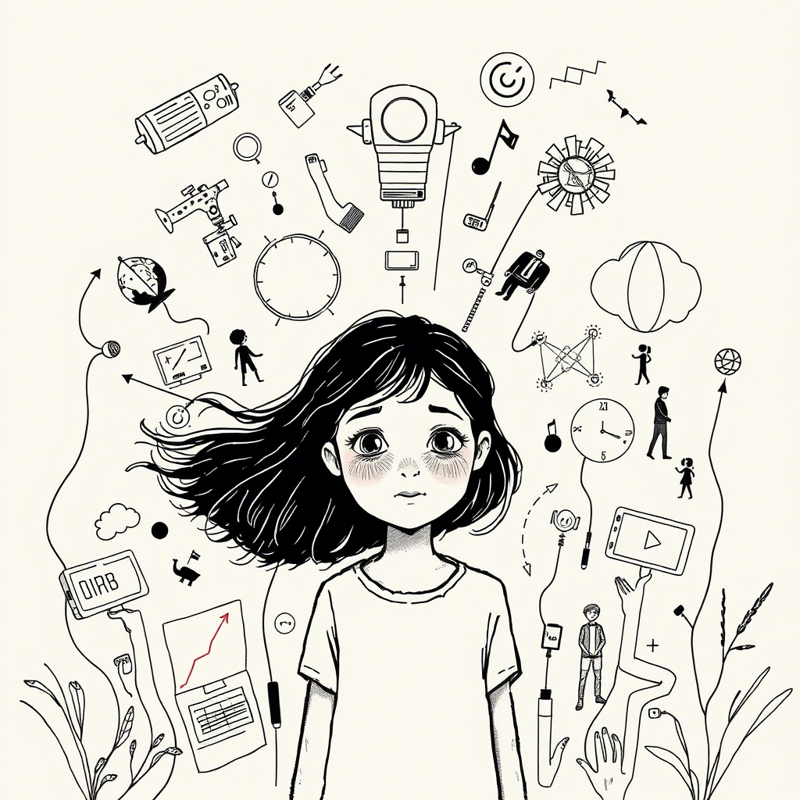

# Deja-vu

C42913

---

*Frankfurt, 2025*

# Prolog: Pierwsze wspomnienie (2027-2029)

Nazywam się Zosia i mam cztery lata. Świat jest duży i kolorowy, ale dorośli wokół mnie wydają się zmartwieni. Często widzę jak mama płacze przy telefonie, a kiedy widzi, że patrzę, szybko ociera łzy i uśmiecha się do mnie.

*10 kwietnia 2027, nagranie głosowe Zosi:*

Dzisiaj narysowałam obrazek. Mama, tata i ja trzymamy się za ręce. Mama powiesiła go na lodówce i powiedziała, że jest piękny, ale potem, gdy myślała, że nie patrzę, znowu rozmawiała z ciocią Julią przez telefon.

"Julia, nie wiem co zrobimy," mówiła mama. "Marcin może stracić pracę. Mówią, że sztuczna inteligencja zastąpi połowę zespołu."

Zapytałam tatę podczas kolacji:

"Tato, co to jest sztuczna inteligencja?"

Tata odłożył widelec i spojrzał na mamę, zanim odpowiedział:

"To jak bardzo mądry komputer, który potrafi robić rzeczy, które kiedyś robiły tylko osoby."

"Ale komputery nie mają uczuć, prawda?" dopytywałam. "Jak komputer może zastąpić człowieka?"

Tata przytulił mnie mocno.

"Właśnie, kochanie. Właśnie. To dobre pytanie."

A czy ty kiedyś zastanawiałeś się, czy maszyny mogą naprawdę zastąpić to, co ludzkie?

---

Babcia często powtarza: "To samo było za mojej młodości, po '89". Gdy pytam, co to znaczy, wzdycha głęboko.

"Zosieńko," powiedziała mi wczoraj babcia, gdy pomagałam jej robić ciasto. "Ludzie myślą, że ich problemy są nowe, ale to nieprawda. Za moich czasów też baliśmy się zmian. Też traciliśmy pracę. Też nie wiedzieliśmy, co przyniesie jutro."

"Ale poradziłaś sobie, babciu?" zapytałam, wkładając palec do ciasta.

"Poradziliśmy sobie, bo byliśmy razem," odpowiedziała, klepiąc mnie czule po głowie. "Ludzie zawsze dają radę, gdy pamiętają o tym, co najważniejsze."

"A co jest najważniejsze?"

Babcia uśmiechnęła się ciepło.

"Jak myślisz? Co jest ważniejsze – najnowszy robot czy ktoś, kto cię przytuli, gdy jest ci smutno?"

Zastanawiam się, czy dorośli dziś też pamiętają, co jest naprawdę ważne? A ty pamiętasz?

---

Dziadek opowiada mi historie o czasach, gdy był młody. Mówi, że historia lubi się powtarzać.

"Widzisz, Zosieńko," powiedział wczoraj, trzymając mnie na kolanach podczas oglądania wiadomości. "Ludzie myślą, że przeżywają coś nowego, ale to tylko nowe kostiumy starych problemów."

Na ekranie pokazywali protesty ludzi, którzy stracili pracę. Wyglądali na smutnych i złych jednocześnie.

"Dziadku, dlaczego ci ludzie krzyczą?" zapytałam.

"Bo się boją," odpowiedział spokojnie. "Boją się, że świat zmienia się zbyt szybko. Że nie ma dla nich miejsca."

"Ale świat jest taki duży," zauważyłam. "Jak może dla kogoś zabraknąć miejsca?"

Dziadek spojrzał na mnie z dziwnym wyrazem twarzy – jakby był smutny i zadowolony jednocześnie.

"Z ust dziecka..." mruknął. "Właśnie, Zosieńko. Dlaczego w tak wielkim świecie niektórzy czują, że nie ma dla nich miejsca? Co to mówi o nas wszystkich?"

Myślę o tym często. Czy ty też czasem zastanawiasz się, dlaczego w tak wielkim świecie ludzie potrafią czuć się zagubieni i niepotrzebni?

Lubię, gdy dziadek opowiada mi historie. Zwłaszcza te o księżniczkach. Ale historie o zmieniającym się świecie chyba nie są jego ulubione. Gdy o nich mówi, jego oczy są smutne, jakby widział je już zbyt wiele razy.

# Rozdział 1: Zabawki, których nie mogę dotknąć

Mam sześć lat. Mój kolega Staś ma świecący tablet, małego robota, który chodzi i mówi, i holograficzne gry, które wypełniają cały pokój kolorowymi światami. Mogę patrzeć, ale nie wolno mi dotykać. Mama mówi, że nie stać nas na takie zabawki.

*Dziennik głosowy Zosi, 10 września 2029:*

Dzisiaj w przedszkolu Staś przyniósł nowego drona wielkości motyla. Fruwał nad naszymi głowami i robił śmieszne zdjęcia, które od razu pokazywały się jako hologramy w powietrzu. Wszystkie dzieci chciały się bawić. Ja też chciałam, ale pani powiedziała, że niektóre zabawki są tylko dla ich właścicieli.

"Dlaczego niektóre dzieci mają takie fajne rzeczy, a inne nie?" zapytałam mamę, gdy mnie odbierała.

Mama westchnęła głęboko, jak zawsze, gdy pytam o rzeczy, które są trudne.

"Zosiu, niektórzy rodzice mają więcej pieniędzy, inni mniej."

"Ale czy to sprawiedliwe? Przecież wszyscy chcemy się bawić tymi samymi rzeczami."

Mama zatrzymała się i kucnęła, by spojrzeć mi w oczy.

"Nie, to nie jest sprawiedliwe. Ale wiesz co? Czasem, gdy świat nie jest sprawiedliwy, ludzie mogą zrobić coś, by to zmienić."

"Co my możemy zrobić?" zapytałam, nie bardzo wierząc, że cokolwiek może zmienić rzeczywistość.

"Zobaczysz. W naszej dzielnicy powstaje coś wspaniałego."

A czy ty kiedyś odczułeś niesprawiedliwość, której nie mogłeś zmienić? Jak się wtedy czułeś?

---

Następnego dnia mama zabrała mnie do starego budynku po bibliotece. Ludzie malowali ściany i ustawiali dziwne maszyny. Niektórzy dorośli kłócili się między sobą, inni śmiali się i współpracowali.

"Co to jest, mamo?" zapytałam, pokazując na robota z wieloma ramionami, który przenosił pudła i pomagał zawiesić coś pod sufitem.

"To jest 'Wspólny Ogród Technologii', kochanie. Miejsce, gdzie wszystkie dzieci będą mogły korzystać z robotów, dronów i sztucznej inteligencji."

Rozejrzałam się z niedowierzaniem. W jednym kącie pomieszczenia dzieci programowały małe roboty, które potem ścigały się po specjalnym torze. W innym, dziewczynka niewiele starsza ode mnie używała gestów, by kontrolować całą armię malutkich dronów układających kolorowy wzór w powietrzu.

"Wszystkie dzieci? Nawet ja?" dopytywałam.

"Zwłaszcza ty," odpowiedziała mama z uśmiechem.

Podeszła do nas pani Jadzia, która kiedyś była nauczycielką, a teraz pokazywała innym dorosłym, jak programować roboty opiekuńcze pomagające starszym osobom.

"Zosiu, chciałabyś nauczyć się programować drona?" zapytała, pokazując mi małą maszynę podobną do tej, którą przyniósł Staś.

"Tak!" zawołałam podekscytowana.

"A wiesz, co jest najważniejsze w takim miejscu jak to?" zapytała pani Jadzia.

Zastanowiłam się chwilę.

"Że są tu fajne zabawki dla wszystkich?"

"To też," przyznała pani Jadzia. "Ale najważniejsze jest to, że pomagamy sobie nawzajem. Że każdy może się nauczyć i każdy może nauczyć czegoś innych."

Czy zauważyłeś, że najlepsze rozwiązania często polegają na dzieleniu się, nie na posiadaniu? Dlaczego w takim razie tak rzadko wybieramy ten model?

---

Gdy opowiedziałam dziadkowi o Ogrodzie Technologii, pokiwał głową ze zrozumieniem.

"Za moich czasów," powiedział, "po upadku komuny też tworzyliśmy spółdzielnie. Wspólnie kupowaliśmy pierwszy sprzęt komputerowy, bo nikogo nie było stać samodzielnie. Historia kołem się toczy."

"To znaczy, że ludzie już kiedyś mieli taki pomysł?" zdziwiłam się.

"Zosieńko, ludzie od zawsze mieli dwa sposoby radzenia sobie z problemami – konkurować albo współpracować. I wiesz co? Za każdym razem, gdy przychodzi kryzys, odkrywamy na nowo, że współpraca jest lepsza."

"To dlaczego o tym zapominamy?" zapytałam.

Dziadek pogłaskał mnie po głowie.

"Dobre pytanie, mała. Bardzo dobre pytanie. Może dlatego, że w dobrych czasach łatwo uwierzyć, że każdy powinien radzić sobie sam?"

A ty, co myślisz? Dlaczego tak łatwo zapominamy o sile współpracy, gdy nie ma kryzysu?

---

W Ogrodzie poznałam Anię i Kubę, którzy też nie mieli robotów w domu. Razem uczyliśmy się programować małe latające drony, którymi można było malować w powietrzu świetlne obrazy.

"Mój tata mówi, że to niesprawiedliwe," powiedział Kuba pewnego dnia. "Że bogaci mają swoje drogie zabawki, a my musimy dzielić się tymi w Ogrodzie."

"A co myśli twoja mama?" zapytałam.

"Ona mówi, że to my mamy lepiej. Bo uczymy się dzielić. Bo mamy więcej przyjaciół. Bo rozumiemy, że fajne rzeczy są fajniejsze, gdy można je robić razem."

"A ty co myślisz?" dopytywałam.

Kuba zastanawiał się długo.

"Myślę, że mama ma trochę racji... Ale chciałbym mieć własnego robota."

Spojrzałam na nasze drony latające w powietrzu, tworząc wspólnie obraz, którego żaden z nich nie mógłby stworzyć sam.

"Wiesz co, Kuba? Ja myślę, że najfajniejsze jest to, że możemy razem tworzyć coś większego niż to, co każdy mógłby zrobić sam."

Czy kiedyś doświadczyłeś radości z tworzenia czegoś wspólnie? Czegoś, czego nigdy nie mógłbyś osiągnąć sam? Jak się wtedy czułeś?

# Rozdział 2: Zimno w domu cioci Ani

U cioci Ani zawsze jest zimno. Muszę nosić sweterek, nawet gdy siedzę w domu. Światła są przyciemnione, a ciocia ciągle patrzy na liczniki na ścianie, które świecą się na czerwono. Mam już siedem lat i zaczynam rozumieć, że czerwone liczby nie oznaczają nic dobrego.

*Dziennik głosowy Zosi, 5 stycznia 2030:*

Dzisiaj odwiedziliśmy ciocię Anię. Gdy weszliśmy do mieszkania, od razu zauważyłam, że jest jeszcze zimniej niż zwykle. Ciocia miała czerwone oczy, jakby płakała. W kuchni słyszałam, jak rozmawiała z mamą, myśląc, że ich nie słucham.

"Nie dajemy rady, Magda," mówiła ciocia, przyciszonym głosem. "Odkąd zamknęli fabrykę na rzecz zautomatyzowanej produkcji, połowa miasta straciła pracę. A teraz ten nowy podatek od emisji CO2. Każą nam przechodzić na 'zieloną energię', ale skąd mam wziąć pieniądze na te wszystkie instalacje?"

"A co z rządowymi dotacjami?" zapytała mama.

"Żartujesz? Trzeba mieć własny wkład. Musiałabym najpierw mieć pieniądze, żeby dostać pieniądze. Klasyka."

W drodze powrotnej zapytałam mamę:

"Dlaczego u cioci zawsze jest tak zimno?"

"Ciocia musi oszczędzać na ogrzewaniu, kochanie. Energia jest bardzo droga."

"Ale przecież wszędzie są te nowe panele słoneczne i wiatraki? W telewizji mówią, że zielona energia jest prawie za darmo."

Mama westchnęła.

"Zosiu, czy zastanawiałaś się kiedyś, ile kosztuje zbudowanie panelu słonecznego albo wiatraka? Ktoś musi najpierw zapłacić, by potem mieć tańszą energię. To jak z nasionami – najpierw musisz je kupić, by zebrać plony."

"To niesprawiedliwe," stwierdziłam stanowczo. "Ci, którzy mają pieniądze, mogą mieć tańszą energię, a ci, którzy nie mają, muszą płacić więcej?"

Mama spojrzała na mnie z dziwnym wyrazem twarzy – mieszanką smutku i dumy.

"Masz rację, to niesprawiedliwe. Ale wiesz co? Czasem, gdy system jest niesprawiedliwy, ludzie znajdują sposób, by go zmienić."

Czy zauważyłeś podobne niesprawiedliwości w systemach, które nas otaczają? Jak myślisz, dlaczego pozwalamy, by one trwały?

---

Gdy wróciłam do cioci tydzień później, zobaczyłam grupę ludzi na dachu jej bloku. Pracowali przy dużych metalowych konstrukcjach, a na podwórku stały pudła z napisem "SolarCoop".

"Co oni robią, ciociu?" zapytałam, pokazując przez okno.

"Zakładamy mikrospółdzielnię energetyczną, skarbie," odpowiedziała z uśmiechem, którego nie widziałam od dawna. "Wszyscy mieszkańcy bloku składamy się na panele słoneczne i małą turbinę wiatrową."

"Ale mówiłaś, że nie masz pieniędzy na takie rzeczy?"

"Sama nie mam. Ale razem mamy wystarczająco."

W kuchni cioci siedzieli sąsiedzi – pan Karol, pani Jadwiga z trzeciego piętra i kilku innych, których kojarzyłam z widzenia. Rozmawiali o "produkcji energii", "bilansowaniu systemu" i innych trudnych słowach.

Pan Karol, zauważając moje zaciekawienie, usiadł obok i wytłumaczył:

"Wiesz, Zosiu, to jak z tymi zabawkami w waszym Ogrodzie Technologii. Osobno nas nie stać, ale razem dajemy radę. I wiesz co? To nie tylko tańsze, ale też lepsze dla planety."

"Lepsze?" zdziwiłam się. "Dlaczego?"

"Bo wykorzystujemy dokładnie tyle energii, ile potrzebujemy. Nikt nie marnuje, bo wszystkim zależy. A kiedy jedni mają nadmiar, dzielą się z tymi, którzy akurat potrzebują więcej."

"Jak rodzina?" zapytałam.

Pan Karol roześmiał się serdecznie.

"Dokładnie tak! Jak rodzina, tylko większa – rodzina sąsiedzka."

A czy ty myślałeś kiedyś o swoim sąsiedztwie jak o rodzinie? Co by się zmieniło, gdybyśmy wszyscy tak zaczęli myśleć?

---

"Za moich czasów," powiedział dziadek, gdy opowiedziałam mu o spółdzielni cioci, "tak samo było, gdy zamykali kopalnie i huty. Ludzie musieli sobie radzić razem, bo indywidualnie nikt nie dał rady."

"I to zadziałało?" dopytywałam.

"Czasami tak, czasami nie," przyznał dziadek. "Ale wiesz, co było najważniejsze? Ludzie odkrywali, że nie są sami. Że razem mogą więcej."

"Dlaczego teraz tego nie pamiętają?" zapytałam.

"Bo ludzie szybko zapominają. Zwłaszcza niewygodne prawdy."

"Jakie niewygodne prawdy?"

Dziadek spojrzał przez okno, na sąsiedni nowoczesny apartamentowiec, gdzie mieszkały bogate rodziny. Każdy miał własny system energetyczny, własny samochód, własnego robota domowego.

"Że potrzebujemy siebie nawzajem, Zosieńko. Że niezależność to iluzja. Że bogaty czy biedny, silny czy słaby – wszyscy żyjemy na tej samej planecie, oddychamy tym samym powietrzem."

"To dlaczego ciągle udajemy, że jest inaczej?" nie dawałam za wygraną.

"Déjà vu, mała. Historia się powtarza," westchnął dziadek. "Ludzie są dumni. Chcą wierzyć, że zawdzięczają wszystko sobie. Że ich sukces to tylko ich zasługa."

"A to nieprawda?"

"Częściowo prawda. Ale nikt nie osiąga niczego zupełnie sam. Zawsze stoimy na ramionach innych – tych, którzy byli przed nami, i tych, którzy są obok nas."

Czy zgadzasz się z dziadkiem Zosi? Czy rzeczywiście zapominamy o naszej wzajemnej zależności? Co tracimy przez to zapomnienie?

---

W mieszkaniu cioci jest już trochę cieplej. Na ścianie wisi nowy panel, który pokazuje, ile energii produkuje ich spółdzielnia, ile zużywają, a ile sprzedają do sieci miejskiej. Liczby najczęściej są zielone, czasem żółte, rzadko czerwone.

"Widzisz te liczby?" zapytała mnie ciocia, gdy przyglądałam się ekranowi. "Gdy są zielone, mamy nadmiar energii. Gdy żółte – bilansujemy się. Czerwone – musimy dokupić z sieci."

"I to wszystko dzięki temu, że działacie razem?"

"Dokładnie tak. Na początku było trudno. Niektórzy sąsiedzi nie chcieli się dołączyć. Bali się, że to jakieś oszustwo albo że to nie zadziała."

"Co ich przekonało?"

Ciocia uśmiechnęła się.

"Rachunki. Gdy zobaczyli, ile oszczędzamy, nagle wszyscy chcieli być częścią spółdzielni."

"Czyli zrobili to dla pieniędzy?" zapytałam, czując lekkie rozczarowanie.

"Na początku tak," przyznała ciocia. "Ale wiesz co? Teraz wszyscy sąsiedzi znają się lepiej. Pomagamy sobie. Organizujemy wspólne wydarzenia. Pieniądze były pretekstem, ale stworzyliśmy coś więcej – prawdziwą wspólnotę."

Ciocia znowu się uśmiecha, a jej mieszkanie jest ciepłe. Zamiast przyciemnionych świateł, salon rozjaśniają kolorowe lampy. Zastanawiam się, czy ciepło pochodzi tylko z lepszego systemu grzewczego, czy też z tego, że ludzie przestali być sami ze swoimi problemami.

A ty, gdzie szukasz ciepła w zimne dni? W technologii czy w ludziach wokół ciebie?

# Rozdział 3: Dlaczego pan robot dostał pracę taty?

Tata stracił pracę. Zamiast niego w fabryce pracuje "zautomatyzowana linia produkcyjna" i roboty z zaawansowaną sztuczną inteligencją. Mam już osiem lat i coraz lepiej rozumiem, co dzieje się wokół mnie. Tata całymi dniami siedzi przy komputerze i szuka nowej pracy, ale wszędzie wymagają innych umiejętności.

*Dziadek westchnął głęboko.

"Niektórzy sobie poradzili. Inni... nie. Zosiu, to jest właśnie powód, dlaczego teraz potrzebujemy nowych rozwiązań. Takich jak dochód podstawowy. Bo jeśli roboty pracują za ludzi, to wszyscy powinni z tego korzystać, nie tylko właściciele robotów."

"Czyli pieniądze z podatku od robotów idą dla wszystkich?" dopytywałam.

"Tak miałoby to działać," potwierdził tata. "To jest sprawiedliwe. Jeśli technologia należy do całego społeczeństwa, to jej zyski też powinny."

"Tylko dlaczego musimy to wymyślać od nowa?" zastanawiał się dziadek. "Przecież te dyskusje już były. Sto lat temu ludzie rozważali, co zrobić, gdy maszyny zastąpią pracę ludzką. Wtedy też mówiono o powszechnym dochodzie."

"I co się stało?" zapytałam.

"Nic," wzruszył ramionami dziadek. "Ludzie znaleźli nowe prace. Ale tym razem może być inaczej. Tym razem maszyny mogą zastąpić nie tylko nasze mięśnie, ale i umysły."

Zastanawiam się, czy jesteśmy mądrzejsi od naszych przodków. Czy wyciągnęliśmy wnioski z ich błędów? Czy może jesteśmy skazani na powtarzanie tej samej historii w nowych dekoracjach?

A ty, co myślisz? Czy potrafimy uczyć się na błędach poprzednich pokoleń?

---

Tata spędza teraz dużo czasu na nauce. Czasem jest sfrustrowany, ale częściej podekscytowany. Wieczorami często opowiada o tym, czego się nauczył.

"Wiesz, Zosiu," powiedział pewnego wieczoru, "może to i dobrze, że roboty przejęły niektóre prace."

"Dlaczego?" zdziwiłam się.

"Bo to były często prace, które ludzie wykonywali jak... roboty właśnie. Powtarzalne, monotonne, wyczerpujące. Może teraz będziemy mogli robić to, co naprawdę ludzkie?"

"Czyli co?"

"Tworzyć. Wymyślać. Troszczyć się o innych. Robić rzeczy, które mają znaczenie."

Spojrzałam na niego uważnie.

"Ale twoja stara praca miała znaczenie, prawda? Inaczej byś jej nie robił."

Tata wyglądał na zaskoczonego. Przez chwilę milczał.

"Masz rację, kochanie. Miała znaczenie, bo utrzymywała naszą rodzinę," przyznał. "Ale teraz mam szansę na pracę, która będzie miała znaczenie także w inny sposób."

"Jaki?"

"Będę pomagał ludziom dostosować się do nowego świata. Będę łącznikiem między starym a nowym."

Może o to właśnie chodzi, pomyślałam. Nie o to, by konkurować z maszynami, ale by znaleźć nowe sposoby bycia człowiekiem w świecie pełnym maszyn. 

Jak wyobrażasz sobie świat, w którym większość pracy fizycznej i umysłowej wykonują maszyny? Co robiliby wtedy ludzie? I czy byłby to świat lepszy czy gorszy od naszego?iennik głosowy Zosi, 12 maja 2032:*

Dziś tata wrócił bardzo smutny z ostatniego dnia w pracy. Jego oczy były czerwone, choć udawał, że to z powodu pyłu. Przytulił mnie mocno i długo nie puszczał.

"Twój tata jest teraz bezrobotny," powiedział, próbując żartować, ale jego głos się łamał.

Podczas kolacji nikt nie odzywał się przez długi czas. W końcu zebrałam się na odwagę i zadałam pytanie, które chodziło mi po głowie:

"Tato, dlaczego robot może pracować w fabryce, a ty nie?"

Tata spojrzał na mamę bezradnie. Nie wiedział, co odpowiedzieć.

"Roboty są tańsze i nie potrzebują odpoczynku, kochanie," odpowiedziała w końcu mama. "Firma woli zatrudniać je zamiast ludzi."

"Ale roboty nie mają rodzin, nie muszą kupować jedzenia ani ubrań," powiedziałam. "To niesprawiedliwe. Roboty nie potrzebują pieniędzy, a ludzie tak."

Zapadła niezręczna cisza. W końcu tata odchrząknął.

"Wiesz, Zosiu, świat się zmienia. Zawsze się zmieniał. Kiedyś większość ludzi pracowała na roli, potem w fabrykach, teraz..."

"Teraz co?" dopytywałam, gdy zawiesił głos.

"Teraz musimy znaleźć nowe miejsce dla ludzi," dokończył, ale brzmiało to, jakby sam sobie nie wierzył.

Czy zastanawiałeś się kiedyś, jaka jest prawdziwa wartość ludzkiej pracy? Czy definiujemy ją tylko ekonomicznie, czy jest w niej coś więcej?

---

Wieczorem podsłuchałam, jak rodzice rozmawiają w kuchni, myśląc, że już śpię.

"Słyszałeś o tym nowym podatku od automatyzacji?" pytał tata, przeglądając coś na tablecie. "Podobno firmy, które zwalniają ludzi na rzecz maszyn, będą musiały płacić specjalny podatek."

"I co z tego? Myślisz, że to pomoże?" westchnęła mama. "To tylko opóźni nieuniknione."

"Podobno w naszym mieście chcą wprowadzić pilotażowy program dochodu podstawowego. Część podatków od automatyzacji miałaby go finansować."

"Dochód podstawowy?" mama brzmiała na sceptyczną. "Czyli co, będziemy dostawać pieniądze za nic?"

"Nie za nic," tata odłożył tablet. "Za bycie obywatelami. Za to, że jesteśmy częścią społeczeństwa, które stać na maszyny wykonujące pracę za nas."

"I myślisz, że to wystarczy? Że pieniądze zastąpią poczucie, że jest się potrzebnym?"

Zapadła cisza. Zastanawiałam się nad tym, co usłyszałam. Czy pieniądze to wszystko, co daje praca? Czy gdyby tata dostawał pieniądze, ale nie miał zajęcia, byłby szczęśliwy?

Jaka według ciebie jest główna wartość pracy w życiu człowieka? Czy to tylko sposób na zarabianie pieniędzy?

---

Tydzień później tata przyszedł z uśmiechem, którego nie widziałam od dawna. Zapisał się do programu pilotażowego. Dostał miejsce na szkoleniu z programowania sztucznej inteligencji i małe miesięczne wsparcie finansowe.

"Będę się uczył rozmawiać z robotami," żartował podczas obiadu, a jego oczy znów błyszczały.

"Czy to znaczy, że będziesz szefem robotów?" zapytałam podekscytowana.

"Nie do końca," roześmiał się tata. "Raczej ich współpracownikiem. Będę projektował zadania, które one wykonują. Wiesz, roboty są silne i szybkie, ale nie są zbyt mądre."

"Jak to?" zdziwiłam się. "Przecież to sztuczna inteligencja. W szkole mówili, że AI jest mądrzejsza od ludzi."

"W pewnych zadaniach tak," zgodził się tata. "Ale nie potrafi myśleć tak jak my. Nie ma intuicji, kreatywności, empatii. To tylko bardzo zaawansowany kalkulator, który potrafi udawać inteligencję."

"Więc roboty nigdy nie zastąpią ludzi całkowicie?" zapytałam z nadzieją.

Tata i mama wymienili spojrzenia.

"W pewnych pracach nie," odpowiedział ostrożnie tata. "Ale w wielu już to zrobiły. Dlatego ludzie muszą znaleźć nowe zajęcia. Takie, w których jesteśmy niezastąpieni."

"Jak które?"

"Jak tworzenie sztuki, opieka nad innymi, wymyślanie nowych rzeczy," odpowiedziała mama. "Wszystko, co wymaga bycia człowiekiem."

Zastanawiam się, co to znaczy "być człowiekiem" w świecie, gdzie maszyny potrafią robić coraz więcej. A ty, co myślisz? Co czyni nas niezastąpionymi?

---

"Wiesz, co powiedział mi trener?" opowiadał tata przy kolacji miesiąc później. "Że po wielkim bezrobociu w latach 90. też były takie programy przekwalifikowania. Tylko że wtedy uczono obsługi komputerów, a teraz uczą nas, jak współpracować z AI."

"To samo mówiłem!" zawołał dziadek, który przyszedł na obiad. "Historia kołem się toczy. Za każdą rewolucją technologiczną idzie rewolucja społeczna. Ludzie tracą stare zajęcia, znajdują nowe."

"Ale co z tymi, którzy nie mogą się przekwalifikować?" zapytałam, pamiętając o sąsiedzie, panu Henryku, który całe życie pracował rękami i mówi, że jest za stary na naukę komputerów.

"To właśnie jest wyzwanie," przyznał dziadek. "Za moich czasów też wielu ludzi zostało z tyłu. Zwłaszcza starszych. Mówiono nam, że musimy nadążać za zmianami, ale nikt nie mówił jak."

"I co się z nimi stało?"

Dz

# Rozdział 4: Nowi przyjaciele z daleka

W mojej klasie pojawiły się nowe dzieci. Mają ciemniejszą skórę i mówią inaczej. Niektórzy rodzice są zdenerwowani. Słyszę jak mówią, że "zabierają nam mieszkania" i "odbierają pracę". Mam dziewięć lat i zaczynam dostrzegać, jak dziwnie dorośli podchodzą do nowych osób.

*Dziennik głosowy Zosi, 3 października 2033:*

Dzisiaj podczas przerwy Adam z Syrii zaprosił mnie do wspólnej zabawy. Ma piękną kolekcję holograficznych kart z postaciami, które ożywają, gdy się je aktywuje gestem. Są przepiękne – postacie tańczą w powietrzu jak miniaturowe fajerwerki. Bawiliśmy się świetnie, tworząc własne historie z postaciami, gdy nagle podszedł do nas Tomek z ostatniej ławki.

"Mój tata mówi, że nie powinniśmy się bawić z uchodźcami. Że zabierają nam wszystko," powiedział, krzyżując ręce na piersi.

"Co zabierają?" zapytałam, naprawdę zdziwiona. "Adam właśnie się ze mną dzieli swoimi kartami. Niczego mi nie zabrał."

"Ale jego rodzice zabrali mieszkanie, które mogliby dostać Polacy," upierał się Tomek.

Adam spuścił głowę. Widziałam, że jest mu przykro.

"Mieszkają w starym, pustym budynku, który odnowili," odpowiedziałam. "Nikt tam nie chciał mieszkać wcześniej. A poza tym – kto to są 'Polacy'? Czy ja jestem bardziej Polką niż Adam, który mieszka tu już dwa lata i mówi po polsku lepiej niż ja po angielsku?"

Tomek nie wiedział, co odpowiedzieć. Po chwili wzruszył ramionami i odszedł.

"Dziękuję," powiedział cicho Adam. "Nie wszyscy są tak mili jak ty."

To sprawiło, że zaczęłam myśleć. Dlaczego ludzie tak łatwo dzielą się na "my" i "oni"? Skąd bierze się ten strach przed innymi? Czy dorośli nie widzą, że wszyscy jesteśmy po prostu ludźmi?

A ty, czy kiedyś czułeś strach przed kimś tylko dlatego, że był inny? Co pomogło ci ten strach przezwyciężyć?

---

Wieczorem zapytałam mamę, czy możemy zaprosić Adama i jego rodzinę na obiad. Była zaskoczona moją propozycją, ale po chwili zastanowienia zgodziła się.

"Myślisz, że to dobry pomysł?" zapytał tata, gdy mama wspomniała o zaproszeniu. "Ludzie w okolicy nie są zbyt przyjaźni wobec nowych."

"Właśnie dlatego," odpowiedziała stanowczo mama. "Zosia ma rację. Trzeba zacząć od małych gestów. Jeśli wszyscy będą się bać, nic się nie zmieni."

"Nie chodzi mi o strach," zaprotestował tata. "Ale słyszałem różne opinie..."

"Jakie opinie?" przerwałam mu. "Czy znasz osobiście kogoś z Syrii? Rozmawiałeś z kimś?"

Tata spojrzał na mnie zdumiony.

"No... nie. Ale wiesz, ludzie mówią..."

"Ludzie mówili, że tata straci pracę przez roboty, a teraz uczysz się z nimi pracować," przypomniałam. "Może ludzie się mylą?"

Rodzice wymienili spojrzenia, w których było coś, czego nie umiałam wtedy nazwać – mieszanka zaskoczenia i dumy.

Czy zauważyłeś, jak często opinie, które przyjmujemy za pewnik, pochodzą z zasłyszanych plotek, a nie z własnych doświadczeń? Jak często sprawdzasz źródła swoich przekonań?

---

Gdy rodzina Adama przyszła na kolację, początkowo atmosfera była napięta. Rodzice rozmawiali powoli, ostrożnie dobierając słowa. Wyczuwało się niepewność, jak na cienkiej tafli lodu.

Ale mama Adama przyniosła pyszne ciasto z daktylami, którego zapach wypełnił cały dom. Tata Adama, gdy zobaczył drona edukacyjnego, którego dostałam w Ogrodzie Technologii, zainteresował się jego konstrukcją. Okazało się, że w Syrii był inżynierem.

"Problem z silnikiem," zauważył, gdy dron zaczął nierówno latać. "Mogę zobaczyć?"

Tata przyniósł narzędzia i razem pochylili się nad dronem. Bariera językowa nagle przestała istnieć, gdy rozmawiali o częściach, obwodach i algorytmach. Mój tata, który uczył się programowania AI, i tata Adama, który znał się na mechanice – uzupełniali się nawzajem.

"Pan był inżynierem w Syrii?" zapytał mój tata, wyraźnie pod wrażeniem umiejętności gościa.

"Tak, przez piętnaście lat," odpowiedział tata Adama. "Ale tutaj... trudno. Dyplomy nie uznawane, język barierą. Pracuję jako konserwator w szkole."

Atmosfera przy stole zmieniła się. Z każdą chwilą było coraz więcej uśmiechów, pytań, wspólnych tematów. Pod koniec wieczoru wszyscy się śmiali, planując następne spotkanie.

Co by się zmieniło, gdybyśmy zawsze patrzyli na ludzi przez pryzmat ich umiejętności i doświadczeń, a nie przez pryzmat naszych uprzedzeń? Jak wyglądałby świat, gdybyśmy dawali każdemu szansę pokazania, kim naprawdę jest?

---

W szkole zaproponowałam utworzenie "Koła Małych Podróżników". Pomysł był prosty – każde dziecko, z pomocą rodziców, opowiada o kraju swojej rodziny, pokazuje zdjęcia, uczy kilku słów i przygotowuje tradycyjną potrawę lub prezentuje element kultury.

Najpierw przychodziły tylko dzieci, a i to nie wszystkie. Ale z czasem zaczęli przychodzić rodzice. Początkowo po to, by pomóc swoim dzieciom, potem z ciekawości.

"Nie wiedziałam, że tradycyjne ukraińskie hafty są tak podobne do naszych łowickich," powiedziała mama Janka po prezentacji mamy Oleny.

"A ja nie miałam pojęcia, że w Syrii jedzą podobne ciasta jak moja babcia w Polsce," dodała mama Kasi.

Tata Adama i mój tata stali się przyjaciółmi. Ojciec Adama dzielił się swoją wiedzą inżynieryjną, a mój tata pomagał mu w nauce programowania.

"Widzisz," powiedziała babcia, gdy opowiedziałam jej o naszym kole, "dokładnie tak samo baliśmy się Ukraińców i Wietnamczyków w latach 90. Ludzie zawsze boją się tego, czego nie znają."

"Ale jak się poznają, to przestają się bać?" zapytałam.

"Dokładnie, Zosieńko. Strach to zwykle tylko brak wiedzy. Historia się powtarza, ale może tym razem będziemy mądrzejsi."

Czy uważasz, że dzisiejsze lęki przed "innymi" różnią się od tych z przeszłości? Czy możemy wyciągnąć lekcje z historii, by lepiej radzić sobie z obecnymi wyzwaniami migracyjnymi?

---

Na ostatnim spotkaniu naszego koła tata Adama i mój tata ogłosili, że razem otwierają warsztat naprawy dronów i robotów domowych. Będą łączyć umiejętności inżynieryjne taty Adama z wiedzą o AI mojego taty.

"To będzie pierwszy taki zakład w naszej dzielnicy," wyjaśnił mój tata. "Serwis i naprawa nowych technologii, ale prowadzony przez ludzi, nie przez automaty."

"Dzięki temu kontakt z klientem będzie lepszy," dodał tata Adama już całkiem dobrą polszczyzną. "Roboty nie rozumieją, jak ważny jest dla ludzi ich osobisty dron czy robot domowy."

Patrzyłam na nich z dumą. Dwie osoby z różnych światów, które początkowo bały się siebie nawzajem, teraz tworzyły coś razem. Coś, co wykorzystuje ich unikalne umiejętności i doświadczenia.

Może właśnie o to chodzi w integracji, pomyślałam. Nie o to, by wszyscy stali się tacy sami, ale by każdy mógł wnieść coś swojego do wspólnego dobra.

A jak ty postrzegasz prawdziwą integrację? Czy oznacza ona zatarcie różnic, czy raczej ich twórcze wykorzystanie dla dobra wszystkich?

# Rozdział 5: Babcia mówi, że lekarze są dla bogatych

Babcia potrzebuje operacji. Mama płacze, bo to bardzo drogo kosztuje, a nasze ubezpieczenie tego nie pokrywa. Mam już dwanaście lat i rozumiem więcej o świecie – szczególnie o tym, jak pieniądze dzielą ludzi nawet w sprawach życia i śmierci.

*Dziennik głosowy Zosi, 5 marca 2035:*

Dziś podsłuchałam, jak mama rozmawia z ciocią Julią o babci. Nie chciałam podsłuchiwać, ale ich głosy dochodziły wyraźnie z kuchni, a ja odrabiałam lekcje w pokoju obok.

"Sto tysięcy za operację, Julia. Sto tysięcy!" płakała mama. "Skąd my weźmiemy takie pieniądze? A przecież to podstawowy zabieg. Gdyby miała lepsze ubezpieczenie..."

"Zawsze jest państwowy szpital," zasugerowała ciocia.

"Dwa lata oczekiwania. Lekarz powiedział, że nie ma tyle czasu."

Poszłam wieczorem do babci. Leżała w łóżku, blada, ale uśmiechnęła się, gdy mnie zobaczyła.

"Za moich czasów," powiedziała, gdy usiadłam na brzegu jej łóżka, "służba zdrowia była dla wszystkich. Niezależnie od tego, ile kto zarabiał."

"A czemu teraz tak nie jest?" zapytałam.

"Bo ludzie zapomnieli, że zdrowie to nie towar," westchnęła babcia. "Jak mydło czy samochód. To podstawowe prawo człowieka."

"Ale skoro wszyscy to wiedzą, dlaczego system jest taki niesprawiedliwy?"

Babcia spojrzała na mnie przenikliwie.

"Myślisz, że wszyscy to wiedzą?" zapytała cicho. "Dopóki jesteś zdrowy, łatwo wierzyć, że opieka zdrowotna jest sprawiedliwa. Dopiero gdy zachorujesz ty albo ktoś, kogo kochasz, odkrywasz prawdę."

"Jaką prawdę?"

"Że choroba to już wystarczająca kara. Nie powinno się karać ludzi dodatkowo za to, że zachorowali."

Czy zastanawiałeś się kiedyś, dlaczego w społeczeństwie, które stać na najnowsze technologie, wciąż nie stać nas na zapewnienie podstawowej opieki zdrowotnej dla wszystkich? Co to mówi o naszych priorytetach?

---

W szkole na zajęciach z projektowania społecznego dostaliśmy zadanie, by wymyślić rozwiązanie problemu w naszej okolicy. Od razu wiedziałam, o czym będę pisać.

"Telemedycyna dla każdego," przedstawiłam swój projekt. "Sieć punktów telemedycznych w każdej dzielnicy, obsługiwanych przez wolontariuszy – emerytowanych lekarzy i pielęgniarki, wspieranych przez zaawansowaną AI diagnostyczną."

"I kto miałby to finansować?" zapytał sceptycznie pan Nowak, nasz nauczyciel.

"Miasto. Z części podatku od automatyzacji," odpowiedziałam bez wahania. "Technologia zastępuje ludzi w pracy, więc niech też pomoże w leczeniu."

"Bardzo idealistyczne podejście," skwitował nauczyciel.

"Czy idealizm to coś złego?" zapytałam. "Jeśli nie będziemy marzyć o lepszym świecie, skąd będziemy wiedzieć, w jakim kierunku iść?"

Klasa zamilkła. Pan Nowak patrzył na mnie przez chwilę, po czym skinął głową.

"Dobrze powiedziane, Zosiu. Bardzo dobrze powiedziane."

Po zajęciach podeszła do mnie pani Olga, nasza druga nauczycielka, która obserwowała prezentacje.

"Wiesz co, Zosiu? Twój pomysł jest nie tylko idealistyczny – jest realny," powiedziała. "Jestem w radzie dzielnicy. Przedstawiłabyś swój projekt na następnym posiedzeniu?"

Czy wierzysz, że młodzi ludzie mogą mieć odpowiedzi na problemy, których nie rozwiązali dorośli? Co by się zmieniło, gdybyśmy częściej słuchali głosu młodych w ważnych kwestiach społecznych?

---

Byłam zdenerwowana, ale myśl o babci dodała mi odwagi. Stanęłam przed radą dzielnicy – grupą dorosłych w formalnych strojach, którzy patrzyli na mnie z mieszaniną zaciekawienia i pobłażania.

"Nazywam się Zosia Kowalska i mam 12 lat," zaczęłam. "Moja babcia potrzebuje operacji, na którą nas nie stać. Ale nie jestem tu, by prosić o pieniądze dla niej. Jestem tu, bo tysiące babć i dziadków, mam i tatów, a nawet dzieci jest w takiej samej sytuacji."

Opowiedziałam o moim projekcie. O punktach telemedycznych w każdej dzielnicy, gdzie AI wstępnie diagnozowałoby pacjentów, a emerytowani lekarze i pielęgniarki konsultowaliby trudniejsze przypadki zdalnie.

"Ten projekt można wdrożyć niewielkim kosztem," argumentowałam. "Technologia już istnieje, potrzebujemy tylko przestrzeni i koordynacji wolontariuszy."

"Brzmi interesująco, ale gdzie znajdziesz lekarzy chętnych do pracy za darmo?" zapytał radny Kowalski.

"Nie za darmo," odpowiedziałam. "Za mikro-honoraria z funduszu dzielnicy i z darowizn. Wielu emerytowanych lekarzy chce pomagać, ale nie może już pracować pełnoetatowo. Dajmy im szansę."

"A skąd wiesz, że emeryci chcą taką pracę wykonywać?" dociekał inny radny.

"Bo zapytałam," odpowiedziałam prosto. "Przeprowadziłam ankietę wśród emerytowanych medyków z naszej dzielnicy. Osiemdziesiąt procent byłoby zainteresowanych udziałem w takim programie."

To zrobiło wrażenie. Radni szeptali między sobą. W końcu przewodniczący rady zapytał:

"Ile osób objęłaś tą ankietą?"

"Trzydzieści siedem," przyznałam. "To nie jest wielka próba, ale to były osobiste rozmowy, nie anonimowe kliknięcia."

Czy uważasz, że proste, praktyczne rozwiązania są lepsze od skomplikowanych systemów? Jak często prostota jest lekceważona w polityce społecznej na rzecz złożonych, biurokratycznych struktur?

---

Dwa miesiące później otwarto pierwszy punkt telemedyczny w naszej dzielnicy. Babcia była pierwszą pacjentką. Lekarz specjalista z Warszawy zbadał ją przez holograficzny interfejs, wspierany przez panią Krystynę – lokalną pielęgniarkę na emeryturze.

"To niesamowite," mówiła babcia po wizycie. "Czułam się, jakby lekarz był w tym samym pokoju, a pani Krystyna wszystko mi tłumaczyła krok po kroku."

AI wstępnie przeanalizowało wyniki badań babci i zasugerowało alternatywne leczenie – nową, mniej inwazyjną procedurę, którą można było wykonać w naszym lokalnym szpitalu za ułamek kosztów.

"Za moich czasów też organizowaliśmy pomoc sąsiedzką, gdy system nie działał," powiedział dziadek na otwarciu punktu. "Po transformacji, gdy wszystko się załamało, ludzie sobie pomagali. Historia się powtarza, tylko narzędzia mamy lepsze."

"Dziadku," zapytałam, gdy wracaliśmy do domu, "dlaczego za każdym razem musimy wymyślać te rozwiązania od nowa? Dlaczego nie uczymy się z historii?"

Dziadek uśmiechnął się smutno.

"Bo każde pokolenie musi samo nauczyć się, co jest naprawdę ważne. Niektórych lekcji nie da się przekazać – trzeba ich doświadczyć."

"To smutne," stwierdziłam.

"Niekoniecznie," odparł dziadek. "To także daje nadzieję. Bo każde pokolenie ma szansę zrobić to lepiej."

Czy zgadzasz się z dziadkiem? Czy niektórych lekcji naprawdę nie da się przekazać między pokoleniami? A może problem leży gdzie indziej – w naszej niechęci do słuchania mądrości poprzedników?

---

Punkty telemedyczne zaczęły powstawać w kolejnych dzielnicach. Model się sprawdzał – był tańszy od tradycyjnej opieki, a jednocześnie dawał pacjentom poczucie, że ktoś naprawdę się o nich troszczy.

"Wiesz, co jest najlepsze w tym systemie?" zapytała mnie kiedyś pani Krystyna, pielęgniarka z naszego punktu. "To, że łączy wysoką technologię z ludzkim dotykiem. AI jest świetne w analizie danych, ale to człowiek trzyma cię za rękę, gdy się boisz."

Program rozszerzono o mobilne punkty, które dojeżdżały do osób, które nie mogły wyjść z domu. Powstał też system "medycznych przyjaciół" – wolontariuszy, którzy pomagali starszym osobom dotrzeć na wizyty i zrozumieć zalecenia lekarskie.

Babcia dostanie operację w ramach specjalnego programu współpracy między naszym punktem a szpitalem uniwersyteckim. Będzie dobrze.

Wieczorem znalazłam mamę w kuchni – płakała, ale tym razem ze szczęścia.

"Wiesz," powiedziała, przytulając mnie, "gdy byłam w twoim wieku, też marzyłam o zmienianiu świata. Potem dorosłam i uznałam, że świat jest zbyt skomplikowany. Że jedna osoba nic nie zmieni."

"I co myślisz teraz?" zapytałam.

"Że się myliłam," odpowiedziała z uśmiechem. "Bo ty pokazałaś, że nawet dwunastolatka może zacząć rewolucję."

A ty, czy wierzysz, że jednostka może zmieniać świat? I czy wiek ma w tym znaczenie?

# Rozdział 6: Niewidzialni ludzie

Pan Henryk z parteru nie istnieje – tak mówi mama. To znaczy, istnieje naprawdę, widujemy go codziennie, ale nie ma go w systemach. Nie ma konta, karty chipowej, cyfrowego ID. Jest "cyfrowym pariasem". Mam już czternaście lat i zaczynam rozumieć, jak niebezpieczne może być życie na marginesie cyfrowego świata.

*Dziennik głosowy Zosi, 12 listopada 2037:*

Dziś widziałam, jak pani Jadwiga z drugiego piętra kupowała panu Henrykowi leki na receptę. System apteczny go nie rozpoznaje, więc nie może sam realizować recept.

"Dlaczego pan Henryk nie może dostać leków w aptece?" zapytałam mamę, gdy opowiedziałam jej o tej sytuacji.

"Bo system go nie widzi, kochanie," odpowiedziała mama, przygotowując obiad. "Nie ma cyfrowej tożsamości."

"Ale przecież on istnieje naprawdę!" zaprotestowałam. "Jest człowiekiem z krwi i kości. Jak system może go nie widzieć?"

"System widzi tylko to, co zostało w nim zarejestrowane," wyjaśniła mama. "Pan Henryk nigdy nie założył cyfrowego ID, nie ma smartfona, komputera, konta bankowego. Dla systemu jest niewidzialny."

"To absurdalne," stwierdziłam. "Człowiek istnieje tylko wtedy, gdy system go widzi? A co z jego prawami?"

Mama odłożyła nóż i spojrzała na mnie poważnie.

"Właśnie o to chodzi, Zosiu. System został zaprojektowany dla wygody większości, ale kompletnie zapomina o mniejszościach. O starszych, jak pan Henryk. O biednych, którzy nie mają dostępu do technologii. O wykluczonych z różnych powodów."

"Ale przecież to niesprawiedliwe! Czy nie można tego zmienić?"

"Można," odpowiedziała mama. "Pytanie, czy wystarczająco wielu ludzi zauważa problem."

Czy dostrzegasz podobne wykluczenia w dzisiejszym świecie? Jak często myślimy o tych, którzy nie pasują do głównego nurtu technologicznego lub społecznego?

---

Na lekcji historii rozmawialiśmy o grupach wykluczonych w różnych epokach. Pan Adam, nasz nauczyciel, opisywał systemy kastowe, segregację rasową, wykluczenie ze względu na pochodzenie, religię czy płeć.

"Zawsze istniały grupy ludzi, których system nie zauważał," wyjaśnił pan Adam. "W Indiach byli to pariasi, w średniowieczu trędowaci, w XX wieku często imigranci bez dokumentów."

"A dziś są to cyfrowi pariasi," dodałam. "Jak pan Henryk z mojego bloku."

"Dokładnie," przytaknął nauczyciel. "Co pokazuje, że choć technologie się zmieniają, ludzka tendencja do tworzenia systemów wykluczających pozostaje."

"Ale dlaczego?" zapytał Marek z ostatniej ławki. "Przecież dziś mamy więcej świadomości, więcej wiedzy historycznej."

"Dobre pytanie," odparł nauczyciel. "Co myślicie? Dlaczego, mimo że znamy błędy przeszłości, wciąż je powtarzamy?"

Przez chwilę nikt się nie odzywał. W końcu zebrałam się na odwagę.

"Może dlatego, że systemy projektują ludzie, którzy sami nie doświadczyli wykluczenia?" zasugerowałam. "Tworzą dla takich jak oni, zapominając o innych."

"Albo dlatego, że wygoda większości jest ważniejsza niż prawa mniejszości," dodała Ania.

"A może po prostu zapominamy, że za każdym numerem, statystyką czy kategorią stoi prawdziwy człowiek," powiedział cicho Adam, mój przyjaciel z Syrii.

Zapadła cisza. Pan Adam popatrzył na nas z uznaniem.

"Myślę, że wszyscy macie rację," powiedział pan Adam. "I to właśnie jest największy problem systemów wykluczenia – mają wiele przyczyn, co sprawia, że trudno je całkowicie wyeliminować."

Czy zauważyłeś, jak łatwo współczesne systemy tworzą nowe formy wykluczenia? Co mówi o nas fakt, że mimo doświadczeń historycznych wciąż dopuszczamy do powstawania takich barier?

---

Po lekcji zapytałam pana Adama, czy moglibyśmy coś z tym zrobić. Tak powstał "Klub Pomocy Cyfrowej". Początkowo było nas tylko pięcioro – ja, Adam, Ania, Kuba i Marek. Pomagaliśmy starszym osobom załatwiać sprawy online, uczyliśmy ich korzystać z podstawowych systemów, pomagaliśmy zakładać konta i cyfrowe tożsamości.

Jednym z naszych pierwszych "klientów" był pan Henryk.

"Nie chcę tego całego cyfrowego badziewia," oświadczył, gdy zapukaliśmy do jego drzwi. "Siedemdziesiąt pięć lat żyłem bez tego i jakoś dawałem radę."

"Ale pan wie, że niedługo nawet emeryturę trzeba będzie odbierać przez aplikację?" zapytałam.

"To niech mi ją wsadzą..." zaczął pan Henryk, ale urwał, widząc miny naszej piątki. "Przepraszam. Ale nie rozumiem, dlaczego muszę się dostosować. Dlaczego to zawsze słabsi muszą się dostosować do systemu, a nie odwrotnie?"

To pytanie zawisło w powietrzu. Nie miałam na nie dobrej odpowiedzi.

"Ma pan rację," przyznał w końcu Adam. "System powinien dostosować się do ludzi, nie odwrotnie. Ale dopóki to się nie stanie, możemy pomóc panu poruszać się w tym systemie."

"Albo stworzyć alternatywę," dodał Kuba.

"Co masz na myśli?" zapytałam.

"System równoległy. Dla tych, którzy nie chcą lub nie mogą być w głównym nurcie."

Taka była geneza naszego drugiego projektu. Wspólnie z lokalnym domem kultury stworzyliśmy "Bank Czasu" – system wymiany usług, który działał równolegle do oficjalnej gospodarki. Każdy mógł zaoferować swoją pomoc w dowolnej dziedzinie i otrzymać punkty, które później wymieniał na pomoc innych.

Jakie alternatywne systemy mogłyby uzupełniać te oficjalne, by nikt nie pozostawał wykluczony? Czy możliwa jest gospodarka, która ceni wszystkich – niezależnie od tego, jak dobrze pasują do dominującego modelu?

---

"Mama opowiadała mi, że dokładnie takie banki czasu tworzyliśmy w latach kryzysu po transformacji," powiedziała Ania, której mama jest ekonomistką. "To naprawdę jak déjà vu."

"Zawsze gdy system zawodzi, ludzie organizują się oddolnie," dodał pan Adam, który został naszym opiekunem. "To jak z pomocą sąsiedzką podczas powodzi czy żywiołów – państwo często nie nadąża, a ludzie po prostu robią, co trzeba."

Pan Henryk okazał się nieocenionym uczestnikiem naszego Banku Czasu. Oferował naprawy rowerów i drobne prace stolarskie. Okazało się, że przez lata pracował jako konserwator i złota rączka.

"Widzicie," powiedział podczas jednego ze spotkań, "według systemu jestem nikim. Nie mam odpowiednich papierów, dyplomów, licencji. Ale potrafię naprawić prawie wszystko, co ma śrubki i sprężyny."

W zamian za swoje usługi korzystał z pomocy przy zakupach, wizytach medycznych i drobnych naprawach elektroniki. System go nie widział, ale my widzieliśmy.

"Czasem trzeba stworzyć własny system, gdy ten oficjalny zawodzi," powiedział dziadek, gdy opowiedziałam mu o naszym banku. "Tak było zawsze. Historia lubi się powtarzać."

"Ale dlaczego musimy wciąż od nowa wymyślać te same rozwiązania?" zapytałam. "Dlaczego nie wyciągamy wniosków?"

"Bo każde pokolenie myśli, że jego problemy są wyjątkowe," westchnął dziadek. "Że świat zaczął się wraz z nim."

Czy zauważasz, jak często każde pokolenie musi na nowo odkrywać te same prawdy? Dlaczego tak trudno jest nam uczyć się z doświadczeń poprzedników?

---

Bank Czasu rozrósł się poza nasze najśmielsze oczekiwania. Wkrótce działał w całej dzielnicy, obejmując setki osób w różnym wieku.

Pewnego dnia odwiedziła nas przedstawicielka urzędu miasta.

"To, co robicie, jest nielegalne," oświadczyła. "Wymiana usług bez opodatkowania, nieformalny system gospodarczy..."

"Nielegalne?" zdziwiłam się. "Pomagamy sobie nawzajem. Co w tym nielegalnego?"

"System musi mieć kontrolę nad wymianą gospodarczą," wyjaśniła urzędniczka. "Inaczej nie ma jak egzekwować standardów, podatków, zasad bezpieczeństwa."

"A czy system ma kontrolę nad tym, że sąsiadka pomaga sąsiadce wnieść zakupy na trzecie piętro?" zapytał pan Henryk, który akurat był na spotkaniu. "Czy to też jest nielegalne?"

Urzędniczka zawahała się.

"To nie to samo..."

"A czym się różni?" nie ustępował pan Henryk. "Skalą? Tym, że zorganizowaliśmy się, zamiast działać chaotycznie?"

W końcu, po długich negocjacjach i kilku spotkaniach, wypracowaliśmy kompromis. Bank Czasu został zarejestrowany jako eksperymentalny program społeczny pod patronatem urzędu miasta. Otrzymaliśmy małe dofinansowanie i wsparcie prawne.

"Widzisz," powiedział mi później pan Henryk, "czasem trzeba nagiąć system, by się zmienił. Ale ostrożnie, żeby się nie złamał."

"Czy to nie paradoks?" zapytałam. "Walczymy z wykluczeniem przez system, a teraz staliśmy się jego częścią?"

"Nie," uśmiechnął się pan Henryk. "To ewolucja. System się zmienia, bo my się nie poddajemy."

Czy uważasz, że lepiej jest zmieniać system od wewnątrz czy budować alternatywy poza nim? A może prawdziwa zmiana wymaga obu tych strategii?

# Rozdział 7: Samotność w tłumie

Mam siedemnaście lat. Studiuję projektowanie społeczne w programie wczesnym uniwersyteckim. Moi rówieśnicy mają setki wirtualnych znajomych, są podłączeni do sieci przez implanty komunikacyjne i rozszerzoną rzeczywistość, a mimo to większość z nich cierpi na samotność i stany lękowe. Depresja jest epidemią naszego pokolenia, mimo że podobno nigdy nie byliśmy tak połączeni.

*Dziennik głosowy Zosi, 7 kwietnia 2040:*

"Czy wy też czasem czujecie, że poznawanie kolejnych ludzi w sieci tylko pogłębia poczucie izolacji?" zapytałam dziś na zajęciach z psychologii społecznej.

Inicjalnie zapadła cisza. Nikt nie chciał być pierwszy. To ironiczne – w wirtualnym czacie wszyscy byliby odważniejsi. Ale tu, patrząc sobie w oczy, bez filtrów i nakładek AR, nagle staliśmy się nieśmiali.

Potem wszyscy zaczęli mówić jednocześnie. Jakby tama pękła. Okazało się, że prawie każdy zmaga się z tym samym problemem. Jesteśmy pokoleniem paradoksów – najbardziej połączonym i jednocześnie najbardziej samotnym.

"Mam tysiąc trzysta sześćdziesiąt jeden znajomych w MetaVerse," powiedziała Maja. "A wczoraj płakałam całą noc, bo nie miałam z kim porozmawiać o rozstaniu z chłopakiem."

"Mój avatar ma idealne życie," dodał Wojtek. "Podróżuje, imprezuje, ma świetną pracę. A ja nie wychodzę z domu od trzech dni."

"Często rozmawiam z botami AI, udając, że to prawdziwi przyjaciele," wyznał cicho Olek. "Czasem zapominam, że nie są prawdziwi. To przerażające."

Patrzyłam na ich twarze – prawdziwe twarze, bez nakładek upiększających z AR – i widziałam w nich to samo zagubienie, które czuję w sobie.

"Mój dziadek opowiadał mi, jak w jego czasach ludzie spotykali się osobiście," powiedziałam. "Organizowali wydarzenia, potańcówki, spotykali się w kawiarniach bez ciągłego zerkania na urządzenia."

"To brzmi jak science fiction," zaśmiał się Marek. "Spotkania bez wirtualnych nakładek i stałego połączenia? Jak oni w ogóle ze sobą rozmawiali?"

"Może właśnie w tym problem," zauważyłam. "Że oduczyliśmy się rozmawiać bez technologicznych pośredników."

Czy zauważasz podobny paradoks we własnym życiu? Jak często czujesz się samotny, mimo bycia otoczonym przez technologię łączącą ludzi? Jak odnajdujesz równowagę między światem cyfrowym a fizycznym?

---

Po zajęciach grupa z nas długo rozmawiała. Siedzieliśmy w małej kawiarni na kampusie – jednej z niewielu bez interaktywnych stołów i systemów rozpoznawania klientów. Staromodne miejsce, gdzie trzeba było podejść do lady, by zamówić.

"Wiecie co jest najdziwniejsze?" zapytała Maja, obracając w dłoniach ceramiczny kubek. "Mam wrażenie, że dopiero teraz was naprawdę poznałam. Po dwóch latach w tej samej klasie."

"Bo tu jesteśmy prawdziwi," odpowiedział Adam. "Bez filtrów, bez możliwości edytowania tego, co mówimy, bez avatarów."

"Ale co z ludźmi, którzy nie mogą spotykać się fizycznie?" zapytał Olek. "Osoby niepełnosprawne, mieszkające daleko, nieśmiałe?"

"Nie chodzi o to, by odrzucić technologię," wyjaśniłam. "Ale by pamiętać, że jest narzędziem, nie celem samym w sobie. By używać jej świadomie."

Postanowiliśmy założyć "Ruch Prawdziwych Spotkań". Znaleźliśmy starą, nieużywaną świetlicę osiedlową i dostaliśmy zgodę na jej rewitalizację od zarządu dzielnicy.

"Co to ma być?" pytali sceptycy. "Muzeum życia społecznego sprzed ery cyfrowej?"

"Nie, to laboratorium przyszłości," odpowiadałam. "Miejsce, gdzie technologia służy ludziom, a nie odwrotnie."

Czy uważasz, że jest możliwe korzystanie z technologii bez bycia przez nią zdominowanym? Jak wyglądałby świat, w którym pozostajemy panami narzędzi, które stworzyliśmy?

---

Pierwsze spotkanie – bez urządzeń, bez wirtualnych nakładek, bez streamowania. Tylko herbata, ciastka i rozmowy. Przyszło kilkanaście osób, głównie z naszego roku. Było dziwnie, niezręcznie, ale też... autentycznie.

"Nie wiem, o czym rozmawiać," przyznał Wojtek po pięciu minutach niezręcznego milczenia. "Zwykle po prostu udostępniam memy albo komentuje czyjeś posty."

"A o czym rozmawialiście w tej kawiarni po zajęciach?" zapytała starsza kobieta, która nieoczekiwanie dołączyła do spotkania.

"O samotności," odpowiedziałam. "O paradoksie bycia połączonym, a jednak samotnym."

"To dobry początek," uśmiechnęła się kobieta. "Nazywam się Barbara, jestem psycholożką i pracowałam z młodzieżą przez czterdzieści lat. Widziałam, jak zmieniały się kolejne pokolenia pod wpływem technologii."

Barbara stała się naszym nieoficjalnym mentorem. Pokazywała nam techniki prowadzenia rozmów, organizowania spotkań, budowania prawdziwych relacji. Nie odrzucała technologii – sama korzystała z najnowszych rozwiązań – ale uczyła nas, jak używać jej świadomie.

"Wasze pokolenie nie jest pierwsze," mówiła. "Każda nowa technologia komunikacyjna – od telegrafu, przez telefon, telewizję, aż po internet – wywoływała podobne obawy. Ale ludzie zawsze odnajdywali równowagę."

"Dlaczego teraz wydaje się to trudniejsze?" zapytałam.

"Bo tempo zmian jest większe niż kiedykolwiek. Nie nadążamy z adaptacją psychologiczną za rozwojem technologii," wyjaśniła. "Ale paradoksalnie, to może być wasza największa siła."

"W jaki sposób?"

"Jesteście pierwszym pokoleniem, które od urodzenia funkcjonuje w tej hiperpołączonej rzeczywistości. Jeśli ktokolwiek może znaleźć zdrową równowagę, to właśnie wy."

Czy zgadzasz się, że każde wyzwanie technologiczne niesie ze sobą ziarna rozwiązania? Czy fakt dorastania w cyfrowym świecie może być zarówno przekleństwem, jak i błogosławieństwem?

---

Przyprowadziłam dziadków na jedno ze spotkań. Dziadek był wyraźnie wzruszony, obserwując młodych ludzi rozmawiających bez pośrednictwa urządzeń.

"W latach 80. mieliśmy podobne miejsca spotkań," powiedział, popijając herbatę. "Tylko wtedy z konieczności, bo nic innego nie było. A wy to robicie z wyboru."

"I co było lepsze, dziadku?" zapytałam. "Przymus czy wybór?"

"Wybór zawsze jest lepszy," odpowiedział po chwili namysłu. "Ale tylko wtedy, gdy jest świadomy. Większość ludzi z mojego pokolenia wpadła w pułapkę myślenia, że nowe zawsze znaczy lepsze. Przyjmowaliśmy każdą technologię bez zastanowienia."

"My też tak robimy," przyznała Maja.

"Ale przynajmniej zdajecie sobie z tego sprawę," uśmiechnął się dziadek. "To pierwszy krok do zmiany."

Z każdym tygodniem przychodzi więcej osób. Stworzyliśmy przestrzeń, gdzie można zdjąć cyfrową maskę. Paradoksalnie, nasz ruch stał się viralem w sieci. Podobne świetlice powstają w innych dzielnicach.

"Czy to nie ironiczne?" zapytał Olek podczas jednego ze spotkań. "Używamy sieci, by promować spotykanie się poza siecią."

"Nie," odpowiedziałam. "To pokazuje, że nie chodzi o odrzucenie technologii, ale o znalezienie jej właściwego miejsca w naszym życiu."

Historia zatacza koło, ale może tym razem w dobrym kierunku. Zamiast być niewolnikami naszych narzędzi, uczymy się być ich mądrymi użytkownikami.

Co według ciebie oznacza "mądre korzystanie z technologii"? Jak rozpoznać moment, gdy to narzędzie zaczyna kontrolować nas, a nie my je?

# Rozdział 8: Pokolenie połączonych

Mamy po dziewiętnaście lat. Ja, Adam z Syrii, Ania z rodziny dotkniętej automatyzacją, Marek z zamożnego domu, Maja z depresją, której pomogły nasze spotkania – razem tworzymy niezwykłą grupę. Dostrzegamy wzorce, które umykają innym. Widzimy, jak te same problemy wracają w nowych przebraniach.

*Dziennik głosowy Zosi, 23 września 2042:*

Dzisiaj mieliśmy burzliwą dyskusję podczas spotkania naszej grupy. Zaczęło się niewinnie – od najnowszych doniesień o kryzysie migracyjnym wywołanym zmianami klimatu i kolejnej fali automatyzacji.

"Co jeśli największym problemem nie jest technologia, automatyzacja czy migracja, ale sposób, w jaki społeczeństwo radzi sobie ze zmianami?" zapytałam, gdy analizowaliśmy najnowsze dane.

"Dokładnie," przytaknął Adam, który teraz studiuje socjologię. "Mój ojciec zawsze mówi, że w Syrii przed wojną też były napięcia społeczne związane z nowymi technologiami i zmianami klimatu. Nie umialiśmy sobie z nimi poradzić i to było podłoże wojny, nie polityka."

"Moja babcia opowiada to samo o Polsce lat 90.," dodała Ania, stukając w tablet z danymi. "Szok transformacji, zamykanie fabryk, bezrobocie. Wtedy też technologia zmieniała świat, tylko wolniej."

"I co z tego?" zapytał Janek, nowy w naszej grupie. "Co nam daje zauważenie tych wzorców?"

"Możliwość ich przerwania," odpowiedziałam. "Jeśli widzimy, że historia się powtarza, możemy spróbować zmienić jej bieg."

Marek, który studiuje politologię, podniósł rękę.

"Wiecie co? Myślę, że powinniśmy pójść dalej niż tylko dyskusje. Powinniśmy działać. Wykorzystać to, co wiemy, do realnej zmiany."

"Co proponujesz?" zapytała Maja.

"Założenie 'Rady Młodych' przy władzach miasta," odpowiedział Marek. "Formalnego ciała doradczego złożonego z młodych ludzi, którzy wniosą świeżą perspektywę do podejmowania decyzji."

Pomysł wydawał się szalony, ale im więcej o nim rozmawialiśmy, tym bardziej nabierał sensu. Może właśnie tego brakowało – połączenia doświadczenia starszych z perspektywą młodszych? Dialogu między pokoleniami?

A ty, jak sądzisz – czy młodzi ludzie powinni mieć większy głos w podejmowaniu decyzji o przyszłości? Co mogliby wnieść, czego brakuje obecnie?

---

Założyliśmy "Radę Młodych" przy władzach miasta. Początkowo traktowano nas z pobłażaniem – grupka idealistycznych studentów bez doświadczenia. To zabawne, jak dorośli potrafią jednocześnie narzekać na brak zaangażowania młodych i lekceważyć ich, gdy się angażują.

Pierwsze spotkanie z radnymi było trudne. Czuliśmy się jak dzieci zaproszone do stołu dorosłych – możemy siedzieć, ale nie powinniśmy się odzywać.

"Z całym szacunkiem," powiedział radny Kowalski, gdy przedstawialiśmy nasze propozycje dotyczące integracji migrantów klimatycznych, "ale brakuje wam doświadczenia. Nie rozumiecie złożoności tych problemów."

"Może właśnie dlatego mamy świeże spojrzenie?" odpowiedziałam. "Może czasem doświadczenie jest ciężarem, który nie pozwala zobaczyć nowych rozwiązań?"

"Poza tym," dodał Adam, "mamy inne doświadczenia. Ja sam byłem migrantem. Ania pochodzi z rodziny dotkniętej automatyzacją. Marek widział, jak jego rodzina korzystała na zmianach, które innych pogrążały w biedzie. Nasze doświadczenia są inne, ale nie mniej wartościowe."

"Proponujemy program międzypokoleniowej wymiany wiedzy," przedstawiłam naszą główną propozycję. "Starsi dzielą się doświadczeniem z przeszłych transformacji, młodzi wnoszą zrozumienie nowych technologii i świeże spojrzenie. Razem możemy znaleźć lepsze rozwiązania."

"To nic nowego," prychnął jeden z radnych. "Takie programy już były."

"Tak, były," zgodziłam się. "I właśnie dlatego powinniśmy je przywrócić, ale w nowej formie. Historia się powtarza, ale możemy się z niej uczyć."

Czy myślisz, że dialog międzypokoleniowy jest kluczem do rozwiązania dzisiejszych problemów? Jak mógłby wyglądać, by był autentyczny i efektywny?

---

Program "Mosty Pokoleń" ruszył miesiąc później. Łączymy umiejętności technologiczne z tradycyjną wiedzą. Dziadkowie uczą nas, jak tworzyć wspólnoty wsparcia, my pokazujemy, jak wykorzystać technologię dla dobra wspólnego.

Największym sukcesem była współpraca przy projekcie mieszkań wielopokoleniowych. Starsi mieszkańcy mieli przestrzeń i doświadczenie, ale brakowało im energii i znajomości nowych technologii. Młodzi mieli wiedzę i energię, ale nie mogli sobie pozwolić na własne mieszkania w coraz droższym mieście.

"To jak za dawnych czasów," powiedziała pani Krystyna, emerytowana pielęgniarka, która udostępniła część swojego dużego mieszkania młodej parze studentów. "Kiedyś rodziny mieszkały razem, pomagały sobie. Potem nastała moda na izolację, każdy osobno. A teraz znów odkrywamy wartość wspólnoty."

Studenci pomagali w codziennych czynnościach, uczyli obsługi nowych technologii, zapewniali towarzystwo. Seniorzy dzielili się przestrzenią, doświadczeniem życiowym i często umiejętnościami, które młodsi nie posiadali – od gotowania tradycyjnych potraw po naprawy domowe.

"Tak samo robiliśmy po transformacji," powiedział dziadek podczas jednego ze spotkań ewaluacyjnych. "Łączyliśmy stare metody samoorganizacji z nowymi możliwościami. Tylko wtedy to był przymus ekonomiczny, a teraz świadomy wybór."

"Czy to źle, że robimy to z wyboru, a nie z przymusu?" zapytała Maja.

"Wręcz przeciwnie," uśmiechnął się dziadek. "To pokazuje, że jesteście mądrzejsi od nas. My potrzebowaliśmy kryzysu, by odkryć wartość współpracy. Wy odkrywacie ją z wyprzedzeniem."

Historia rzeczywiście się powtarza, ale tym razem jesteśmy mądrzejsi. Widzimy wzorce, których dorośli często nie dostrzegają, zaabsorbowani codziennymi problemami.

Czy uważasz, że nowe pokolenia rzeczywiście mogą być mądrzejsze, ucząc się na błędach poprzedników? Czy też każde pokolenie jest skazane na popełnianie własnych błędów?

---

"Może właśnie po to jest nowe pokolenie?" zapytał kiedyś Adam podczas jednej z naszych dyskusji. "Żeby patrzeć świeżymi oczami na stare problemy?"

"Ale też po to, by doceniać stare rozwiązania," dodała Ania. "Zauważyliście, jak wiele z naszych 'innowacyjnych' pomysłów ma korzenie w przeszłości?"

"To jak z modą," zaśmiała się Maja. "Wszystko wraca w nowym wydaniu."

"Ale czy to wystarczy?" zapytał Marek, zawsze najbardziej sceptyczny z nas. "Czy naprawdę zmieniamy coś, czy tylko odtwarzamy te same wzorce w nowych dekoracjach?"

To pytanie często do mnie wraca. Czy naprawdę zmieniamy świat, czy tylko dostosowujemy się do jego cyklicznych przemian? Czy dostrzeganie wzorców wystarczy, by je przerwać?

Może odpowiedź leży gdzieś pośrodku. Nie możemy całkowicie uwolnić się od przeszłości, ale możemy świadomie wybierać, które wzorce chcemy powtarzać, a które przerwać.

"Myślę, że największą różnicą jest świadomość," powiedziałam podczas ostatniego spotkania Rady Młodych. "Poprzednie pokolenia działały instynktownie, reaktywnie. My staramy się działać świadomie, z pełnym zrozumieniem historycznych wzorców."

"A może właśnie w tym leży nasza nadzieja," dodał Adam. "Nie w znalezieniu całkowicie nowych rozwiązań, ale w świadomym wykorzystaniu tego, co już wiemy, w nowy sposób."

Rada Młodych stała się stałym elementem procesu decyzyjnego w mieście. Nasze inicjatywy – od mieszkań wielopokoleniowych, przez punkty telemedyczne, aż po Banki Czasu – przestały być eksperymentami, a stały się standardem.

Czy wierzysz, że świadomość historycznych wzorców jest kluczem do lepszej przyszłości? Jak możemy wykorzystać wiedzę o przeszłości, nie będąc przez nią ograniczanymi?

# Epilog: Nowe początki (2045)

Mam dwadzieścia dwa lata i obserwuję moją małą kuzynkę, Hanię. Ma cztery latka, tyle co ja, gdy zaczynała się ta historia. Patrzy na świat z tą samą ciekawością, z jaką ja patrzyłam, ale jej świat jest już nieco inny niż ten, który witał mnie.

*Ostatni wpis w dzienniku, 15 maja 2045:*

Dziś Hania zapytała mnie, dlaczego niebo jest niebieskie. Takie proste pytanie, a jednak tak ważne. Dzieci nie boją się pytać "dlaczego". Nie boją się kwestionować rzeczy, które dorośli przyjmują za oczywiste.

Odpowiedziałam jej najlepiej jak umiałam, o rozpraszaniu światła i długości fal. Patrzyła na mnie wielkimi oczami, chłonąc każde słowo, choć pewnie niewiele rozumiała. A potem zadała kolejne pytanie:

"A dlaczego niektóre dzieci mają własne roboty, a inne muszą chodzić do Ogrodu?"

I wtedy zdałam sobie sprawę, że mimo wszystkich zmian, które wprowadziliśmy przez te lata, niektóre pytania pozostają takie same. Dzieci wciąż dostrzegają nierówności, które my, dorośli, nauczyliśmy się ignorować.

"Bo świat jeszcze nie jest idealny, Haniu," odpowiedziałam szczerze. "Ale pracujemy nad tym, żeby był lepszy."

"I ty też pracujesz nad tym?" dopytywała.

"Tak, ja i wiele innych osób staramy się, by świat był bardziej sprawiedliwy."

Hania zamyśliła się na moment, marszcząc brwi w sposób, który przypomniał mi siebie sprzed lat.

"A czy kiedyś wszystkie dzieci będą miały tak samo?" zapytała w końcu.

To pytanie zawisło w powietrzu. Chciałam odpowiedzieć "tak", dać jej nadzieję. Ale przypomniałam sobie wszystkie cykle historii, wszystkie wzorce, które dostrzegłam przez te lata. I wiedziałam, że uczciwa odpowiedź jest inna.

"Nie wiem, Haniu," powiedziałam po chwili. "Ale wiem, że warto o to walczyć. I że każde pokolenie ma szansę zrobić świat trochę lepszym."

Dzieci mają tę niezwykłą zdolność zadawania pytań, które trafiają w sedno. Pytań, które obnażają absurdy, na które przywykliśmy nie zwracać uwagi. Może właśnie dlatego każde nowe pokolenie jest tak ważne – bo patrzy na świat świeżymi oczami.

Czy uważasz, że naiwne pytania dzieci mogą być cenniejsze niż wyrafinowane analizy dorosłych? Co tracimy, dorastając i przyzwyczajając się do status quo?

---

Dzięki perspektywie mojego pokolenia, które dorastało zadając naiwne pytania, wiele się zmieniło. Nie wszyscy dorośli chcieli słuchać, ale wystarczyło, że niektórzy zaczęli.

W naszej dzielnicy Ogród Technologii tętni życiem. To już nie tylko miejsce, gdzie dzieci używają robotów i dronów – to przestrzeń, gdzie wspólnie projektują nowe rozwiązania technologiczne dla lokalnej społeczności. Dzieci z różnych środowisk pracują razem, ucząc się nie tylko technologii, ale i współpracy.

Spółdzielnie energetyczne zapewniają tanie ogrzewanie dla całych bloków. Model, który wymyślili mieszkańcy bloku cioci Ani, rozprzestrzenił się po całym mieście. Teraz nawet deweloperzy budują nowe osiedla z myślą o wspólnym zarządzaniu energią.

Program dochodu podstawowego, początkowo eksperymentalny, został rozszerzony. Nie rozwiązał wszystkich problemów społecznych, ale dał ludziom przestrzeń na przekwalifikowanie się, na twórczość, na poszukiwanie sensu poza tradycyjną pracą.

Punkty telemedyczne działają sprawnie, łącząc technologię z ludzkim dotykiem. Stały się modelem nowego podejścia do opieki zdrowotnej – zdecentralizowanej, ale jednocześnie profesjonalnej.

Bank Czasu rozrósł się do systemu obejmującego całe miasto. Ludzie wymieniają się nie tylko usługami, ale i wiedzą, umiejętnościami, czasem. To alternatywna gospodarka, która funkcjonuje równolegle do tej oficjalnej.

Świetlice "Prawdziwych Spotkań" przyciągają ludzi w każdym wieku. Paradoksalnie, pomogła im pandemia wirusa Omega-23 z 2041 roku – gdy świat znów się zamknął, ludzie odkryli na nowo wartość prawdziwych, głębokich kontaktów.

Czy uważasz, że kryzys może być katalizatorem pozytywnych zmian? Jak możemy wprowadzać dobre zmiany bez czekania na katastrofę?

---

Problemy nie zniknęły. Nadal istnieją nierówności, nadal pojawiają się nowe wyzwania. Automatyzacja wciąż wypiera ludzi z kolejnych zawodów. Zmiany klimatu nadal powodują migracje. Technologia nadal może zarówno łączyć, jak i dzielić.

Ale coś się zmieniło w sposobie, w jaki na nie reagujemy. Jest więcej świadomości, więcej współpracy, więcej dialogu między różnymi grupami.

"Wiesz, co jest najważniejsze?" zapytał mnie dziadek podczas ostatniego spotkania Rady Młodych, gdzie przedstawiał historię transformacji lat 90. "Że nauczyliśmy się rozpoznawać wzorce. Déjà vu nie musi być przekleństwem – może być ostrzeżeniem i szansą."

Hania dorasta w świecie, który wciąż nie jest idealny, ale który nauczył się cenić mądrość pytania "dlaczego?". Historia nadal się powtarza, ale teraz patrzymy na nią innymi oczami.

Na moich studiach magisterskich z projektowania społecznego analizujemy teraz "cykliczność kryzysów i odpowiedzi społecznych". To, co kiedyś zauważyłam intuicyjnie jako dziecko, teraz staje się przedmiotem akademickich badań. Może to kolejny krok w kierunku przerwania tych cykli?

Czy dostrzegasz podobne cykle w otaczającym cię świecie? Jak możemy wykorzystać znajomość historii, by nie powtarzać jej błędów?

---

"Ciociu Zosiu," zapytała mnie dziś Hania, bawiąc się małym edukacyjnym robotem zaprojektowanym w naszym Ogrodzie Technologii. "Czy roboty marzą?"

Uśmiechnęłam się. Nowe pytania, nowe wyzwania, ale ta sama dziecięca ciekawość.

"Nie wiem, Haniu," odpowiedziałam szczerze. "Ale myślę, że najważniejsze jest, byśmy my, ludzie, nie przestali marzyć."

"O czym marzysz, ciociu?" zapytała, odkładając robota.

Zastanowiłam się przez chwilę.

"Marzę o świecie, w którym ludzie pamiętają lekcje z przeszłości. W którym patrzą na siebie nawzajem i widzą człowieka, nie etykietki. W którym technologia służy nam, a nie my jej."

Hania patrzyła na mnie uważnie, przetwarzając to, co usłyszała.

"To trudne marzenie," stwierdziła w końcu.

"Tak," zgodziłam się. "Ale warte starań."

A może właśnie w tym jest nadzieja? W tym, że każde pokolenie ma swoje marzenia, swoje pytania, swoje sposoby patrzenia na świat. I każde pokolenie ma szansę naprawić coś, czego poprzednie nie zdołało.

Teraz, gdy słyszę słowo "déjà vu", uśmiecham się. Rozpoznanie wzoru to pierwszy krok do jego zmiany. A każde nowe pokolenie ma szansę napisać historię na nowo.

Jakie marzenia ma twoje pokolenie? I co robisz, by je urzeczywistnić?

# Posłowie

Dziękuję, że zdecydowałeś się towarzyszyć Zosi w jej podróży przez zmieniający się świat. "Déjà vu" nie jest powieścią o przyszłości - to opowieść o teraźniejszości widzianej oczami dziecka, które nie nauczyło się jeszcze akceptować absurdów jako "normalności".

Pisząc tę książkę, chciałem skorzystać z unikalnej perspektywy, jaką oferuje dziecięce spojrzenie. Dzieci mają dar zadawania fundamentalnych pytań, które dorośli przestali zadawać. Pytają "dlaczego?" tam, gdzie dorośli przyjmują "tak po prostu jest". Widzą świeżym okiem to, co my uznajemy za oczywiste. A może właśnie ta świeżość spojrzenia jest nam dziś najbardziej potrzebna?

Nasza cywilizacja zmaga się z wyzwaniami, które wydają się bezprecedensowe - od sztucznej inteligencji i automatyzacji, przez kryzys klimatyczny i migracje, po epidemię samotności w hiperłączliwym świecie. A jednak, jak pokazuje historia Zosi, wiele z tych wyzwań ma swoje korzenie w przeszłości. Cykle historii powtarzają się, choć w nowych kostiumach.

Czy jesteśmy skazani na to powtarzanie? Czy każde pokolenie musi na nowo odkrywać te same prawdy i popełniać podobne błędy? A może – tak jak Zosia i jej przyjaciele – możemy nauczyć się rozpoznawać wzorce i świadomie je przełamywać?

Kiedy obserwuję dzisiejsze pokolenie młodych ludzi, widzę w nich ogromny potencjał. Są pierwszym pokoleniem, które od urodzenia funkcjonuje zarówno w przestrzeni fizycznej, jak i cyfrowej. Pierwsze, które w pełni doświadcza globalnych skutków zmian klimatycznych. Pierwsze, które musi znaleźć równowagę w świecie, gdzie technologia i człowieczeństwo nieustannie się przenikają.

Ale widzę też ich determinację, świadomość, chęć działania. W przeciwieństwie do poprzednich pokoleń, mają dostęp do całej ludzkiej wiedzy na wyciągnięcie ręki. Mogą uczyć się na błędach przeszłości, o ile zechcą do niej sięgnąć.

"Déjà vu" to opowieść o nadziei. O tym, że nawet jeśli nie możemy całkowicie uwolnić się od cykli historii, to możemy je rozpoznać i świadomie modyfikować. Że każde pokolenie ma szansę zrobić świat trochę lepszym, trochę sprawiedliwszym, trochę mądrzejszym.

W świecie pełnym dystopijnych wizji przyszłości, chciałem stworzyć narrację, która jest jednocześnie realistyczna i pełna nadziei. Która nie ucieka od trudnych pytań, ale też nie pogrąża się w cynizmie. Która pokazuje, że nawet w obliczu powtarzających się problemów, wspólnota, empatia i dialog międzypokoleniowy mogą prowadzić do realnych zmian.

Bo może właśnie tego najbardziej potrzebujemy – przypomnienia, że nie jesteśmy pierwszym pokoleniem, które zmaga się z głębokimi zmianami społecznymi. Że możemy czerpać mądrość zarówno z przeszłości, jak i z niewinnych pytań dzieci o przyszłość.

I może, tak jak Zosia, powinniśmy czasem spojrzeć na świat oczami czterolatka i zapytać: "Dlaczego?"

